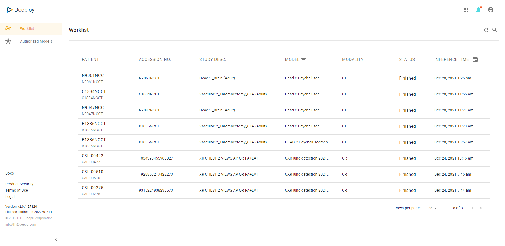
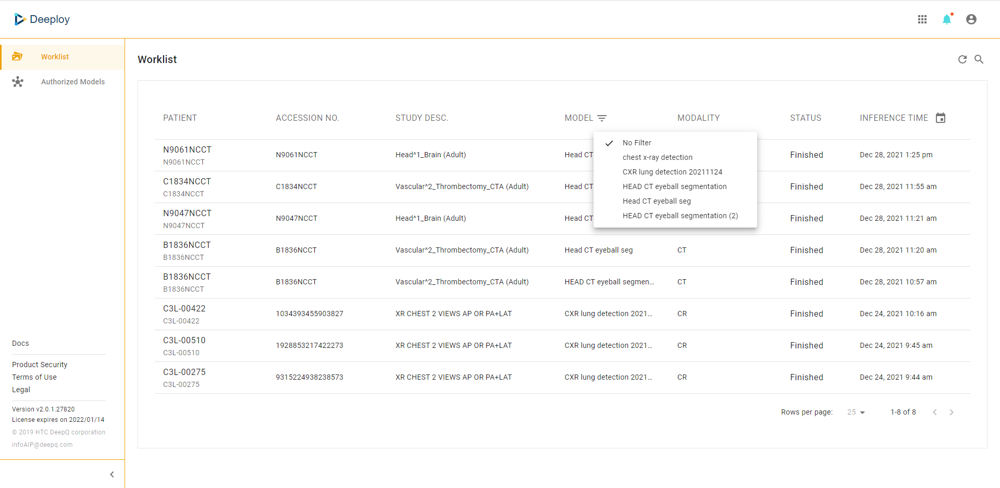
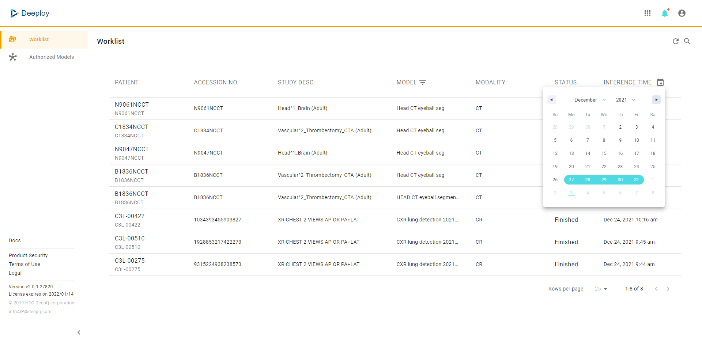
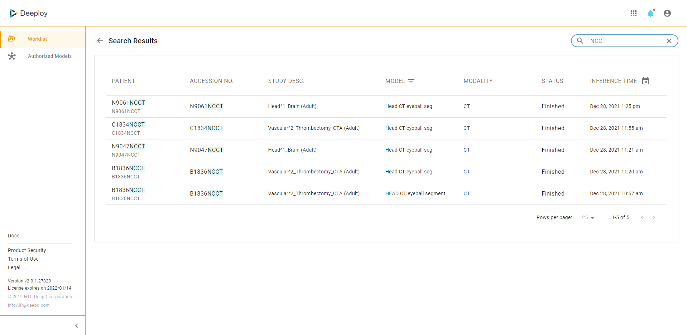

# 5.1 AI worklist & viewer

### AI worklist

An AI worklist will appear at the first glance. The AI worklist will contain all of the inference jobs of models that are authorized to you. User may be able to sort the worklist by model & inference time.

### AI Viewer

Clicking on any inference job on the AI worklist will open the AI viewer, showing the image study & inference results. The layout & functionality AI viewer is the same as image viewer used in Dataset.

