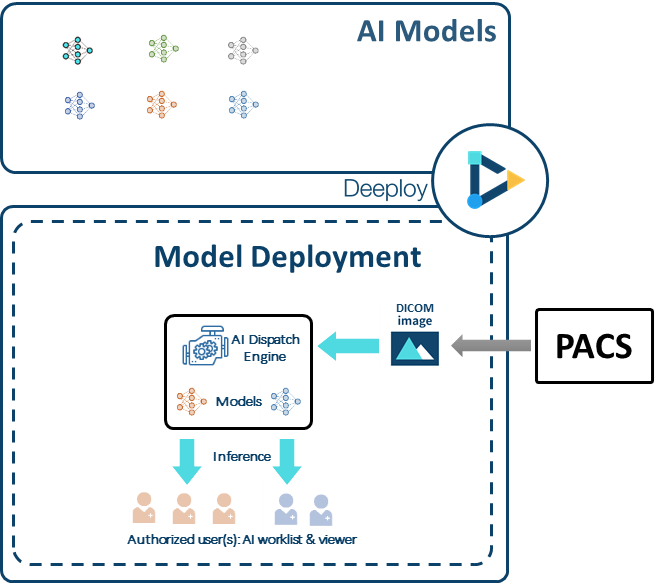
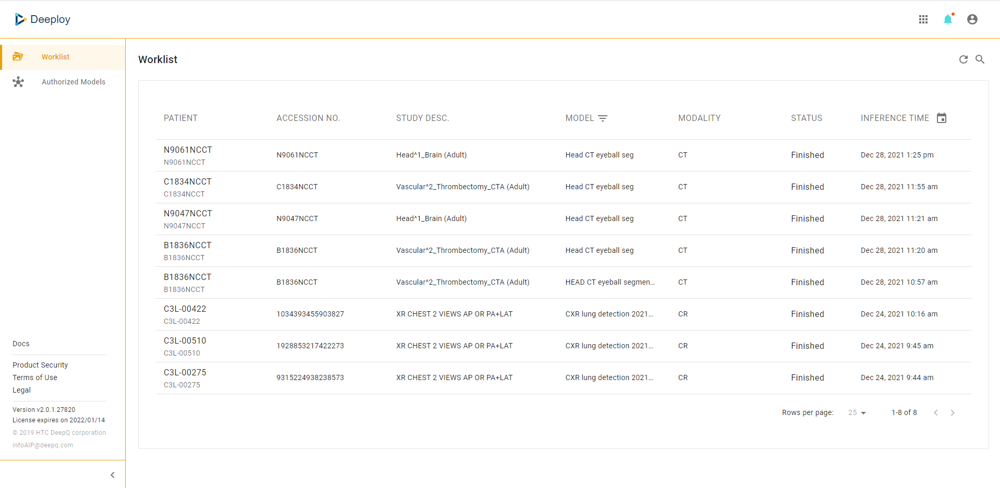

# 5. Deeploy

Running models on a fixed test set is never enough, bringing real-world data to the algorithm is the beginning of continual self-improvement. Deeploy receives DICOM images from your PACS and dispatches them to coresponding deployments that runs models of different purposes.

### Side Menu 

**Worklist**: A complete list of the image studies processed by model deployments that are authorized to you, shown from newest to oldest. Users can filter the worklist by selecting models by clicking on "MODEL".

**Authorized Models**: You can view the detials of model deployments that are authorized to you. please conatct system admin for model deployment authorization.
