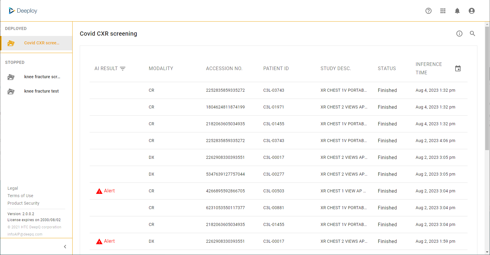
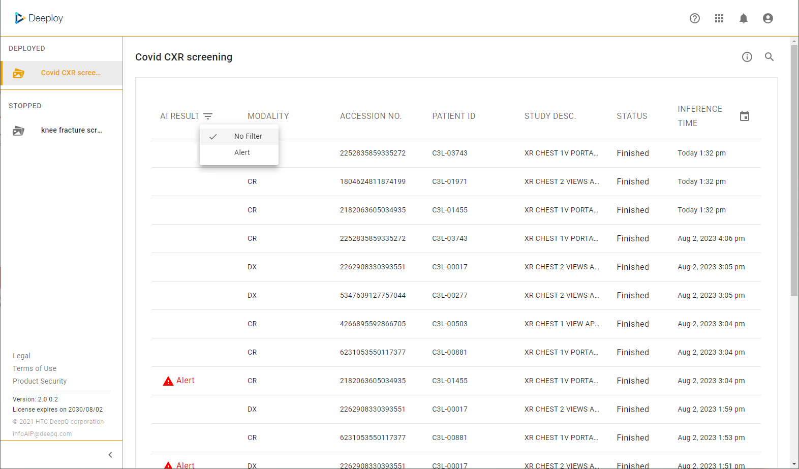
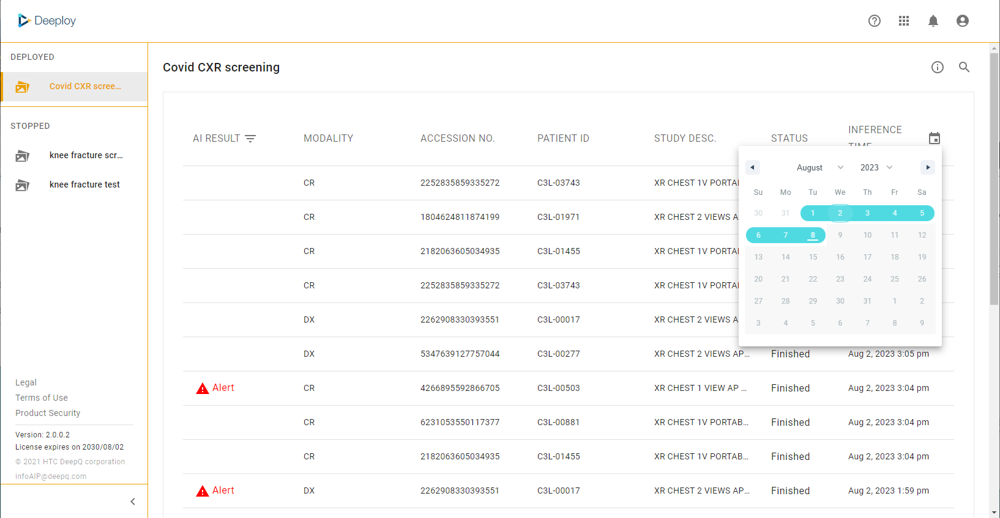
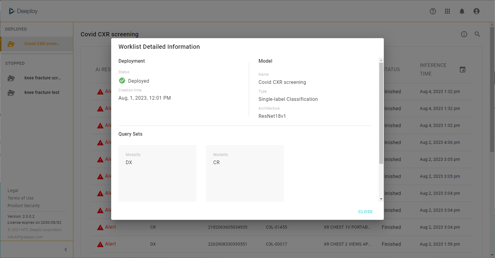
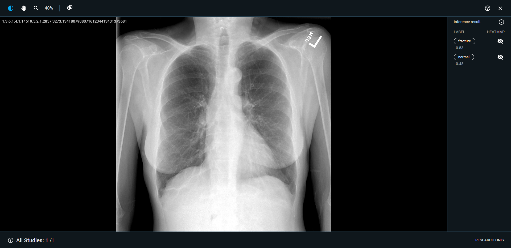
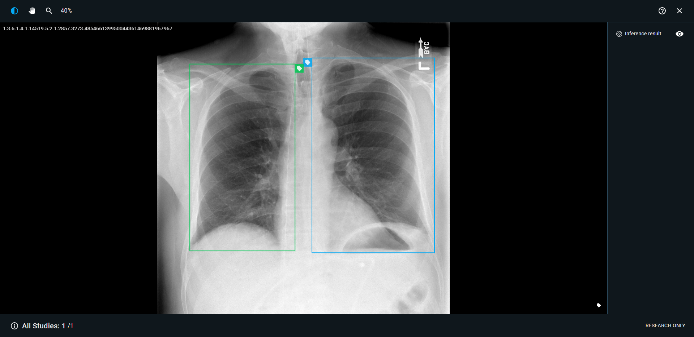

# 2. AI worklist & viewer

When logging into the Deeploy system, authorized deployment(s) will show up in the side menu. Please make sure you have been given authorization by your system admin.

### Side Menu 

**Deployed** : A complete list of deployments that are authorized to you and currently deployed, listed from newest to oldest.

**Stopped**: Model deployments authorized to you but were stopped. you can still view the jobs that has been processed but there won't be new inference jobs.

### AI Worklist&#x20;

Select a deployment from the side menu will bring up the AI worklist, each deployment will have an individual worklist which the content can be configured by the administrator.&#x20;

**AI RESULT**：If an indicator is set up in this deployment, it will appear under this column once the trigger condition is met. Please conatct your system admin about the indicator settings (rules & text).

**DICOM tag columns (Max. 4 columns)**：These columns contain information of each DICOM study, selected by the admin during deployment setup. You may also search for a specific study with the search icon  at the upper right of the worklist.

**Inference time**：The inference jobs are shown from new to old, you may also search the jobs within a time interval by clicking on the calendar button .png>). For stopped deployments you can still view previous results but there won't be new inference jobs.

### AI Viewer

Clicking on any inference job on the AI worklist will open the AI viewer, showing the image study & inference results. For image classification applications, heatmap can be toggled on/off by clicking for expainablility. for detection & segmentation applications, the toggles on/off bounding boxes & segmentation masks.&#x20;

