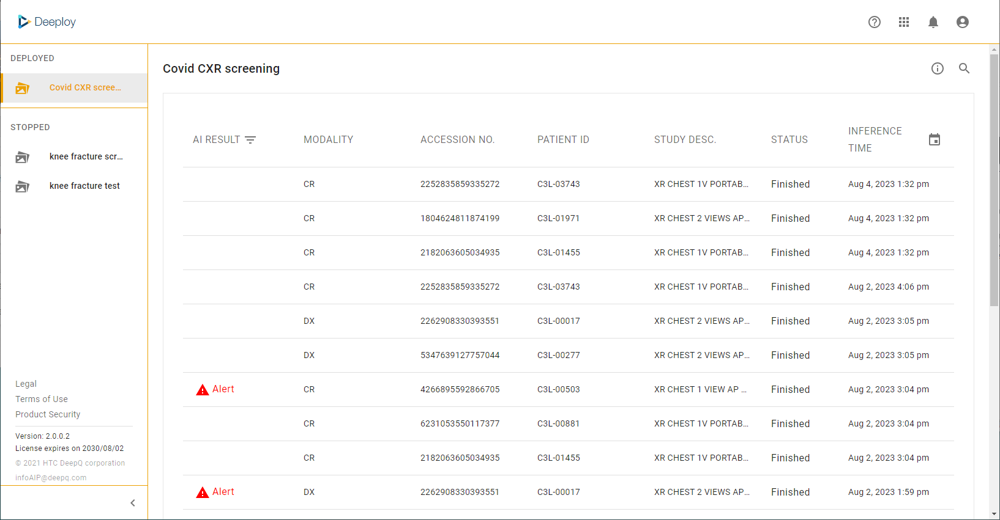

# 2. AI worklist & viewer

the AI worklist will first appear when logging into the Deeploy system, authorized deployment(s) will show up in the side menu as well as the stopped deployments. Please make sure you have been given authorization by your system admin.

From here, users can switch between deployment worklists and view the inference results in the AI viewer.&#x20;

<figure><figcaption></figcaption></figure>
