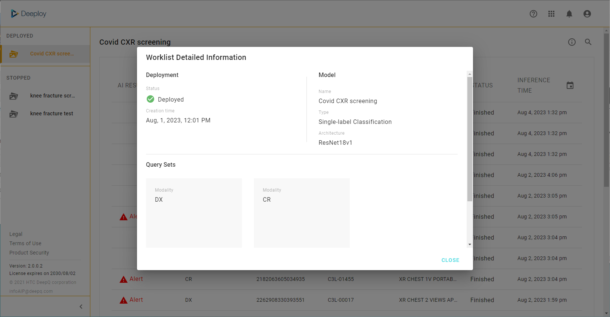

# 2. AI worklist & viewer

### AI worklist

An AI worklist will appear at the first glance. The AI worklist will contain all of the inference jobs of models that are authorized to you. User may be able to sort the worklist by model & inference time.

### Side Menu 

<mark style="color:yellow;">**Deployed**</mark> <mark style="color:yellow;"></mark><mark style="color:yellow;">: A complete list of the image studies processed by model deployments that are authorized to you, shown from newest to oldest. Users can filter the worklist by selecting models by clicking on "</mark><mark style="color:yellow;">**MODEL**</mark><mark style="color:yellow;">".</mark>

<mark style="color:yellow;">**Stopped**</mark><mark style="color:yellow;">: You can view the detials of model deployments that are authorized to you. please conatct system admin for model deployment authorization.</mark>

### configurable columns

<mark style="color:yellow;">**AI result**</mark>

<mark style="color:yellow;">**filter by inference time**</mark>

### AI Viewer

Clicking on any inference job on the AI worklist will open the AI viewer, showing the image study & inference results. The layout & functionality AI viewer is the same as image viewer used in Dataset.

