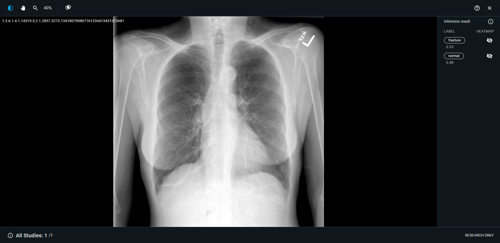
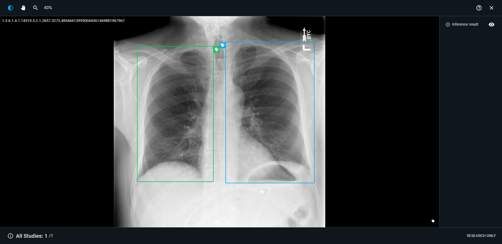
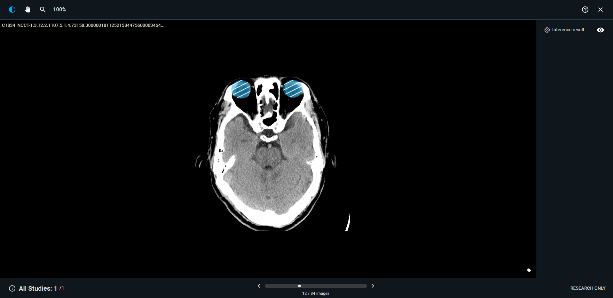

# 2.2 AI viewer

### AI Viewer

Clicking on any inference job on the AI worklist will open the AI viewer, showing the image study & inference results. For image classification applications, heatmap can be toggled on/off by clicking for expainablility. for detection & segmentation applications, the toggles on/off bounding boxes & segmentation masks.

