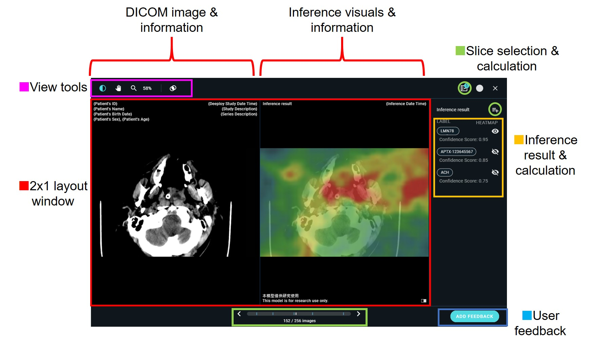
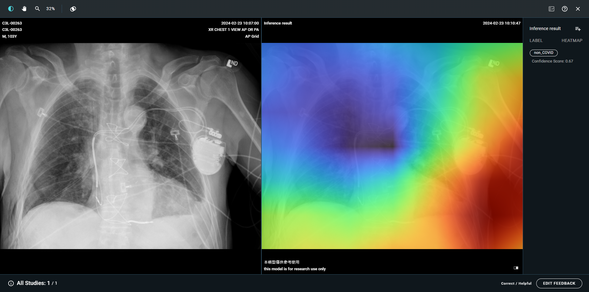
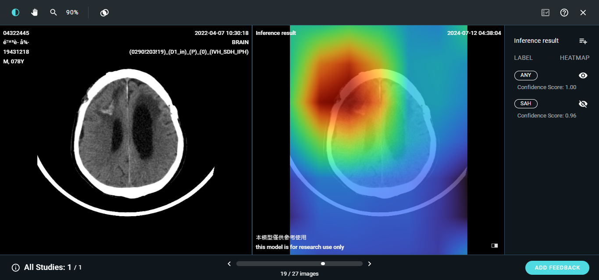
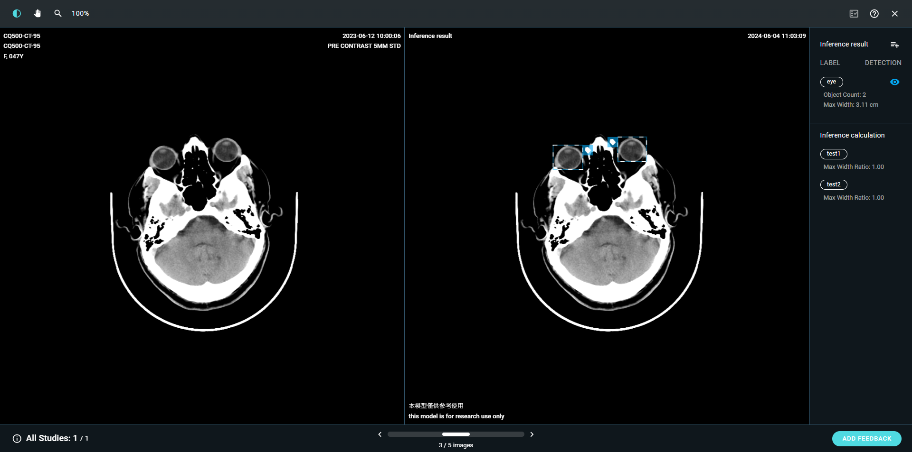
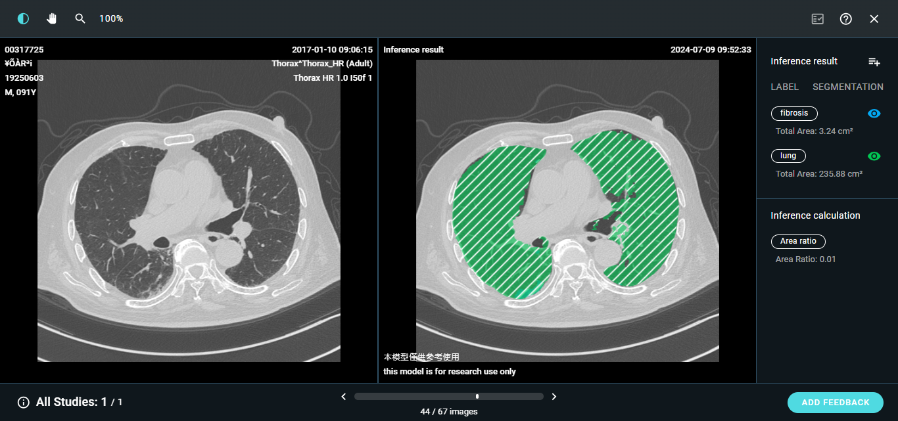
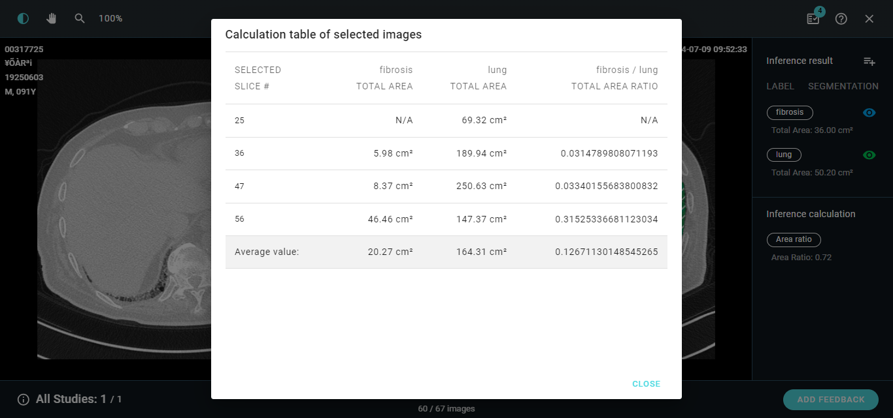
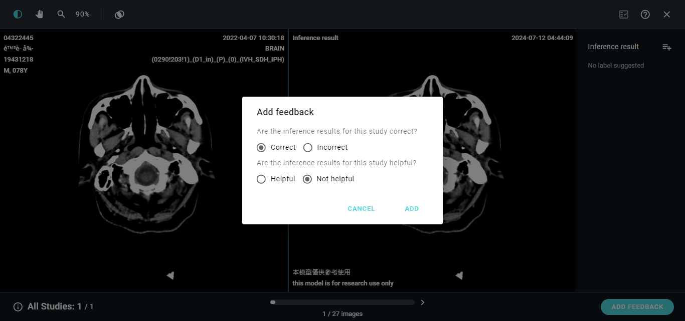

# 2.2 AI viewer

### AI viewer layout

The standard AI viewer has a 2x1 layout, with the raw DICOM image and information on the left, inference results and information on the right.

<figure><figcaption>
AI viewer: Object Detection
</figcaption></figure>

<figure><figcaption>
AI viewer: Object Segmentation
</figcaption></figure>

### Inference calculation

<figure><figcaption></figcaption></figure>

### User feedback

Users can leave their feedback in the AI viewer: correct/incorrect ; helpful/not helpful.

All feedback from different users can be downloaded via the admin console for further use.

<figure><figcaption></figcaption></figure>

