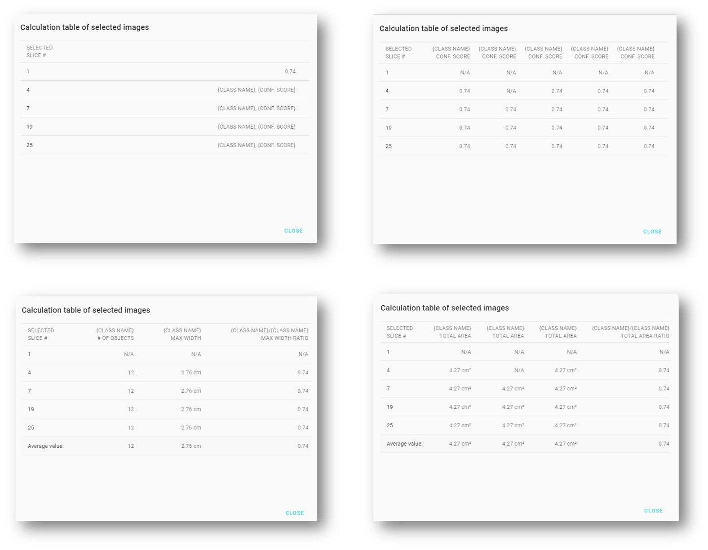

# 2.2 AI viewer

### AI viewer layout

The standard AI viewer has a 2x1 layout, with the raw DICOM image and information on the left, inference results and information on the right. The side bar at the far right contains inference result & calculation (optional), image slider at the bottom will appear when the study contains multiple images.

**Single-Label Classification:**

* Inference visualization: heatmap of the inference result
* Inference result: class name and confidence score

**Multi-Label Classification:**

* Inference visualization: heatmap of the inference result (can switch between classes with )
* Inference result: class names and confidence score of each class that has conf. score >0.5

**Object Detection:**

* Inference visualization: bounding boxes of the inference result (toggle on/off with )
* Inference result: Name, object count & max. object width for each class that appears in the image

<figure><figcaption>
AI viewer: Object Detection
</figcaption></figure>

**Object Segmentation:**

* Inference visualization: object masks of the inference result (toggle on/off with )
* Inference result: Name & total area for each class that appears in the image. (Area calculated in pixels if no available spatial information)

<figure><figcaption>
AI viewer: Object Segmentation
</figcaption></figure>

### Inference calculation

<figure><figcaption></figcaption></figure>

<figure><figcaption>
Inference calcualtion of different types of AI models
</figcaption></figure>

### User feedback

Users can leave their feedback in the AI viewer: correct/incorrect ; helpful/not helpful.

All feedback from different users can be downloaded via the admin console for further use.

<figure><figcaption></figcaption></figure>

