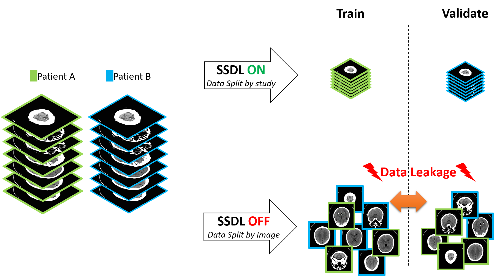
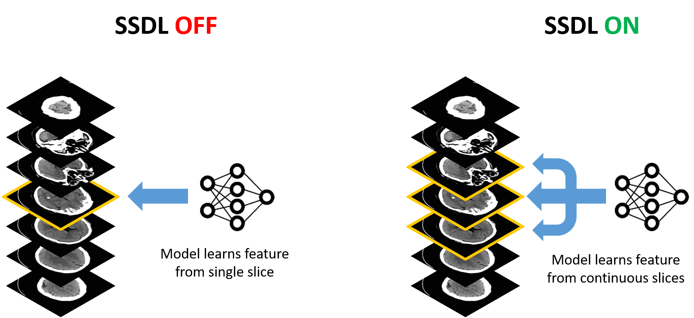
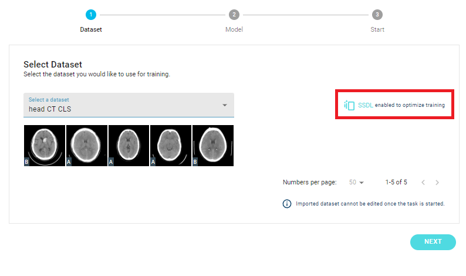
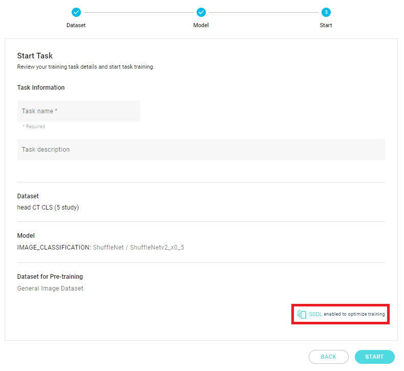
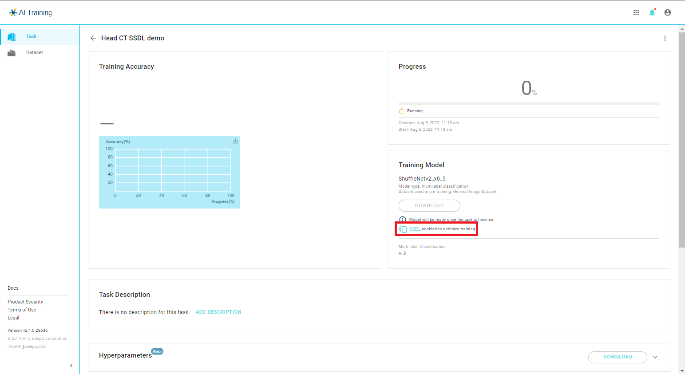

# 4.7 SSDL explained

### Smart Scan Deep Learning (SSDL)

Smart Scan Deep Learning (SSDL) is a advanced technique that can optimize the training results of sequential images. SSDL will automatically activate when sequentail images in the dataset are detected.&#x20;

### Prevent Data Leakage

Data Leakage during training happens when the train/validate split is not handled carefully, causing some of the validation data contains information from the training data. As a result the validation score might overperform and be misleading.

In medical scans with spatial-sequential images, information might be shared between slices in a single scan. Therefore, splitting data by study prevents data leakage, as shown in the figure below.

### Learn continous features

Most features in human body occupies a certain space and will appear in multiple sequential images in a volumetric scan. For instance, the features of a tumor or a hemmorhage may appear in 3\~5 consecutive CT or MRI images. It has been proven that in some cases, learning features from adjacent slices the model may perform better in predicting these objects/pattterns.

SSDL is activated, it allows the model to learn from its neighboring slices instead of a single slice, shown in the figure below.

### Activating SSDL

When the user selects a dataset in training tasks, the system will detect whether the dataset contains sequential information.&#x20;

