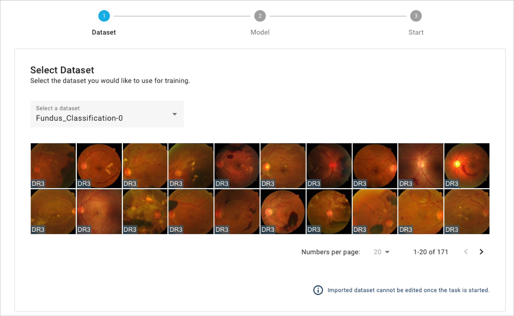

# 4.1.1 Select Dataset

* All training tasks requires the user to select one of the datasets from the drop list.
* Only datasets with annoatation corresponding to your previous selection will be shown in the list.
* Case preview will be shown below to help you ensure that you select the correct dataset.

