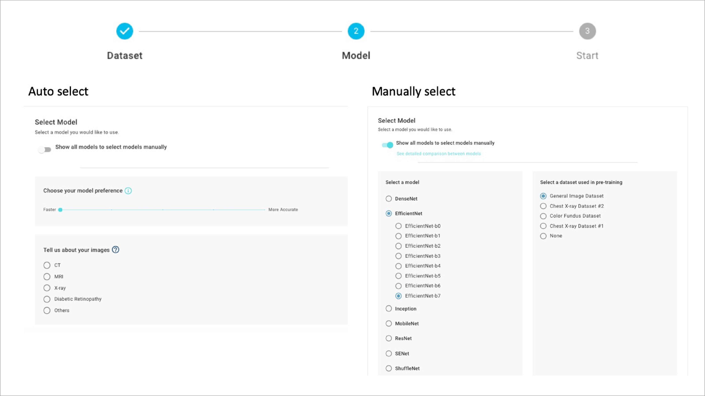

# 2. Select Model & Tuning methods

## Auto Select:

* Input your data type & training preference for us to suggest a neural network that meets you needs.

## Manually Select:

* There are over 200 neural netwok \* pre-train combinations in the DeepQ AI Training model zoo that utilizes [transfer learning](../../working-flow-1/what-is-deep-learning.md#what-is-transfer-learning) for faster & better training results.
* Expand model list to select the model you want to deploy.
* <mark style="color:red;background-color:red;">Add My Model Description</mark>
* for more manual tuning options, please refer to [Model Training & Hyperparameter tuning explained](../model-training-and-hyperparameter-tuning-explained.md)

