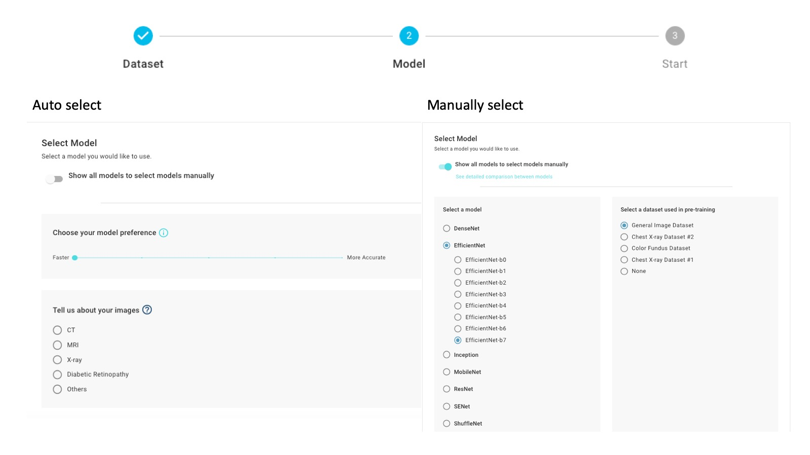

# 2. Select Model

## Manually Select:

* There are over 200 models for you to choose from in the DeepQ AI Training model zoo. 
* Expand model list to select the model you want to deploy. 
* The right column indicates the pre-training dataset used in the models, you can select the one that matches yours. You can also select "None" if there is no suitable dataset. 

## Auto Select:

* The default model will be selected according to the data and project that project owner set. 
* Scroll model preference for either faster or more accurate feature. 

