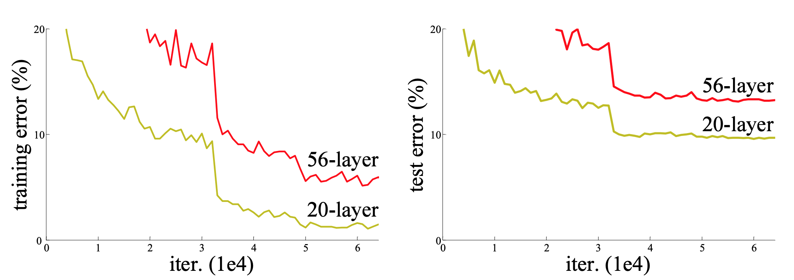

# About Deep Learning Models

## Residual Network

Deep residual network \(ResNet\) blew up deep learning world when Mircrosoft Research released [Deep Residual Learning for Image Recognition](https://arxiv.org/pdf/1512.03385.pdf) and took over the 1-st place in all five main tracks of the ImageNet and COCO 2015 competitions. ResNet introduces a new idea of shortcut connection \(or skip connection\) that enables to have a deeper network \(LeNet-5, VGG-19, ResNet-152\).

This post will cover:

1. Previous Struggle
2. Shortcut Connection in Residual Network \(ResNet\)
3. ResNet Architecture

### Previous Struggle

Network depth plays a crucial character in neural network architectures. However, when the network goes deeper, the problem of vanishing gradients occurs and makes it difficult to train.

**Vanishing Gradients**

_**With network depth increasing, accuracy gets saturated \(which might be unsurprising\) and then degrades rapidly. Unexpectedly, such degradation is not caused by overfitting, and adding more layers to a suitably deep model leads to higher training error.**_

During backpropagation, partial derivative of the error function has the effect of multiplying n numbers to compute gradients in an n-layer network. When the network is deep, multiplying n of small numbers will become zero which also called vanished. And of course, multiplying n of large number make the number explode.

### Shortcut Connection in Residual Network \(ResNet\)

It reformulates the fundamental building block to H\(x\) = F\(x\) + x. Even if the vanishing gradient occurs, it still has the identity x to transfer back.

### ResNet Architecture

ResNet architecture can be easily seen as above figure. With the benefit of shortcut connection, we can now focus on building residual blocks instead of building layers and this helps us creating deeper networks. Here we demonstrate ResNet family in below.

