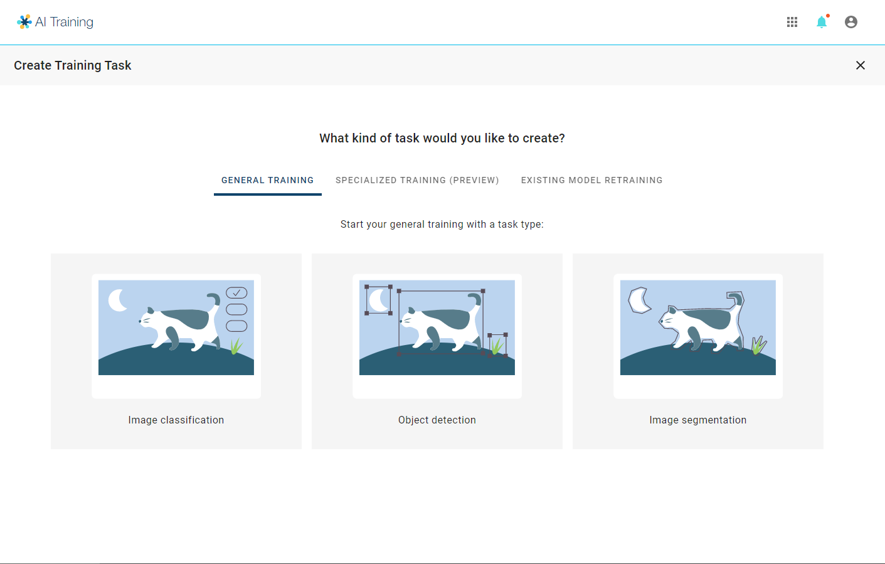
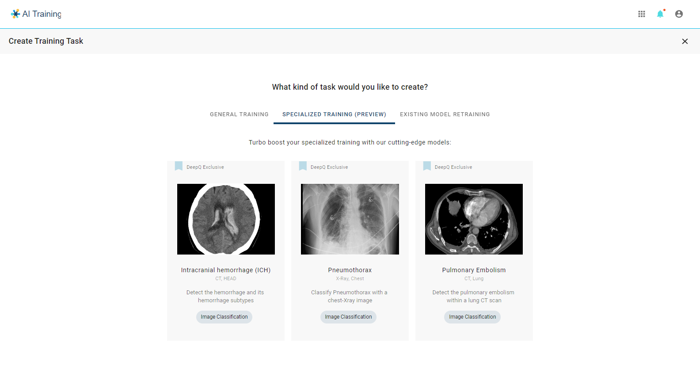
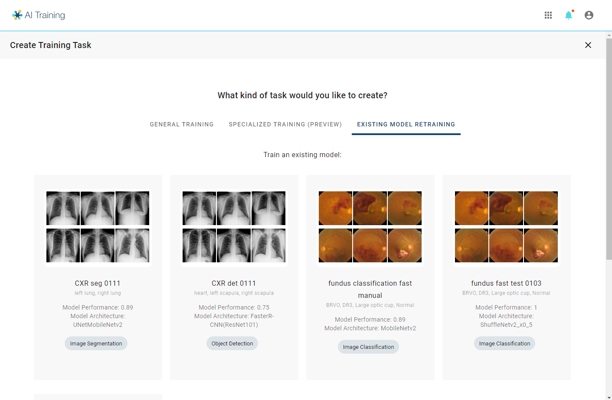

# 4.1 Create Training Tasks

Clicking on the "**CREATE NEW TASK**" tab leads you to selecting one of the training task flows:

1. **General Training**：To train an AI model of any topic based on the user's choice
2. **Specialized training**：To train an AI for a specific topic using the presets and will only need a few quality data (\~100 cases) to obtain good training results.&#x20;
3. **Existing Model Retraining**：Using the user's previously trained AI model as a starting point to start a new training task.

<mark style="color:yellow;">Tutorial Video:</mark> [#video-create-training-task](../../tutorial-videos/model-training-inference.md#video-create-training-task "mention")

The different options between these three flows are laid out in the table below:

|                               | Annotation type | Neural Network | Tuning Methods                                                |
| ----------------------------- | --------------- | -------------- | ------------------------------------------------------------- |
| **General Training**          | Any             | Selectable     | 
Auto <em>with preferences</em>

/ Full Manual
     |
| **Specialized Training**      | Specific        | Fixed          | 
Auto <em>without preferences</em> 

/ Full Manual
 |
| **Existing Model Retraining** | Specific        | Fixed          | 
Auto <em>without preferences</em> 

/ Full Manual
 |

### General Training

The first step of general training is to select the task type: image classification, object detection or Object segmentation

### Specialized Training

With specialzed training, you may choose from the tasks that has been prepared by DeepQ. Users should provide datasets (image format & annotation) according to the table below.

<figure><figcaption></figcaption></figure>

| Topics                      | Task type                       | Image format              | Classes                                                                                                                                          |
| --------------------------- | ------------------------------- | ------------------------- | ------------------------------------------------------------------------------------------------------------------------------------------------ |
| **Intracranial Hemmorhage** | Multi-Label Classification (5)  | Head CT , non-contrast    | 
>Subarachnoid hemorrhage  >Subdural hemorrhage  >Epidural hemorrhage  >Intraparenchymal hemorrhage  >Intraventricular hemorrhage
 |
| **Pneumothorax**            | Single Label Classification (2) | Chest X-ray               | 
>PTX >normal
                                                                                                                           |
| **Pulmonary Embolism**      | Single Label Classification (2) | Chest CT with contrast IV | 
>PE >normal
                                                                                                                            |

### Existing Model Retraining

Select one of your previously trained models to start a new training task

<figure><figcaption></figcaption></figure>
