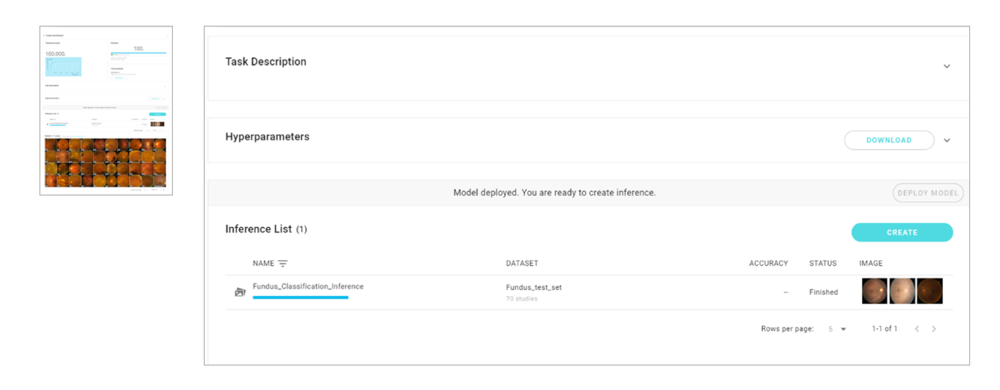

# 4.6 Deep Learning metrics explained

### 
Evaluating the performance of the Model:

Evaluating your machine learning algorithm is an essential part of any project. Your model may give you satisfying results when evaluated using a metric say **Sensitivity** but may give poor results when evaluated against other metrics such as **Specificity** or any other such metric. DeepQ AI platform provides various metrics for model evaluation, metrics for different applications will be explained in this section.


**Batch inference report:**

To evaluate a model’s performance, run batch inference under a completed training task and assign a test set \(data with ground truth\)

An inference job will appear on the list once the batch inference is complete, click on the job to view the quantitative results.

