# 4.6.1 Image Classification

### Inference report: Classification

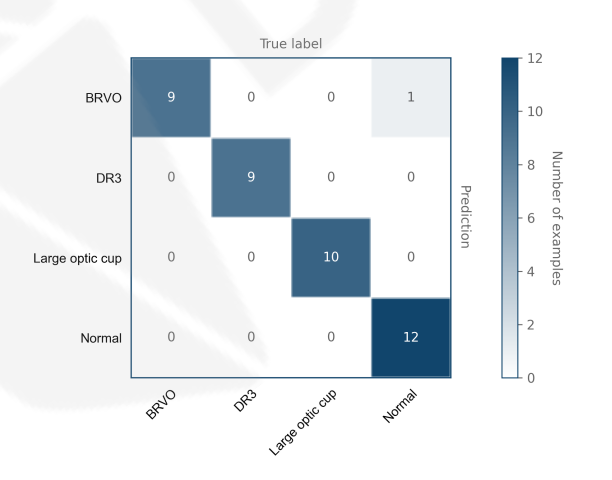

The inference report of multi-class classification shows the ROC curve, PR curve and the visualized confusion matrix.

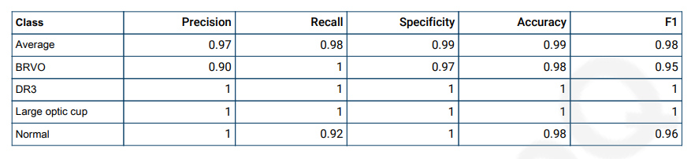

Confusion matrix and other metrics are listed in the table

### **Confusion Matrix**

Confusion matrix is a performance measurement for machine learning classification problem where output can be two or more classes. It is a table with 4 different combinations of predicted and actual values. The confusion matrix is extremely useful for measuring Recall, Precision, Specificity, Accuracy and most importantly AUC-ROC Curve. Let’s understand TP, FP, FN, TN in terms of pregnancy analogy.

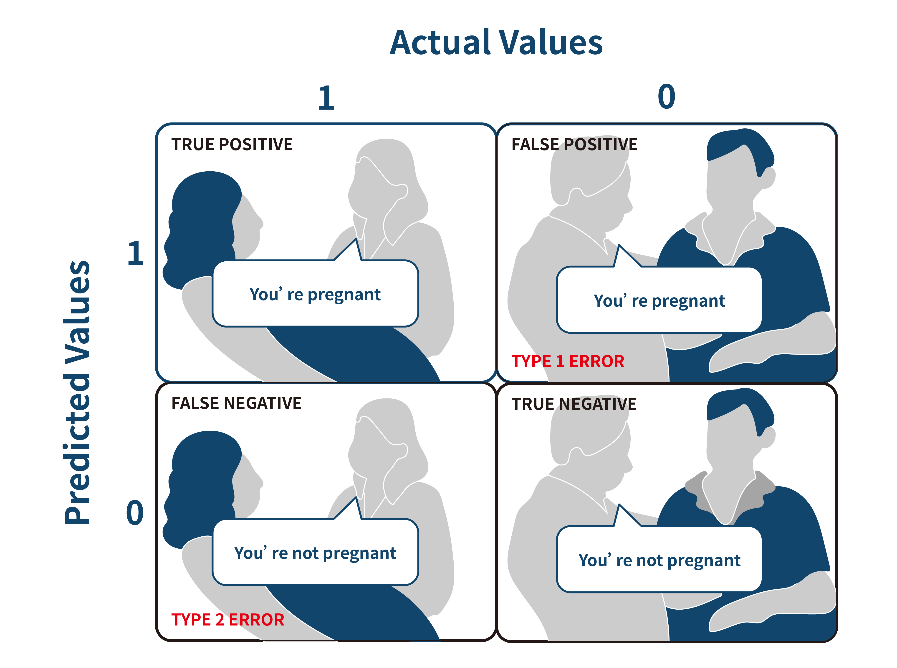

**True Positive (TP):** You predicted positive and it’s true.\
You predicted that a woman is pregnant and she actually is.

**True Negative (TN):** You predicted negative and it’s true.\
You predicted that a man is not pregnant and he actually is not.

**False Positive (FP): (Type 1 Error)** You predicted positive and it’s false.\
You predicted that a man is pregnant but he actually is not.

**False Negative (FN): (Type 2 Error)** You predicted negative and it’s false.\
You predicted that a woman is not pregnant but she actually is.

Just Remember, We describe predicted values as Positive and Negative and actual values as True and False.

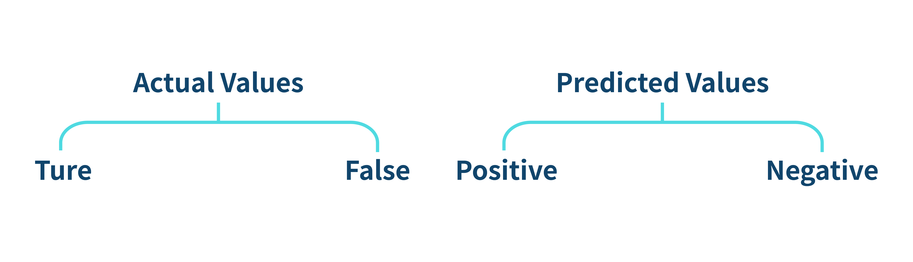

### **How to Calculate Confusion Matrix**

Let’s understand confusion matrix through math.

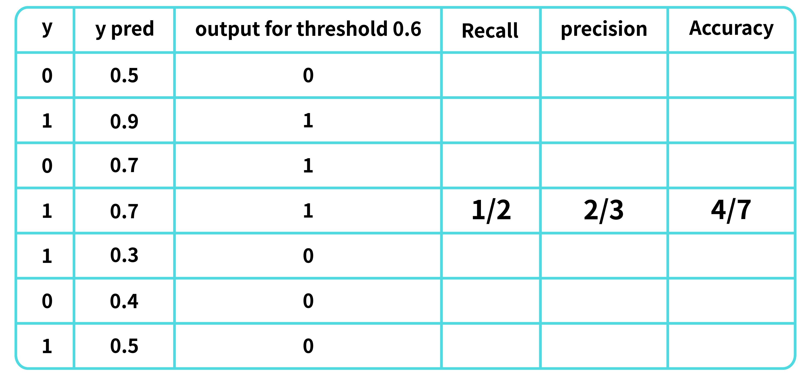

The output of classification models consists of classes and confidence levels (0\~1). An output threshold is set to determine whether the output is seen as “positive”. Here the threshold is set at 0.6, meaning that the predictions with confidence value >0.6 will be counted as “y positive -- 1”, otherwise “y negative -- 0”.

### · **Sensitivity (True Positive rate, 0\~1, the greater the better)**

Sensitivity measures the proportion of positives that are correctly identified (i.e. the proportion of those who have some condition (affected) who are correctly identified as having the condition).

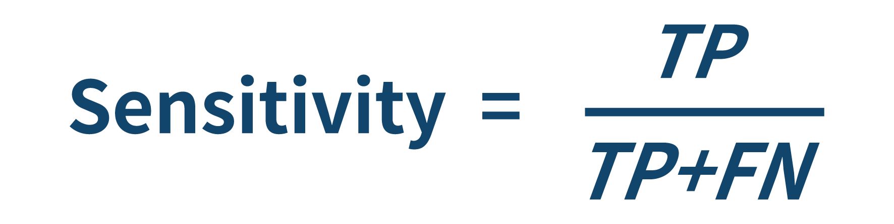

### · **Specificity (True Negative rate, 0\~1, the greater the better)**

Specificity measures the proportion of negatives that are correctly identified (i.e. the proportion of those who do not have the condition (unaffected) who are correctly identified as not having the condition).

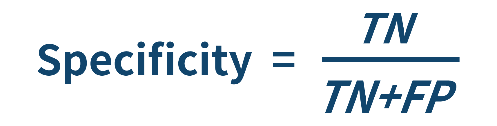

### · **Recall (0\~1, the greater the better)**

Out of all the positive classes, how much we predicted correctly. It should be high as possible.

### · **Precision(0\~1, the greater the better)**

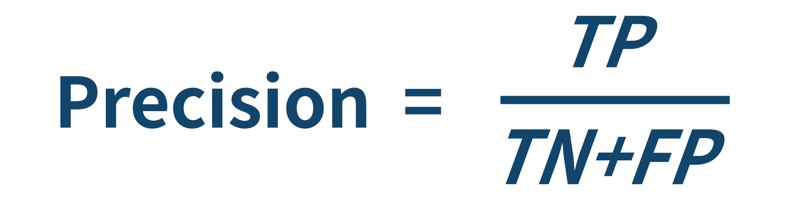

Out of all the positive classes we have predicted correctly, how many are actually positive, and **Accuracy** will be

Out of all the classes, how much we predicted correctly, it should be high as possible.

### · **F-measure (0\~1, the greater the better)**

It is difficult to compare two models with low precision and high recall or vice versa. So to make them comparable, we use F-Score. F-score helps to measure Recall and Precision at the same time. It uses Harmonic Mean in place of Arithmetic Mean by punishing the extreme values more.

### · **Diagnostic odds ratio DOR (0\~infinity)**

In medical testing with binary classification, the diagnostic odds ratio (DOR) is a measure of the effectiveness of a diagnostic test. It is defined as the ratio of the odds of the test being positive if the subject has a disease relative to the odds of the test being positive if the subject does not have the disease.

### **AUC - ROC Curve**

AUC - ROC curve is a performance measurement for the classification problems at various threshold settings. ROC is a probability curve and AUC represents the degree or measure of separability. It tells how much the model is capable of distinguishing between classes. Higher the AUC, the better the model is at predicting 0s as 0s and 1s as 1s. By analogy, the Higher the AUC, the better the model is at distinguishing between patients with the disease and no disease.

The ROC curve is plotted with TPR against the FPR where TPR is on the y-axis and FPR is on the x-axis.

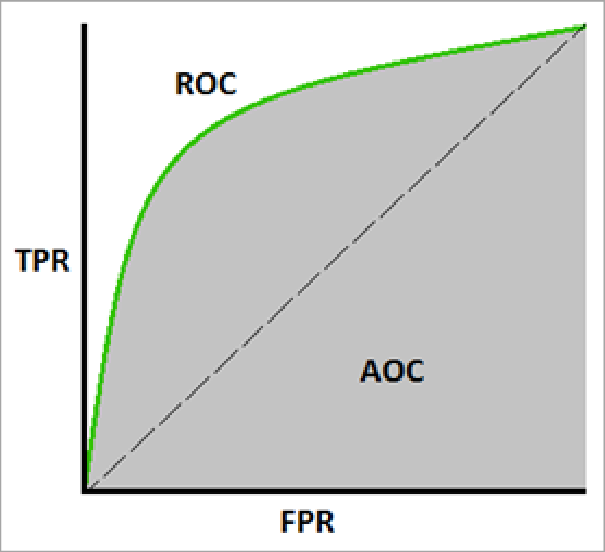

**Defining terms used in AUC and ROC Curve.**

TPR (True Positive Rate) / Recall /Sensitivity & FPR (False Positive Rate)

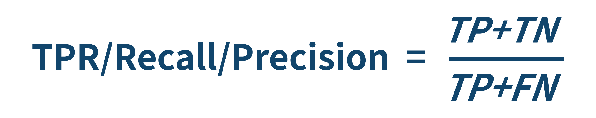

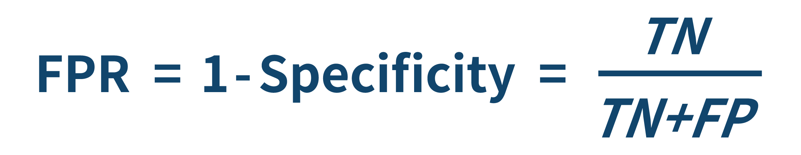

### · **Understanding AUROC curve**

An excellent model has AUC near to the 1 which means it has a good measure of separability. A poor model has AUC near to the 0 which means it has the worst measure of separability. In fact, it means it is reciprocating the result. It is predicting 0s as 1s and 1s as 0s. And when AUC is 0.5, it means the model has no class separation capacity whatsoever.

As we know, ROC is a curve of probability. So let's plot the distributions of those probabilities: Note: Red distribution curve is of the positive class (patients with disease) and the green distribution curve is of the negative class (patients with no disease).

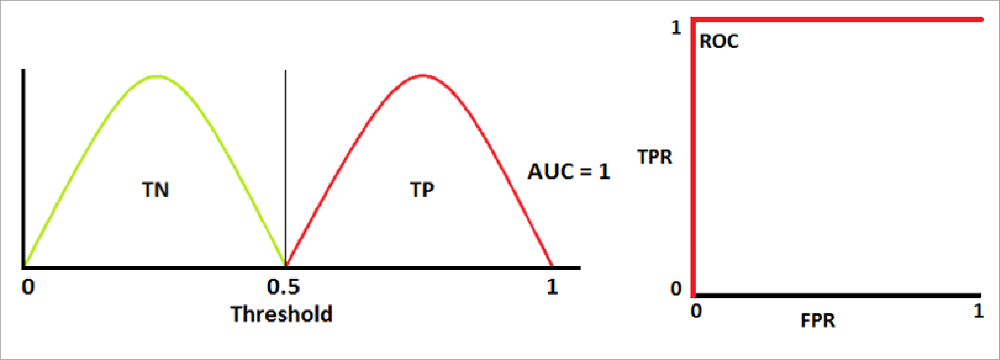

This is an ideal situation. When two curves don’t overlap at all means model has an ideal measure of separability. It is perfectly able to distinguish between positive class and negative class.

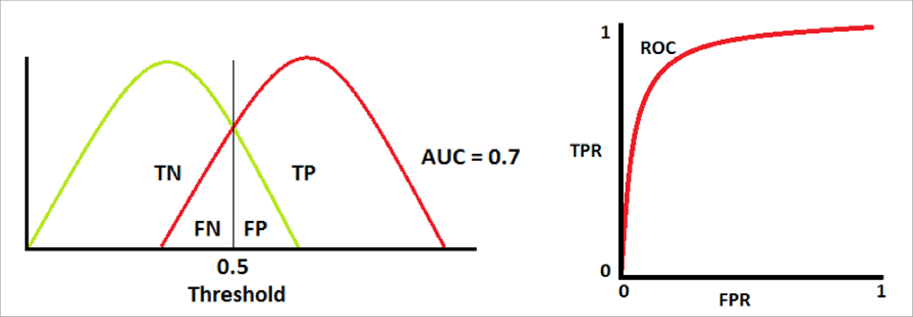

When two distributions overlap, we introduce type 1 and type 2 errors. Depending upon the threshold, we can minimize or maximize them. When AUC is 0.7, it means there is a 70% chance that the model will be able to distinguish between positive class and negative class.

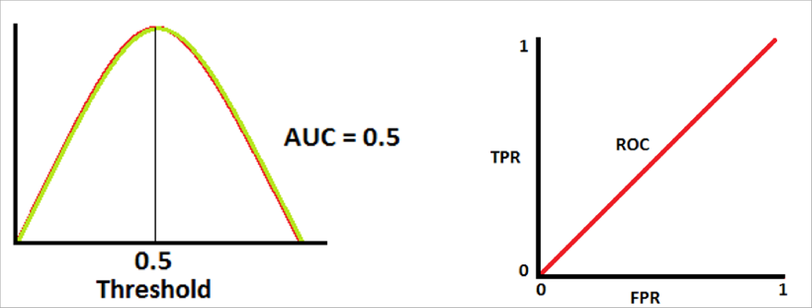

This is the worst situation. When AUC is approximately 0.5, the model has no discrimination capacity to distinguish between positive class and negative class.

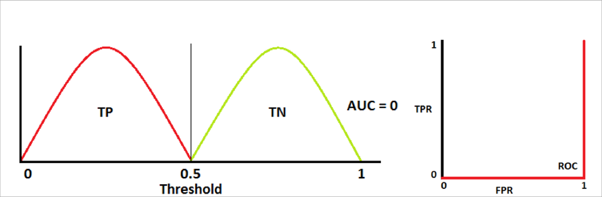

When AUC is approximately 0, the model is actually reciprocating the classes. It means the model is predicting a negative class as a positive class and vice versa.

### · **The relation between Sensitivity, Specificity, FPR, and Threshold.**

Sensitivity and Specificity are inversely proportional to each other. So when we increase Sensitivity, Specificity decreases, and vice versa.

#### Sensitivity⬆️, Specificity⬇️ and Sensitivity⬇️, Specificity⬆️

When we decrease the threshold, we get more positive values thus it increases the sensitivity and decreasing the specificity. Similarly, when we increase the threshold, we get more negative values thus we get higher specificity and lower sensitivity.\\

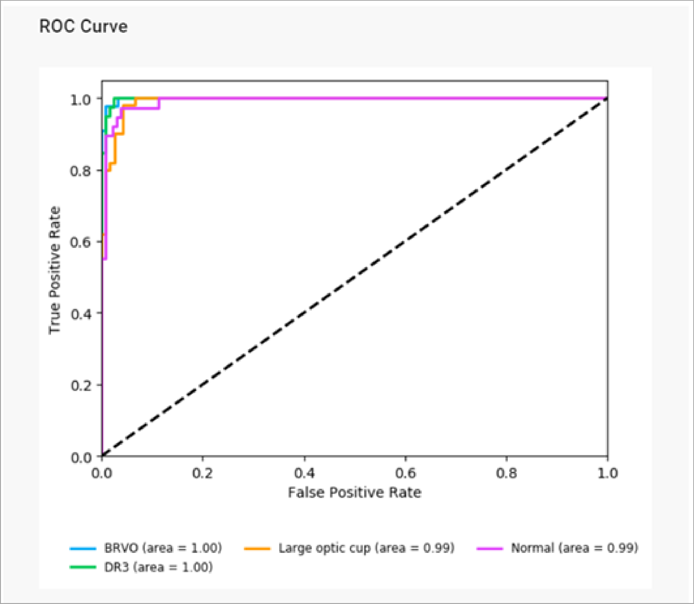

_References:_

1. \_\_[https://towardsdatascience.com/understanding-confusion-matrix-a9ad42dcfd62](https://towardsdatascience.com/understanding-confusion-matrix-a9ad42dcfd62)
2. [https://towardsdatascience.com/metrics-to-evaluate-your-semantic-segmentation-model-6bcb99639aa2](https://towardsdatascience.com/metrics-to-evaluate-your-semantic-segmentation-model-6bcb99639aa2)
3. [https://towardsdatascience.com/understanding-auc-roc-curve-68b2303cc9c5](https://towardsdatascience.com/understanding-auc-roc-curve-68b2303cc9c5)
4. [https://towardsdatascience.com/breaking-down-mean-average-precision-map-ae462f623a52](https://towardsdatascience.com/breaking-down-mean-average-precision-map-ae462f623a52)
