# 4.6.2 Object Detection

#### Inference report: Object detection

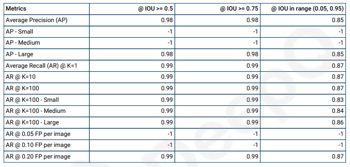

**Average Precision (AP):**

In computer vision, mAP is a popular evaluation metric used for object detection (i.e. localisation and classification). Localization determines the location of an instance (e.g. bounding box coordinates) and classification tells you what it is (e.g. a dog or cat).

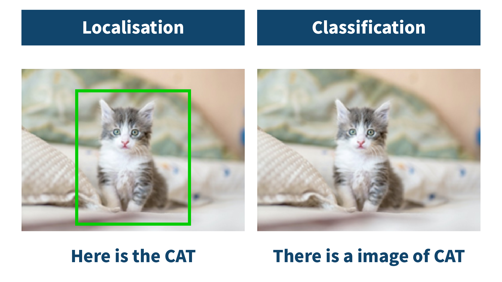

Many object detection algorithms use mAP to evaluate their models. mAP stands for Mean Average Precision, where **Precision** measures how accurate your predictions are. i.e. the percentage of your predictions are correct. It measures how many of the predictions that your model made were actually correct.

Unlike classification, object detection systems make predictions in terms of a bounding box and a class label.

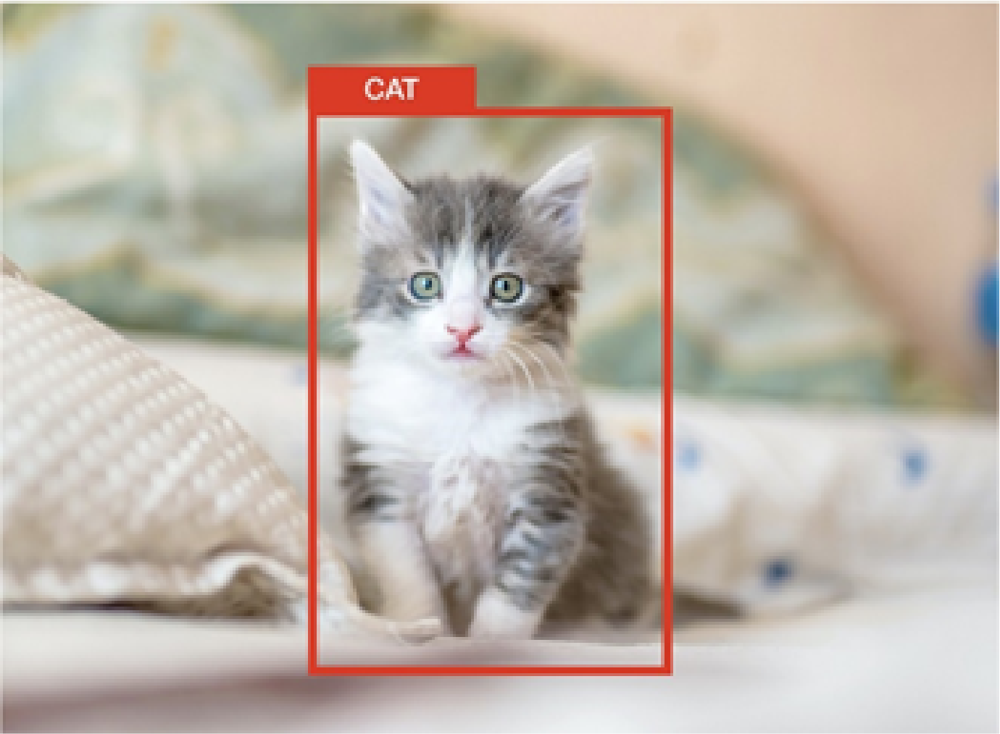

For each bounding box, we measure an overlap between the predicted bounding box and the ground truth bounding box. This is measured by IoU (intersection over union), illustrated below.

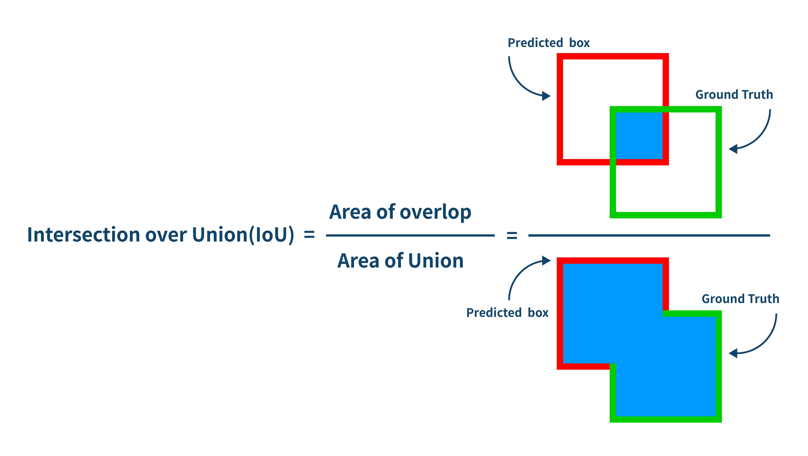

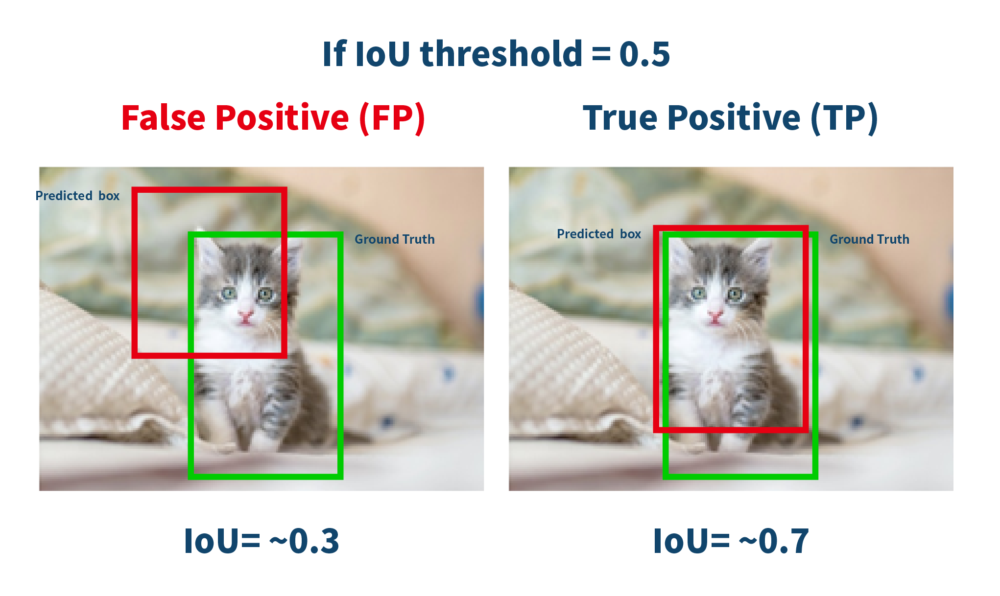

For example the object detection task shown above, we calculate Precision and Recall using IoU value for a given IoU threshold. For example, if IoU threshold is 0.5, and the IoU value for a prediction is 0.7, then we classify the prediction as True Positive (TF). On the other hand, if IoU is 0.3, we classify it as False Positive (FP).

That also means that for a prediction, we may get different binary TRUE or FALSE positives, by changing the IoU threshold.

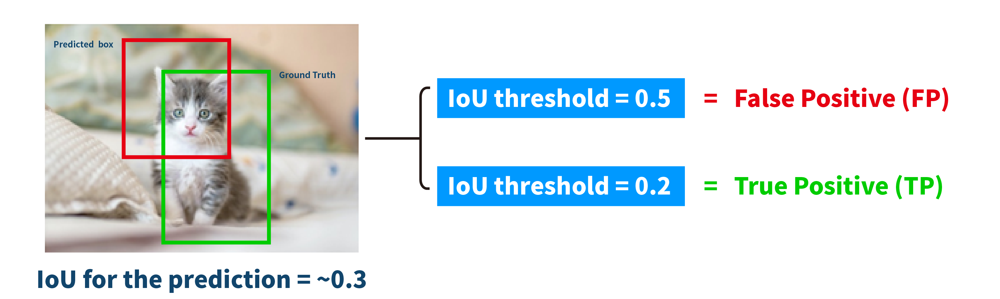

Another important term to understand is Recall.

**Recall** measures how well you find all the positives. For example, we can find 80% of the possible positive cases in our top K predictions.

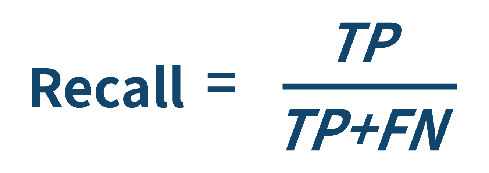

Remember the definition of TP & FN:

TP = True Positives (Predicted as positive as was correct)

FN = False Negatives (Failed to predict an object that was there)

### **The general definition for the Average Precision (AP) is finding the area under the precision-recall curve above.**

**mAP (mean average precision)** is the average of AP. In some contexts, AP is calculated for each class and averaged to get the mAP. But in others, they mean the same thing.

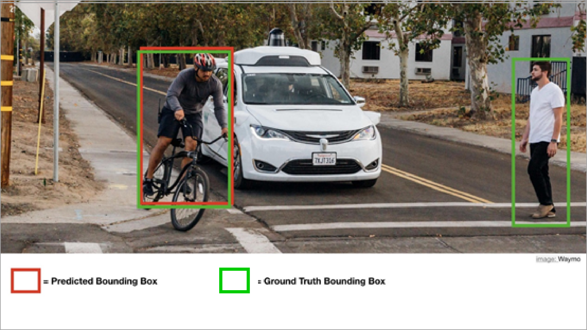

So for the above Advanced driver-assistance systems (ADAS) image, let’s calculate the mAP using the actual formula:

Here we assume that the confidence score threshold is 0.7 (the default value of DeepQ AI platform for object detection) and the IoU threshold is also 0.5. So we calculate the AP at IoU threshold 0.5.

For simplicity, we will calculate an average for the 11-point interpolated AP. In the latest research, more advanced techniques have been introduced to calculate the AP.

True Positives (TP) = 1 (prediction & ground truth IOU>0.5)

Fasle Positives (FP) = 0 (predicted bounding box only)

False Negatives (FN) = 1 (ground truth bounding box only)

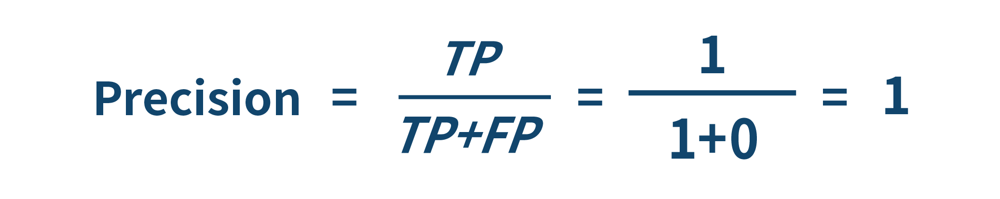

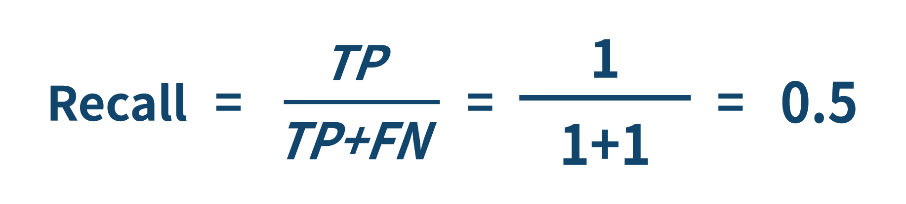

We plot the 11 points interpolated Precision-Recall curve.

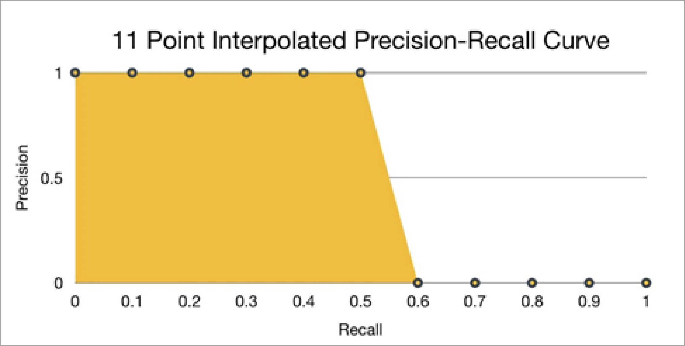

We now calculate AP by taking the area under the PR curve. This is done by segmenting the recalls evenly to 11 parts: {0,0.1,0.2,…,0.9,1}.

So **mAP@0.5 for the image is 0.545**

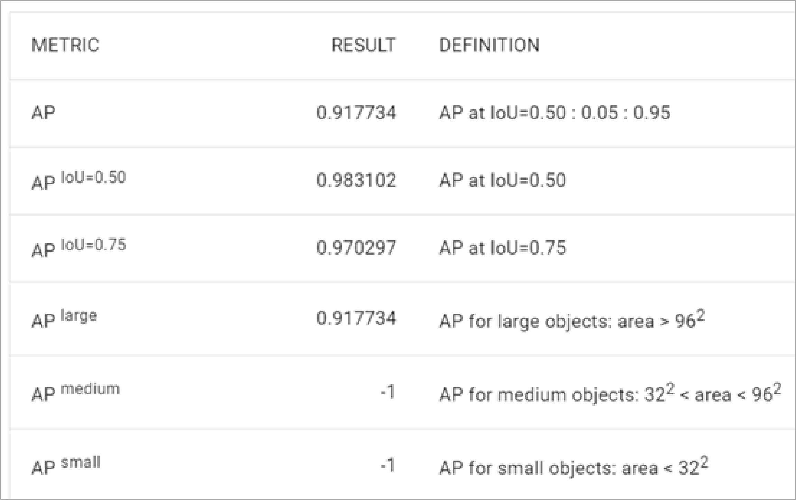

### **Average recall (AR)**

Average recall describes the area doubled under the Recall x IoU curve. The Recall x IoU curve plots recall results for each IoU threshold where IoU ∈ \[0.5,1.0], with IoU thresholds on the x-axis and recall on the y-axis. Similarly to mAP, mAR is the average of AR over the number of classes within the dataset

_References:_

1. \_\_[https://towardsdatascience.com/understanding-confusion-matrix-a9ad42dcfd62](https://towardsdatascience.com/understanding-confusion-matrix-a9ad42dcfd62)
2. [https://towardsdatascience.com/metrics-to-evaluate-your-semantic-segmentation-model-6bcb99639aa2](https://towardsdatascience.com/metrics-to-evaluate-your-semantic-segmentation-model-6bcb99639aa2)
3. [https://towardsdatascience.com/understanding-auc-roc-curve-68b2303cc9c5](https://towardsdatascience.com/understanding-auc-roc-curve-68b2303cc9c5)
4. [https://towardsdatascience.com/breaking-down-mean-average-precision-map-ae462f623a52](https://towardsdatascience.com/breaking-down-mean-average-precision-map-ae462f623a52)
