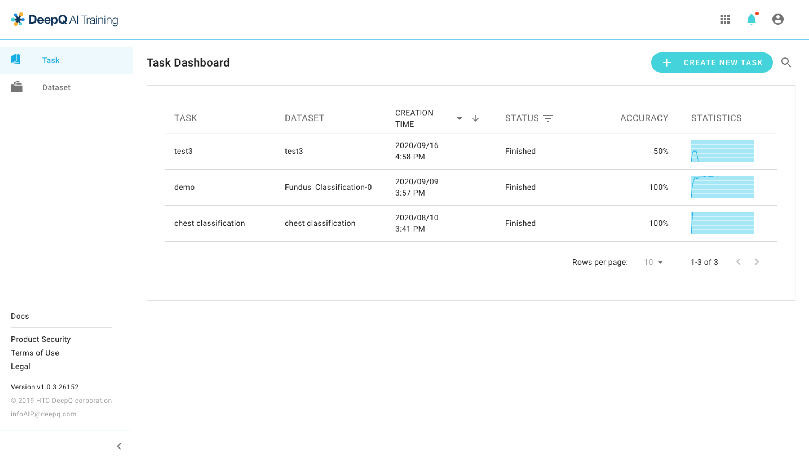
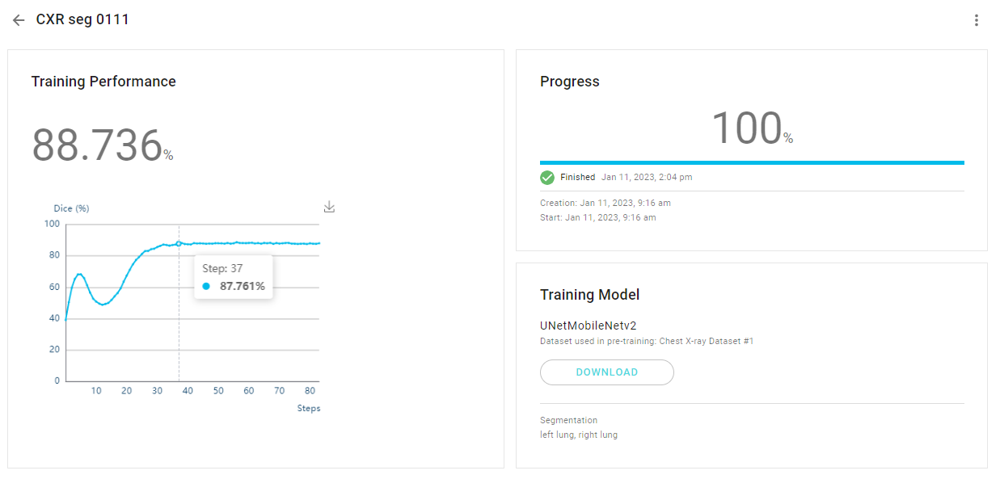
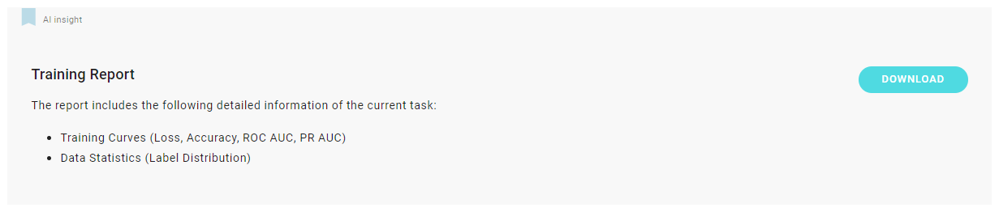
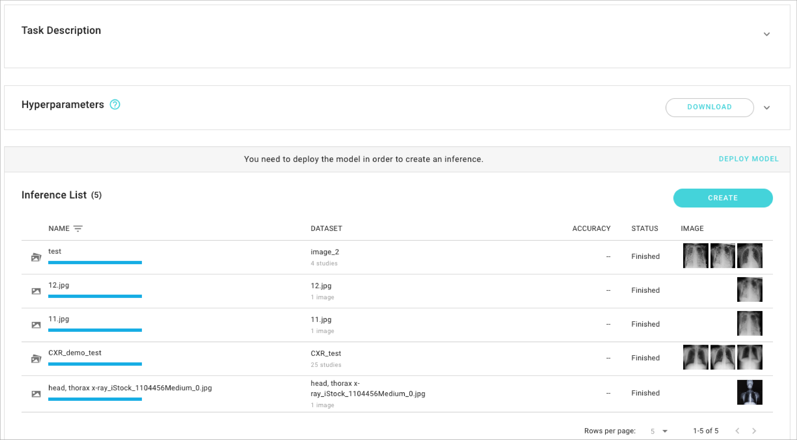
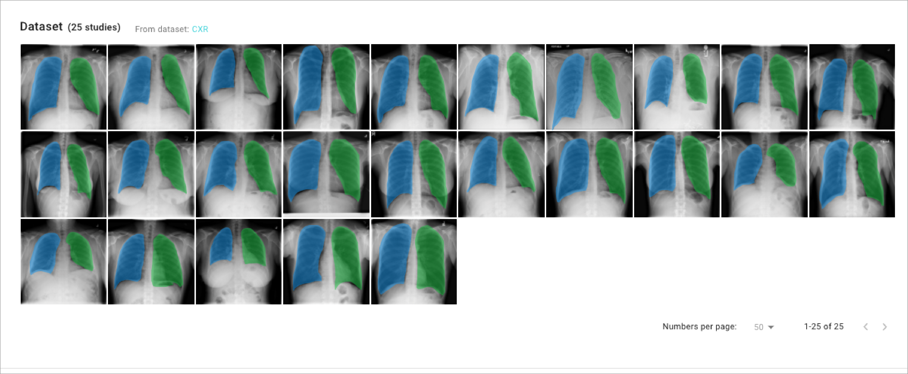

# 4.2 View/Manage Training Tasks

Once a training task is up and running, the owner may view and manage the task through the task dashboard.

* Training Accuracy demonstrates the relation between training progress and accuracy.
* Progress shows the training progress of this task.
* Training Model reveals the model used in this training task.

*

<figure><figcaption></figcaption></figure>

* Task Description will be shown here if any.
* Hyperparameters: Unfold the column to see the detailed hyperparameters, you can also download it to deploy on your own model.
* Inference List: You can view the inference detail about the dataset, accuracy, and status.

* Inference Dataset shows all the cases that have been trained in this task.

