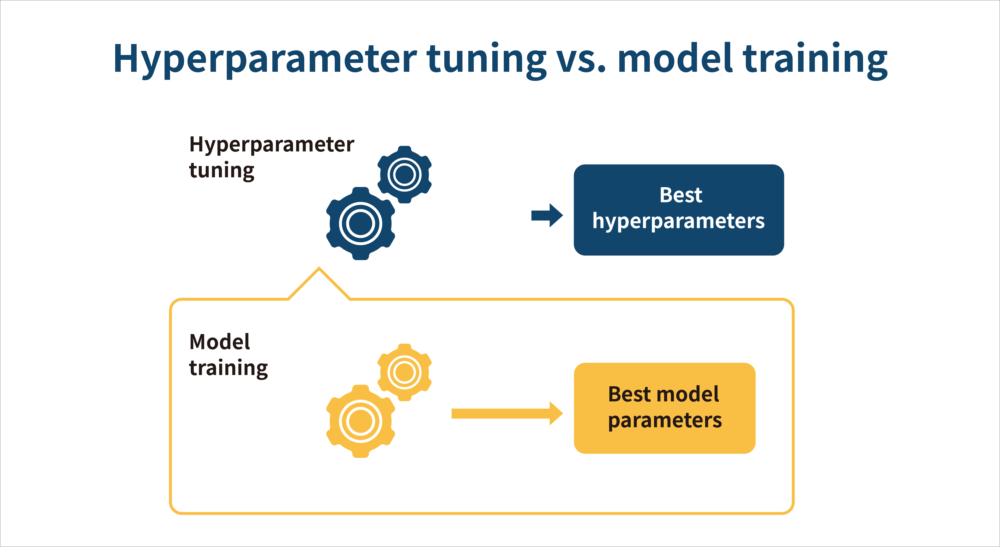
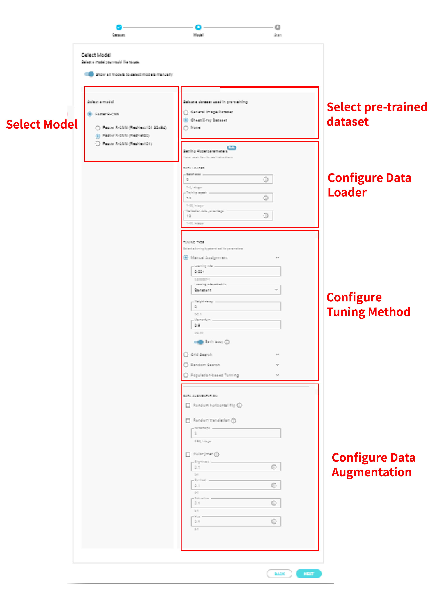
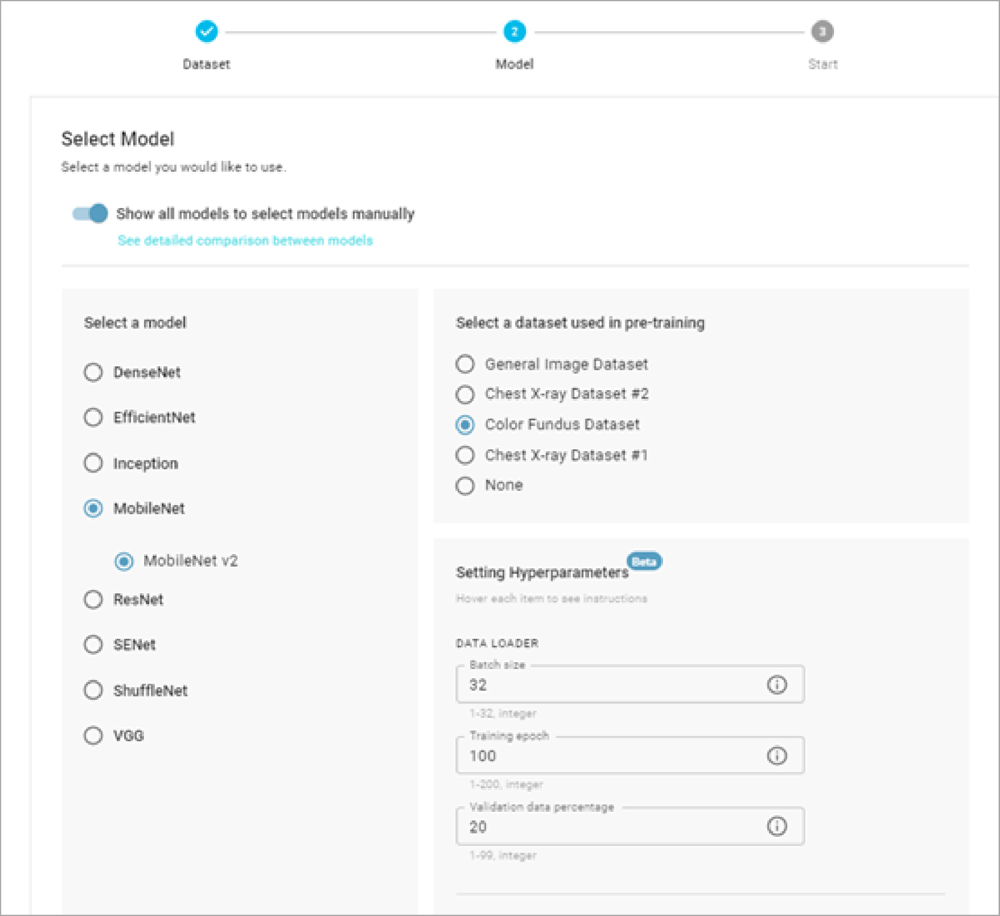
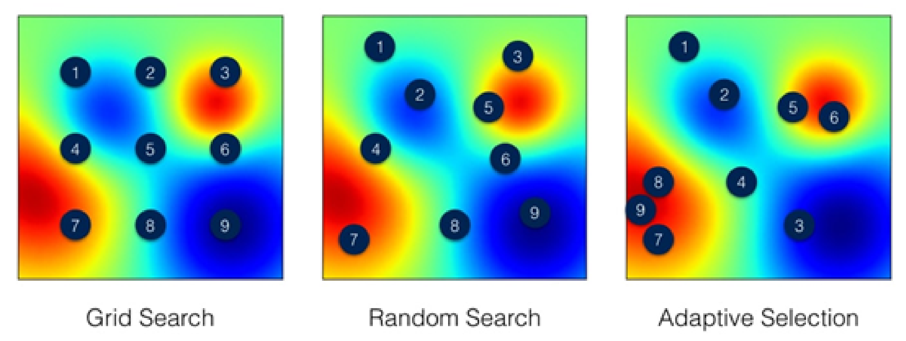
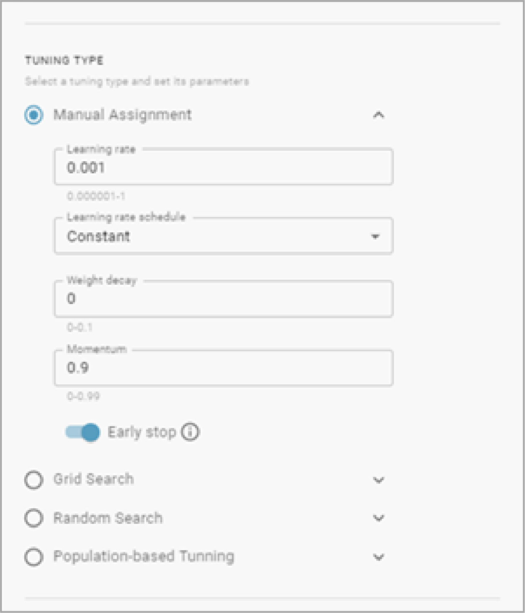
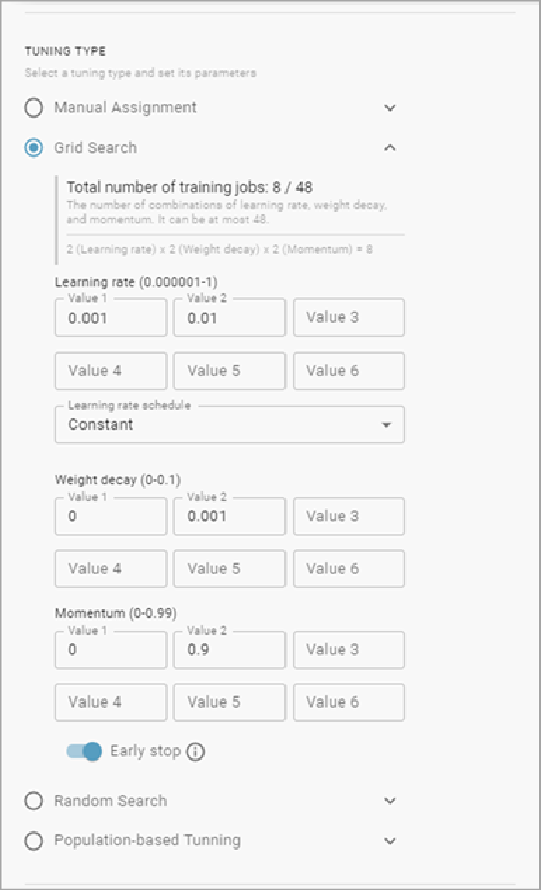
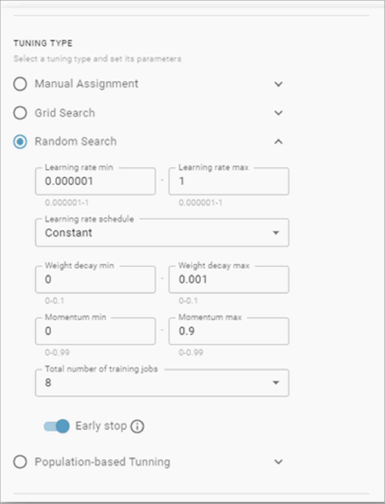
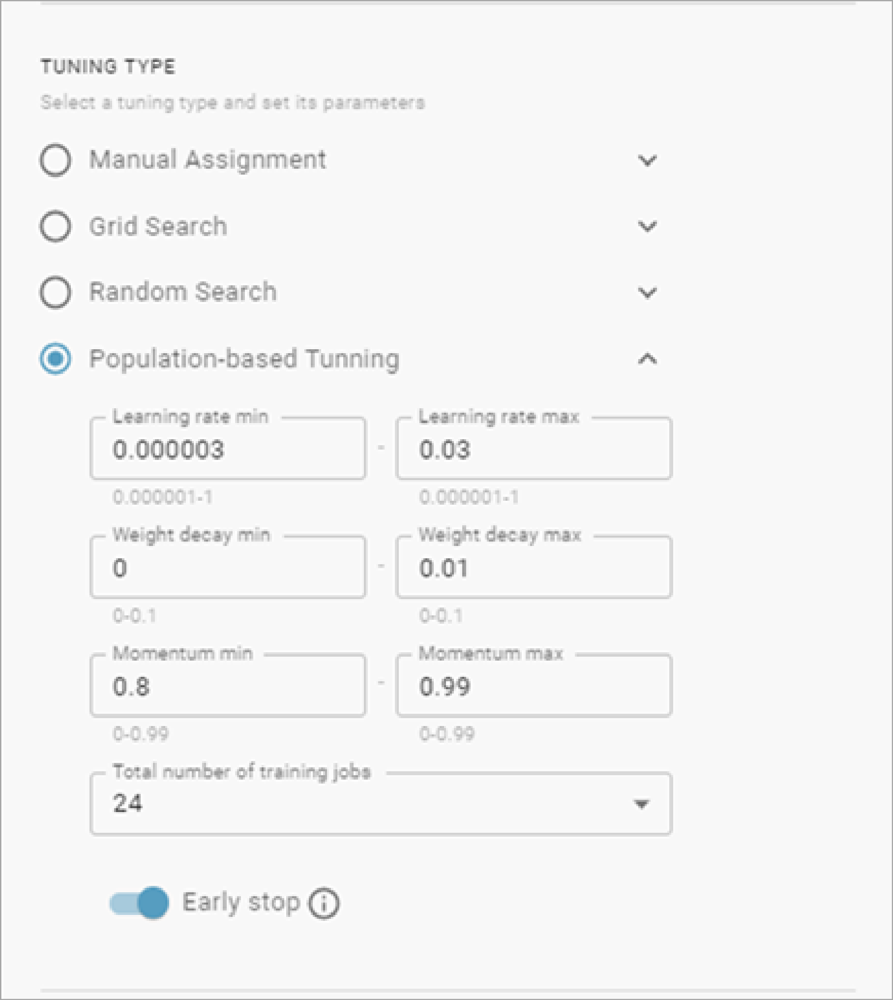
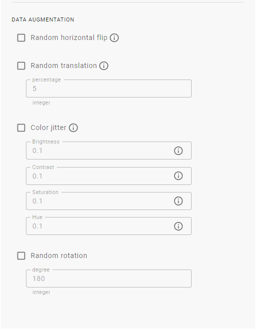

# 4.5 Model Training & Hyperparameter tuning explained

**What is hyperparameter tuning：**

In machine learning, hyperparameter optimization or tuning is the problem of choosing a set of optimal hyperparameters for a learning algorithm. A hyperparameter is a parameter whose value is used to control the learning process. By contrast, the values of other model parameters \\(typically node weights\\) are learned. The same kind of machine learning model can require different constraints, weights or learning rates to generalize different data patterns. These measures are called hyperparameters, and have to be tuned so that the model can optimally solve the machine learning problem.

### Setting Hyperparameters:

Hyperparameter setting in DeepQ AI platform involves three different sections: Data Loader, Tuning Type & Data Augmentation.

**Data Loader:**

Data loading is an important component of any machine learning system. When we work with tiny datasets, we can get away with loading an entire dataset into GPU memory. With larger datasets, we must store examples in main memory. And when datasets grow too large to fit into main memory, data loading can become performance-critical.

<mark style="color:red;">**Batch size:**</mark> <mark style="color:red;">The number of training examples of a mini-batch in each training iteration. Max batch size is determined by model size, image size & training GPU memory, therefore each training configuration might have a different Max. batch size.</mark>

Tips: Choosing a batch size that is too small will introduce a high degree of variance (noisiness) within each batch as it is unlikely that a small sample is a good representation of the entire dataset. Conversely, if a batch size is too large, it may not fit in memory of the compute instance used for training and it will have the tendency to overfit the data.

**Training Epoch:** The total number of epoch for training. An epoch is a term used in machine learning and indicates the number of passes of the entire training dataset the machine learning algorithm has completed.

Example: Assume you have a dataset with 500 samples/images and you choose a batch size of 20 and 100 epochs. This means that the dataset will be divided into 25 mini-batches (500/20), each with 20 samples. The model weights will be updated after each batch of 20 samples. This also means that one epoch will involve 25 mini-batches/updates to the model.

**Validation data percentage:** Validation Dataset is used to provide an unbiased evaluation of a model fit on the training dataset while tuning model hyperparameters. In DeepQ AI platform the default validation data percentage is 20, meaning that 20% of the user’s training data will be used as validation data while the remaining 80% will be used to train the model (weights and biases in the case of a Neural Network).

Tips: When setting validation data percentage, there are two competing concerns: with less training data, your parameter estimates have greater variance. With less validation data, your performance statistic will have greater variance.

### Tuning methods:

Fig. 1 Hyperparameter tuning problem with a 2D search space. Each point represents a specific hyperparameter configuration and warmer colors correspond to better performance. Notice that adaptive selection methods for hyperparameter tuning proceed sequentially and concentrate on promising regions of the search space.

**Manual assignment:**

User assigns a single combination of hyperparameter and running a single training job. There is no searching whatsoever,

**Grid search:**

The traditional way of performing hyperparameter optimization has been grid search, or a parameter sweep, which is simply an exhaustive searching through a manually specified subset of the hyperparameter space of a learning algorithm. Since the parameter space of a machine learner may include real-valued or unbounded value spaces for certain parameters, manually set bounds and discretization may be necessary before applying grid search.

**Random search:**

Random Search replaces the exhaustive enumeration of all combinations by selecting them randomly. This can be simply applied to the discrete setting described above, but also generalizes to continuous and mixed spaces. It can outperform Grid search, especially when only a small number of hyperparameters affects the final performance of the machine learning algorithm. Random Search additionally allows the inclusion of prior knowledge by specifying the distribution from which to sample.

**Population based tuning (Adaptive selection):**

Population Based Training (PBT) learns both hyperparameter values and network weights. Multiple learning processes operate independently, using different hyperparameters. As with evolutionary methods, poorly performing models are iteratively replaced with models that adopt modified hyperparameter values and weights based on the better performers. PBT thus allows the hyperparameters to evolve and eliminates the need for manual tuning. The process makes no assumptions regarding model architecture, loss functions or training procedures. PBT is the default automatic tuning method in DeepQ AI platform.

### **Tuning Method—parameters:**

**Learning rate:** In machine learning and statistics, the learning rate is a tuning parameter in an optimization algorithm that determines the step size at each iteration while moving toward a minimum of a loss function. Since it influences to what extent newly acquired information overrides old information, it metaphorically represents the speed at which a machine learning model "learns".

**Learning rate schedule:** A learning rate schedule changes the learning rate during learning and is most often changed between epochs/iterations. There are 2 learning rate schedules in DeepQ AI platform: Constant & Step decay. The learning rate in constant schedule is fixed throughout the training while Step decay schedule drops the learning rate by a factor every few epochs.

**Weight decay:** When training neural networks, it is common to use "weight decay," where after each update, the weights are multiplied by a factor slightly less than 1. It is used as a tool to effectively prevent model overfitting.

**Momentum:** A sophisticated gradient descent algorithm in which a learning step depends not only on the derivative in the current step, but also on the derivatives of the step(s) that immediately preceded it. Momentum involves computing an exponentially weighted moving average of the gradients over time, analogous to momentum in physics. Momentum sometimes prevents learning from getting stuck in local minima.

**Number of training jobs:** The number of training jobs is determined by the tuning type and hyperparameter setting. The more training jobs per task will lead to more GPU/hrs consumption.

**Early stop**: By using early stop, the training task will stop when the validation loss stops decreasing, saving valuable computation resources if training results cannot be further improved. If early stop is turned off, the training task will complete all training jobs in a task regardless the training performance. Early stop sometimes is also used to prevent the model from overfitting.

### **Data augmentation:**

Data augmentation in data analysis are techniques used to increase the amount of data by adding slightly modified copies of already existing data or newly created synthetic data from existing data. It acts as a regularizer and helps reduce overfitting when training a machine learning model.

**Random Horizontal flip:** flipping the image horizontally with a probability of 50%.

_Tips: If the training task involves identifying objects that may appear symmetrical: left kidney & right kidney instead of “kidneys”, Random Horizontal flip should be disabled to avoid confusing the model._

**Random resized crop:** randomly crop an image to a random size of the original size and a random aspect ratio.

**Color jitter:** Randomly change the brightness, contrast, saturation & hue of an image.

_Tips: in the case of monochrome images (black & white, such as MRI, CT, X-ray..etc.), saturation & hue will not do anything and is advised to be disabled._
