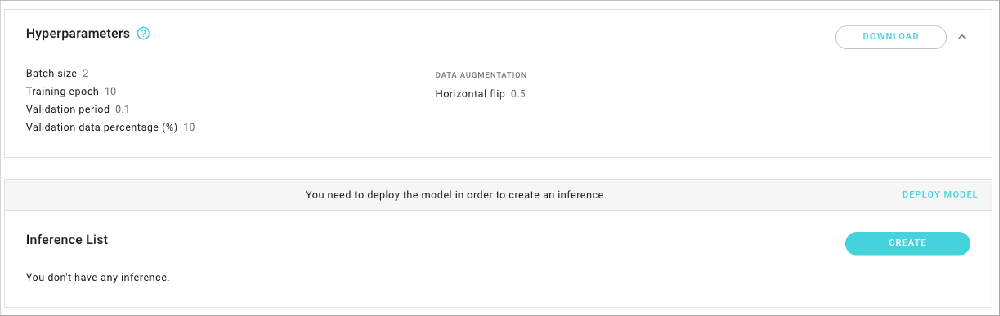
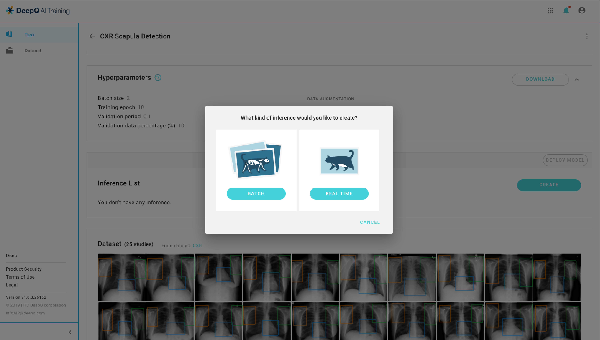
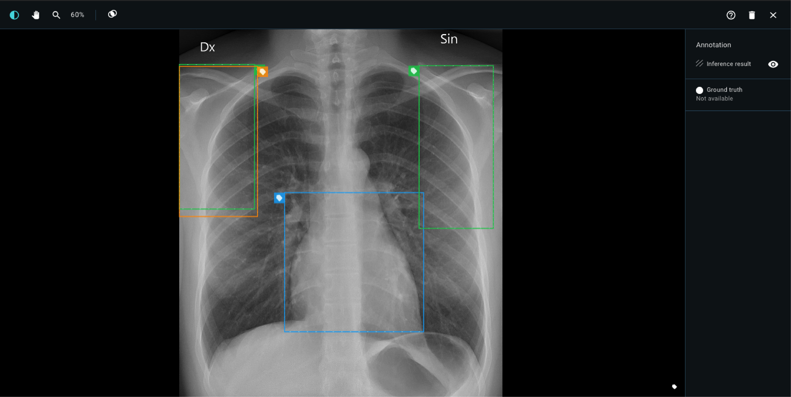
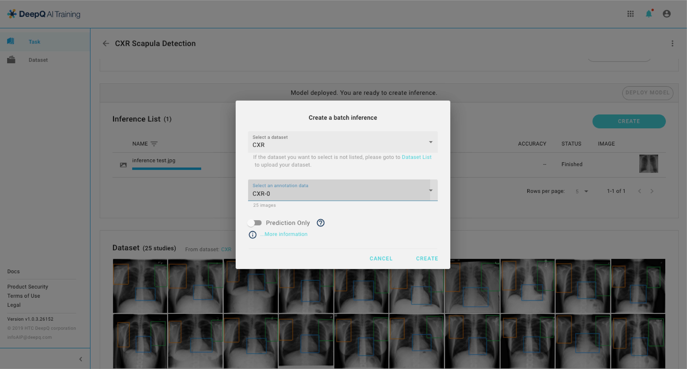
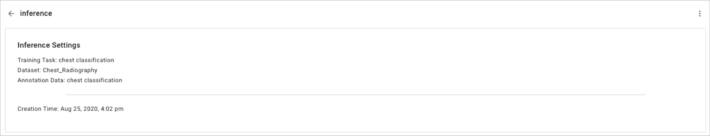
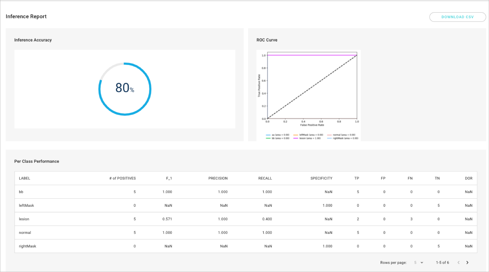

# 4.3 Running Your Models

## Deploy Model & Inference

* You have to deploy the model before creating any inference task.

* There are two modes of model inference: batch & real-time.

### Real-time inference

* **Real-time inference:** Select and open one JPG/ PNG image from your local device, the inference result will be shown automatically . 

### Batch inference

* **Batch inference:** Select one of the dataset that you have uploaded from the drop list, enter the inference name and complete the creation process. 
  * Prediction only: For datasets without annotation data, inference result will only provide prediction results without an inference report.

## View Inference

### Annotation Data \(with ground truth/label\)

* The inference detail, including  training task, dataset, and annotation data will be shown here. 

* The performance of each inference job is presented by the metrics of each type of application. for more information, please see [Deep Learning metrics explained](../deep-learning-metrics-explained/). 

### Prediction only

* Each image of the selected dataset will be shown in the last column, you can check the result by clicking on the image. 

