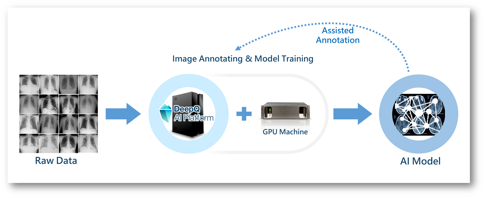
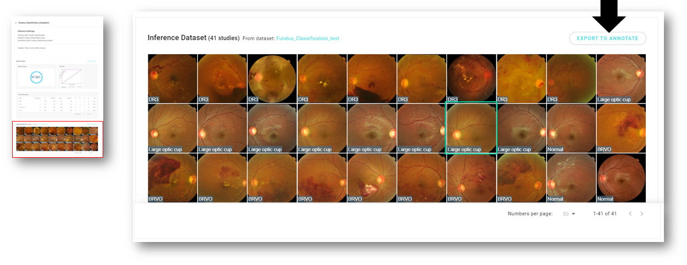
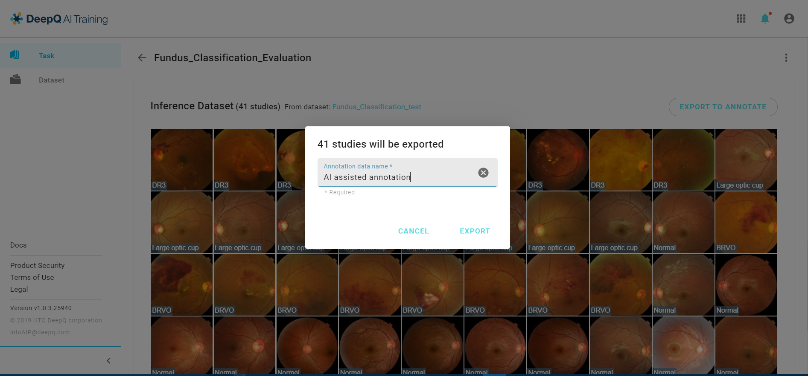
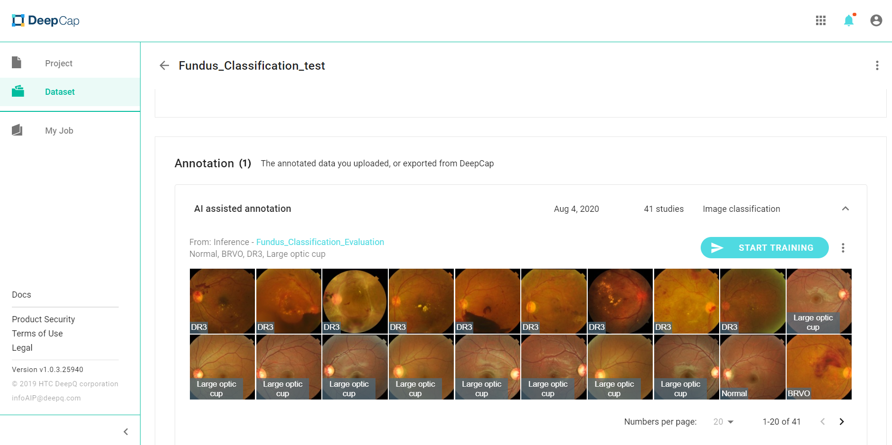
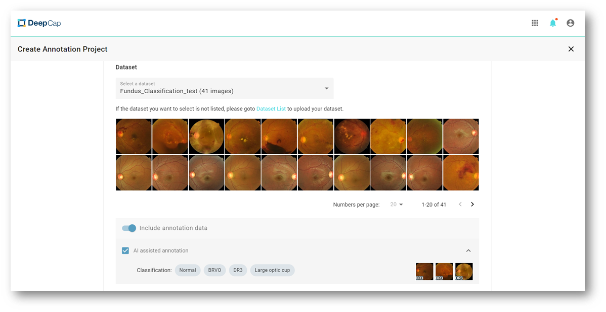

# 4.3.1 AI Assisted Annotation

An algorithm trained to classify Chest X-ray images cannot help in segmenting tumors in brain MRI since each Deep learning algorithm is task-oriented. AI assisted annotation must start with an neural network trained specifically for the same purpose.\

### AI Training

* Create an prediction only batch inference.
* Select the dataset from the inference list, and click on the "EXPORT TO ANNOTATE" tab to start the AI assisted annotation task.

* Name the annotation data that you want to export.

* The column below shows the dataset details, where you can make sure if you have select the right one.

### DeepCap

* Back to DeepCap, and create an annotation project.
* Select the dataset from the drop list, enable the option "Include annotation data", and choose the one that have been annotated by AI.

