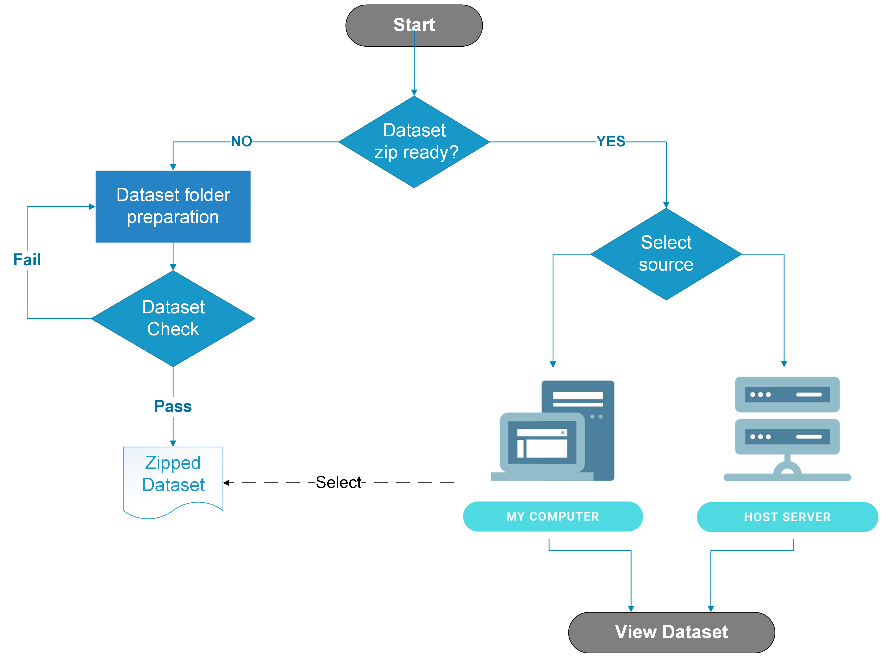

# 2.3 Upload Dataset

DeepQ AI Platform requires users to upload/import datasets from different sources, the dataset preparation flow is shown in the figure below.

<mark style="color:yellow;">Tutorial Video:</mark> [dataset-upload-management.md](../../tutorial-videos/dataset-upload-management.md "mention")

###
