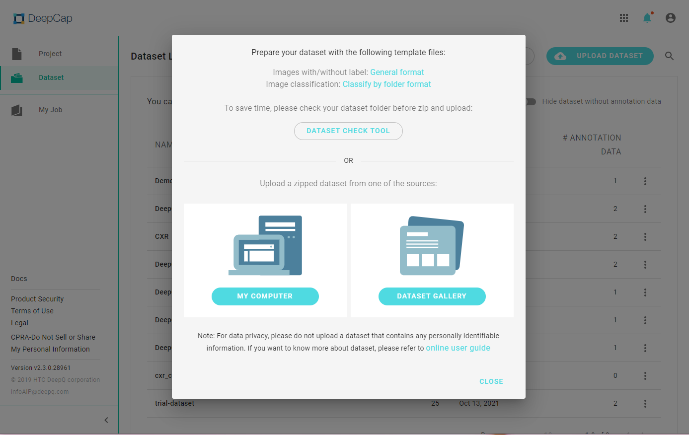
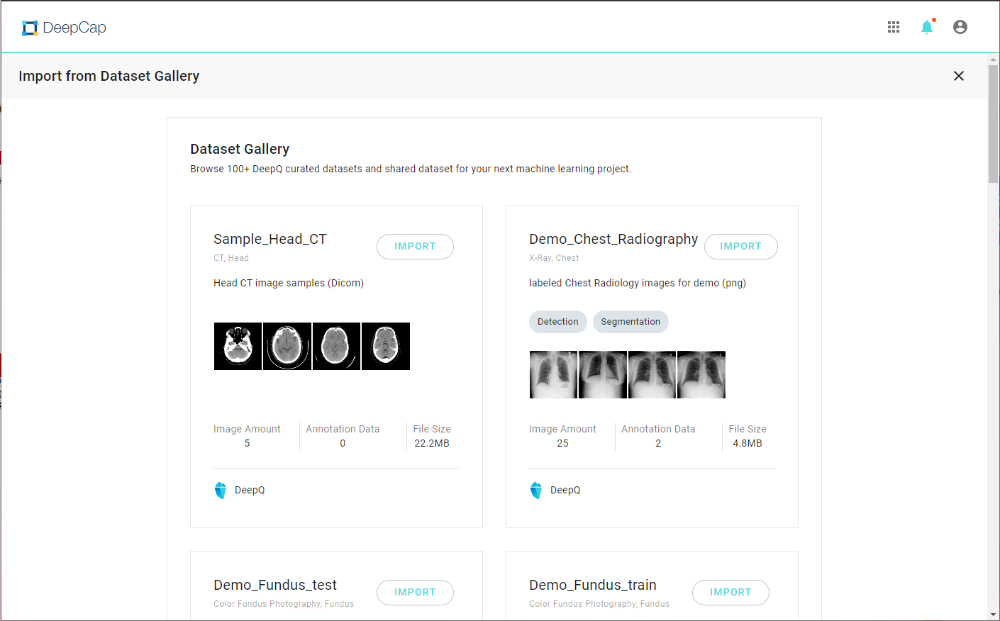
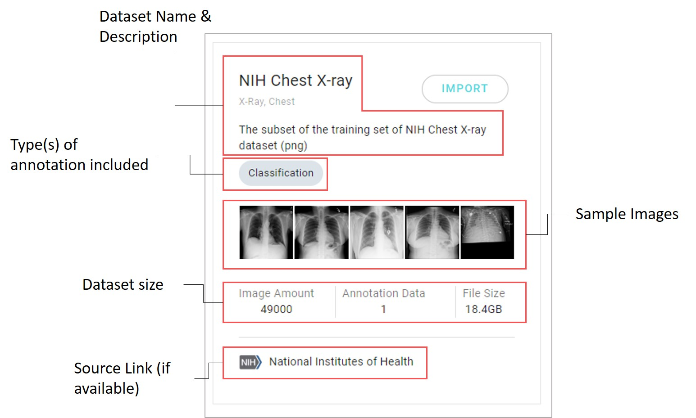

# 2.3.3 Dataset Gallery

Other than uploading datasets from a local computer, users may select datasets that have been uploaded to the DeepQ AI platform's dataset gallery. Please contact the system admin or DeepQ personnel to learn more about these datasets.

