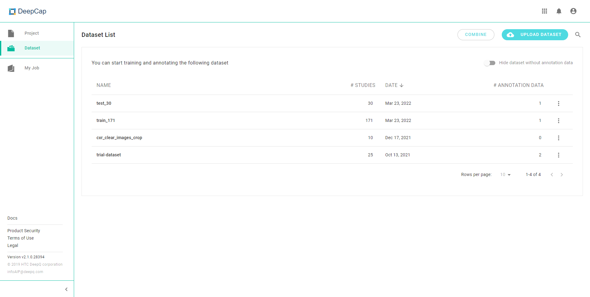
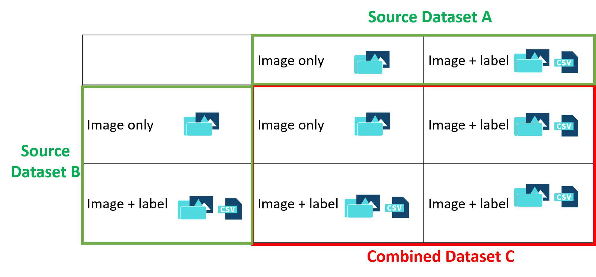

# 2.6 Combine Datasets

* Users can create new datasets by combining existing datasets.
* Click on the "**COMBINE**" tab at the upper right corner of the Dataset list

### Rules of Dataset combination

* If all source datasets are images, the combined result will consist only images.
* A new label will be created in the combined result if **at least one label** is selected from source datasets.
* Only **the same type** (classification, detection, segmentation) of labels can be combined.
* Dicom images will be converted to png format if the combination involves mixed image formats.

