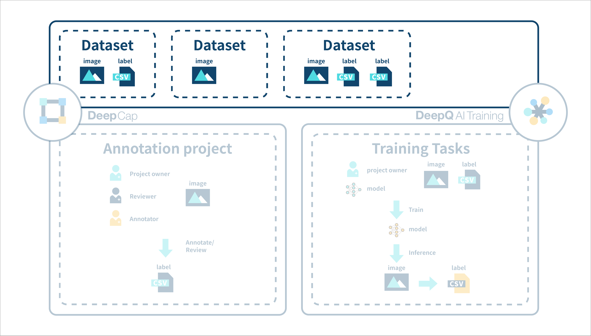

# 2. Dataset

The dataset is shared between DeepCap and DeepQ AI Training, and can be used for annotation, model training and testing.

 (1) (1).png>)

* .png>) **Upload Dataset:** Click on this button and upload your dataset in DICOM/ JPG, PNG form.
* .png>) **Search:** Search for your uploaded dataset by its name.
* The Dataset list shows all the datasets uploaded by the user and # of studies contained in each dataset
* The number of annotation data attached is shown, each dataset can have mutiple annotation data of differet types of labeling and number of studies (subsets).
* Users can hide the datasets without annotation by the toggle button  (1).png>)
* If there is no annotation data, the user has to create an annotation data via annotation project, or else it cannot be used to train an AI model.
* DICOM, JPG and PNG are acceptable image format. Both width and height should be between 16px and 4096px.

### Dataset Detail View

* Selecting a dataset brings out the detail view, showing the raw data (images) and annotation data attached under this image dataset.

.png>)

* Each dataset can contain multiple annotation data with differnt types or differnt number of studies. (the number of studies in an annotation can be a subset of the whole dataset)

.png>)

* Clicking on the thumbnail of raw data(image) opens up the image viewer with essential browsing functions such as pan, zoom in/out & brightness/contrast adjustment.

 (1) (1).png>)

* expanding each annotation shows the labels in the form of thumbnails, clicking on each thumbnail opens the image viewer for a more detailed inspection.

 (1).png>)

Other than the browsing tools, user can toggle on/off the labels by clicking on the  (1) (1).png>)
