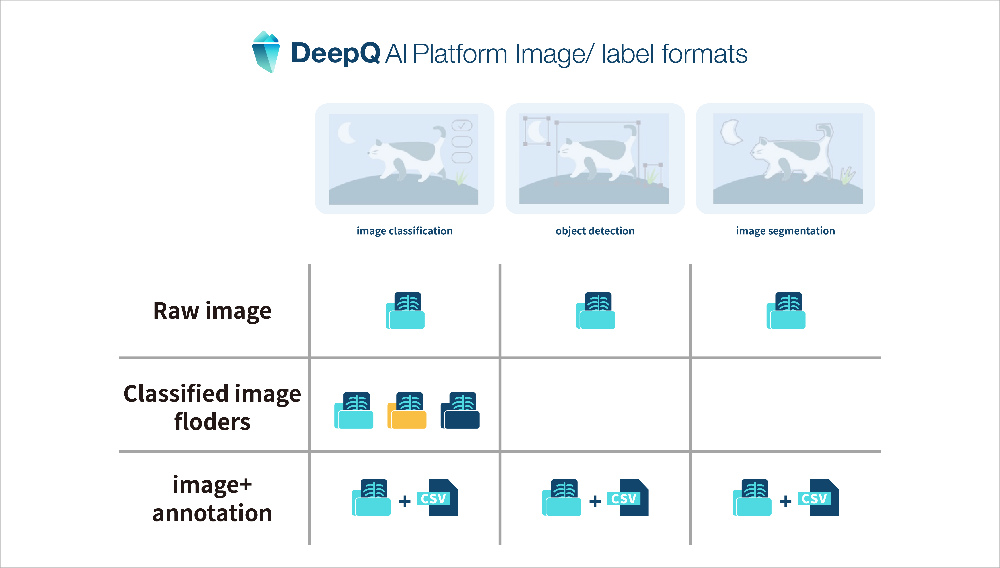
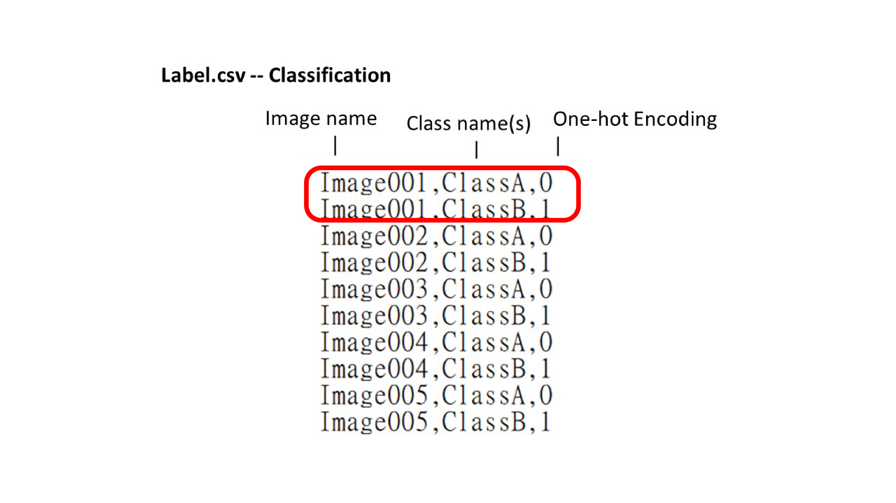
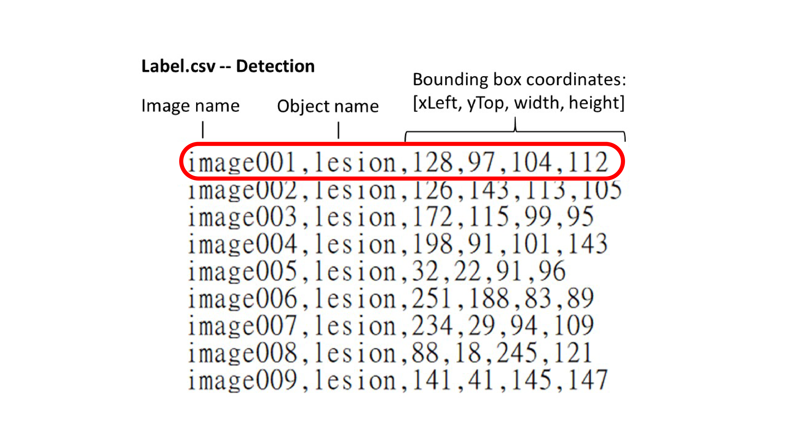

# 2.2 Annotation Data Formats

## Image Classification:

* Each line specifies the name of an image file and its category label that are separated by a comma. 
* The same image should be repeated N times, where N is the number of classes assigned. 
* The pairs of an image name and a category label start from the first line. That is, there is no CSV header in the label file. 
* Pure number \(e.g. 001\) as  class names must be double quoted. \(e.g. "001"\). 

## Object Detection:

* Each line specifies a bounding box of an object.
* Each line must include 6 fields, separated by a comma: image name, object name, xLeft, yTop, width, height. _\*\*_
* \(xLeft, yTop\) is the top-left vertex of the bounding box, and width and height indicate the width and height of the bounding box. 
* \(x, y, w, h\) can be either integer or floating-point numbers. 
* If an image contain more than 1 bounding boxes, it can be shown in multiple lines.
* The bounding box lines must start from the first line. That is, there is no CSV header in the label file. 
* Pure number \(e.g. 001\) as class names must be double quoted. \(e.g. "001"\). 

## Object Segmentation:

DeepQ AI platform uses a proprietary format for object segmentation that offers better flexibility in label modification and storage efficiency. If you want to export your segmentation label as a specific format, please contact DeepQ for assistance.

