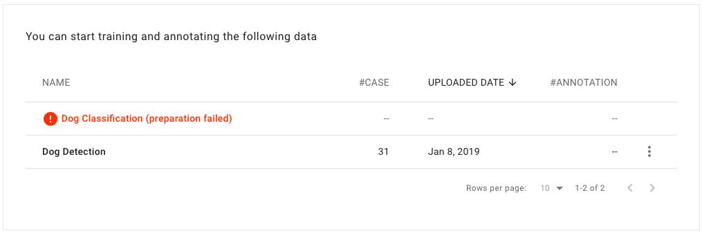
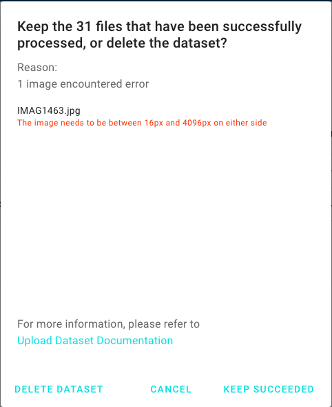

# Manage Datasets \(改圖\)

## Dataset List

After uploading the dataset successfully, you can view the datasets in the “Dataset” tab. 

  
The alert message of “preparation failed” is presented if the dataset format you uploaded is not compatible. Click on the dataset and view the error message. You can either save the successful cases and continue, or you can delete the entire dataset and upload a new one.

改圖

## Delete a Dataset

Rules of deleting a dataset: 

* The dataset you want to delete should not be related to any existing annotation project or training task. If it is related, then you need to delete that project/ task first and then delete the dataset. 

