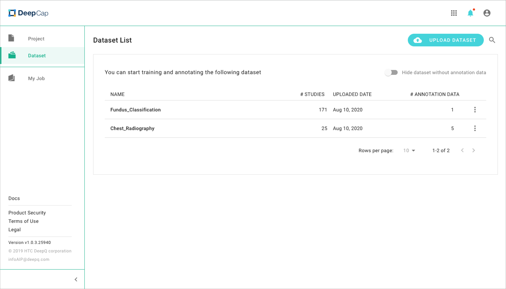
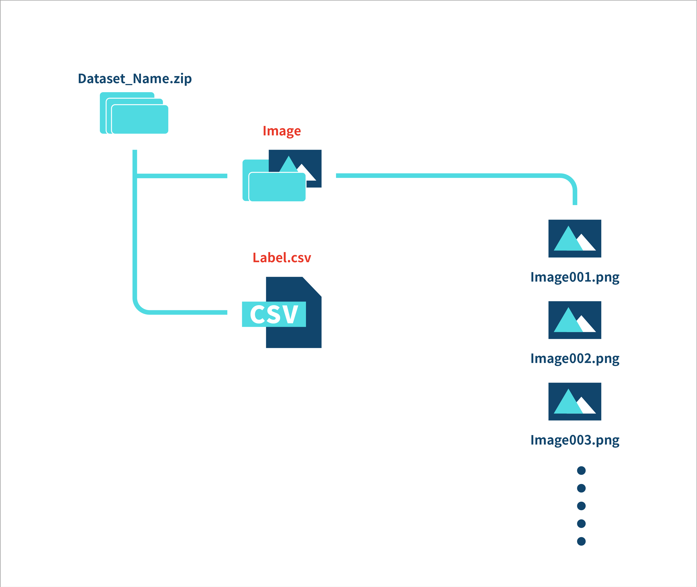
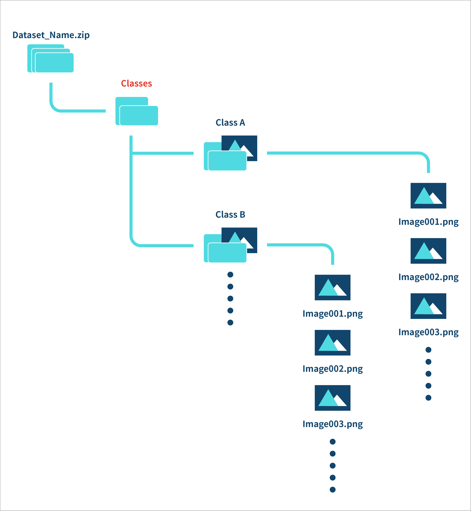
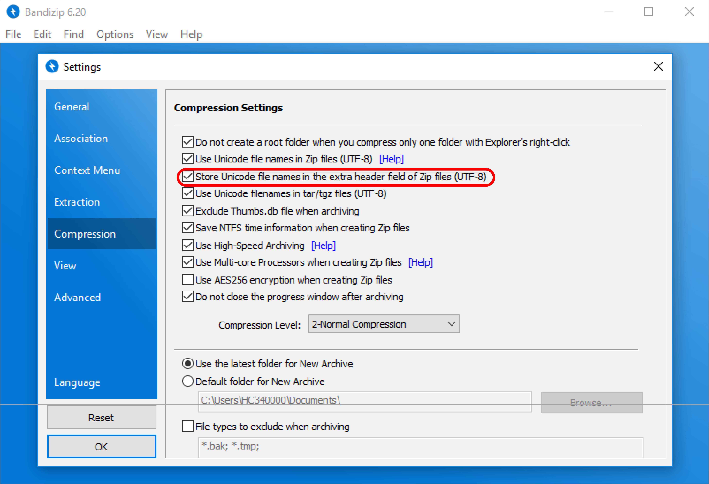

# 2.1 Dataset Format

## **Introduction**

\*\*\*\* **Upload Dataset:** Click on this button and upload your dataset in DICOM/ JPG, PNG form.

\*\*\*\* **Search:** Search for your uploaded dataset by its name.

## Dataset Format

Please check your dataset and image format before uploading.

### General Dataset format: zip file

* **"Image Only" datasets:**  Only a folder of images should be presented here. Please note that the folder name must be “**image**,” entirely in lowercase letters.    
* **"Image & Annotation" dataset:** A folder named “**image**” \_\_in lowercase and a file specifying the label of each image, “**label.csv**” should be presented here. You can either zip “image” and “label.csv” or put them into another folder and zip that folder.
  * CSV file: - For image classification: 3 columns - For object detection: 6 columns

    **For annotation file \(label.csv\) format, please refer to** [**Annotation Data Formats**](annotation-data-formats.md) _\*\*_

### Special case \#1: Import single-label classification data from separate folders

In the case of single-label classification \(each image can only be assigned to one class, as opposed to multi-label classification\) data, 

## Special case \#2: structured jpg/png

In some cases, DICOM image data has to be converted into jpg/png and might lose hierarchical information embedded in DICOM tags. As a result, computer programs will view each image as an independent entity make viewing/annotating/organizing images difficult.

#### Notice:

For Windows users, please compress your file by "Bandizip" tool and process as the following steps if the name of your images are non-English format.

1. Compression Setting: Select "Store Unicode file names in an extra header field if Zip files \(UTF-8\)".
2. Compress "xxx.zip".

#### Naming the zip file:

The name of the dataset should be the same as that of the zip file you uploaded, which cannot be edited in the “Dataset” tab. You can rename the zip file before you upload it.

