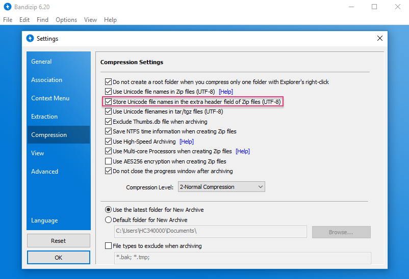
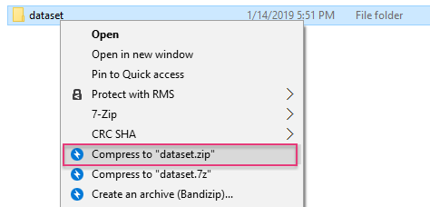

# Upload Datasets

## \*\*\*\*

## **Introduction**

\*\*\*\* **Upload Dataset:** Click on this button and upload your dataset. 

\*\*\*\* **Help:** ~~You can find useful details pertaining to the dataset format details from here.~~ Detailed description of dataset format.  \(elly\)

\*\*\*\* **Search:** ~~You can \(Elly\)~~ search for your uploaded dataset by its name.

## Dataset Format

Please check your dataset and image format before uploading. 

### Dataset format: zip file

* **Without annotation:** Only a folder of images should be present here. Please note that the folder name must be “**image**,” entirely in lowercase letters.   
* **With annotation:** ~~****A folder named as “**image**” __ and a file specifying the label of each image, “**label.csv**” should be present here~~. ~~Please note that the image folder name should be named as “image,” entirely in lowercase letters. For the CSV file, the number of columns can only be two for image classification and six for object detection.~~ ~~You can either zip “image/” and “label.csv” or put them into another folder and zip that folder. For annotation file format, please see~~ [~~Annotation Data Formats~~](annotation-data-formats.md) ~~~~  
  
  \(elly\)  
  A folder named “**image**” __in lowercase and a file specifying the label of each image, “**label.csv**” should be present here. You can either zip “image” and “label.csv” or put them into another folder and zip that folder.

  * CSV file: - For image classification: 2 columns - For object detection: 6 columns  

   For annotation file format, please see [Annotation Data Formats](annotation-data-formats.md) 

  

### Import multi-class data from separate folders 

#### Notice:

 For Windows users, please compress your file by "Bandizip" tool and process as the following steps if the name of your images are non-English format.

1. Compression Setting: Select "Store Unicode file names in an extra header field if Zip files \(UTF-8\)".
2. Compress "xxx.zip".

#### Naming the zip file: 

The name of the dataset should be the same as that of the zip file you uploaded, which cannot be edited in the “Dataset” tab. You can rename the zip file before you upload it.

