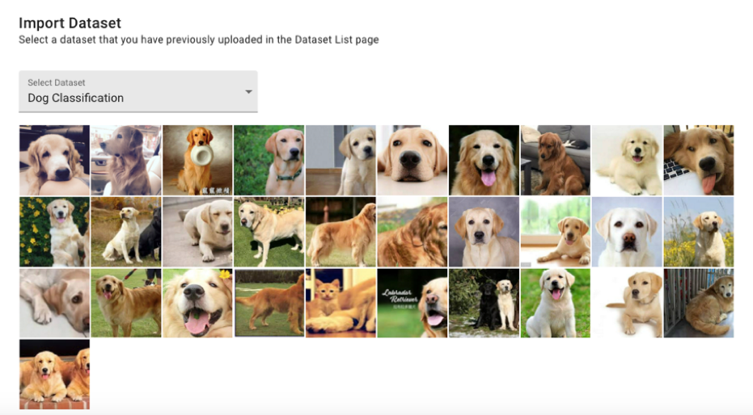
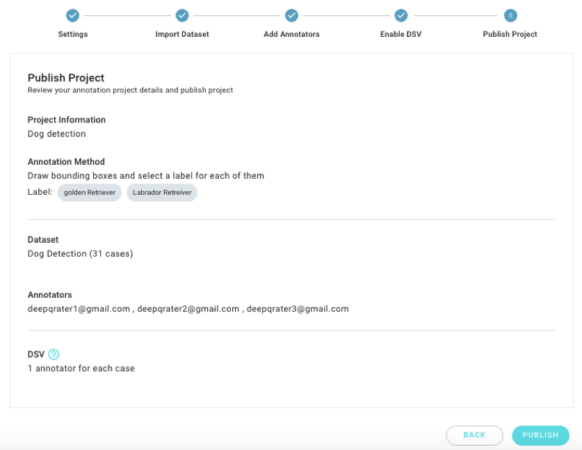

# Create an Annotation Project

DeepCap is an annotation tool with a project-based workflow and a simple interface. You can create projects, complete settings, import datasets, add annotators, enable DSV and publish projects to scale-up qualified training data. Let’s start.

## Project List

In the “Project” tab, you can view the annotation status of all the projects that you have created.

\*\*\*\* **Sort:** Sort your projects by using the “Last created”, “Least progress”, “Last modified” and “Name A-Z” functions. 

\*\*\*\* **Filter:** Filter your projects by using the “Ongoing” and “Stopped” status functions. 

\*\*\*\* **Search**: Search your projects by using the “Project name” function.

## Create Project

\*\*\*\* **CREATE PROJECT:** Click on this button and select “Image Classification” or “Object Detection” for your annotation project.

## Settings

Input project information and the annotation method to be used. Please note that annotation methods of “Image Classification” and “Object Detection” are different. The changes made using these methods cannot be edited once the project is published. For “Image Classification”, at least two labels are required for each annotation project.

## Import Dataset

Import one of the datasets you have already uploaded from the drop list. If you cannot find the dataset that you require for this project, please upload a new dataset in the “Dataset” tab. After selecting a dataset, you can preview all the cases to ensure that you have selected the correct dataset.

## Add Annotators

Invite annotators by email. You can view the registration status of your annotators. Each annotator can be removed after selection.

* **Ready:** Annotators are already registered in the DeepQ AI Platform service. 
* **Pending Registration:** Annotator have not been registered in the DeepQ AI Platform service.

## Enable DeepCap Smart Validation \(DSV\)

Cases from the dataset are automatically distributed to the annotators. To prepare qualified data for training, the DeepCap Smart Validation \(DSV\) function can be enabled if the number of annotators in this project is greater than or equal to two. For example, two or three annotators can be selected to work on each case if the project has three annotators. The DSV function provides a consistent rate based on the DeepQ original algorithm for an iterative annotation process. DeepCap suggests accurate ground truths for model training. **Please note that the number of annotators to work on each case cannot be edited once the project is published.**

## Publish Project

After you have previewed the project details that you have set in previous steps, the annotation project can be published. Then, all the annotators who were invited receive the invitation mail, and the annotation process is initiated.

Congratulations! You can now check your annotation project progress and annotation details from the Project Dashboard.

## View Details

Click on “VIEW DETAILS” to check annotation details of each project that you published. 

**A:** Project settings information 

**B:** You can monitor the annotation progress of your project. If the iteration you set is three, then the quantity of “saved cases” is equal to the annotation quantity that is completed by three annotators. 

**C:** Export your dataset to DeepQ AI training service in one click. 

**D:** Use the “Edit project name”, “Edit instruction for annotator”, “Stop project” and “Delete  
project” functions as required from the menu button. 

**E:** Filter cases based on the annotation status.

| Annotation Status |  |
| :--- | :--- |
| Remaining     | These cases have not been annotated by all assigned annotators.  |
| Saved  | These cases have been annotated and saved by all assigned annotators.  |
| Returned | 
These cases have been returned to one of the assigned annotators. |
| Revised | These cases have received all the requested revisions.  |
| Excluded | These cases have been manually set to exclude from export.  |
| DSV failed | These cases did not pass the consistency standard. |

**F:** Click on each thumbnail image to annotate. “Saved” cases might be indicated using a  
“green tick”. Thus, you can also view the annotation status on this preview mode. 

**G:** Export to an annotated dataset. 

**H:** You can add new annotators before the project is stopped and completed. The cases will be re-allocated once you add new annotators. 

**I:** An annotator can be suspended and removed from you project.

* **Suspend:** An annotator’s job will be released when they are suspended from the project. The suspended status can be resumed. 
* **Remove:** An annotator’s job will be released when they are removed from the project. A removed annotator cannot be added again once removed by a project owner.

Click on one of the cases to view the annotation status. You can return \( \) this case to an annotator or exclude \(\) this case from AI training if the annotation result is not qualified based on your consideration.

## Export Annotated Dataset for Training

The following annotated dataset cannot be exported for training.

* **Without annotation result:** There are no any saved annotations for this dataset. 
* **User exclude:** A project Owner excludes \(\) that case. 
* **System exclude:** The DSV result excludes that case because of an unacceptably lower consistency rate. 
* **Problematic image:** Annotated as “Problematic image” by an annotator.

The following annotated dataset would be excluded from export for training.

* **User exclude:** A project Owner excludes \(\) that case. 
* **System exclude:** The DSV result excludes that case because of an unacceptably lower consistency rate. 
* **Problematic image:** Annotated as “Problematic image” by an annotator.

## Annotation Conditions for Training

To deliver the best possible training performance, please ensure that your annotation meets our system requirements.

* **Image Classification:** The annotated dataset should contain at least two categories and each category should be used as an annotation on at least two cases. For example: Category “Dog” was used on cases A and B, and category “Cat” was used on cases C and D.

| Dataset | Annotation |
| :--- | :--- |
| Case A | Dog |
| Case B | Dog |
| Case C | Cat |
| Case D | Cat |

* **Object Detection:** The annotated dataset must contain at least three cases, and each case should be annotated with at least one bounding box. For example, Cases A, B, and C should be annotated with at least one bounding box.

| Dataset | Annotation |
| :--- | :--- |
| Case A | Bounding Box with Tag “Dog” |
| Case B | Bounding Box with Tag “Dog” |
| Case C | Bounding Box with Tag “Cat” |

