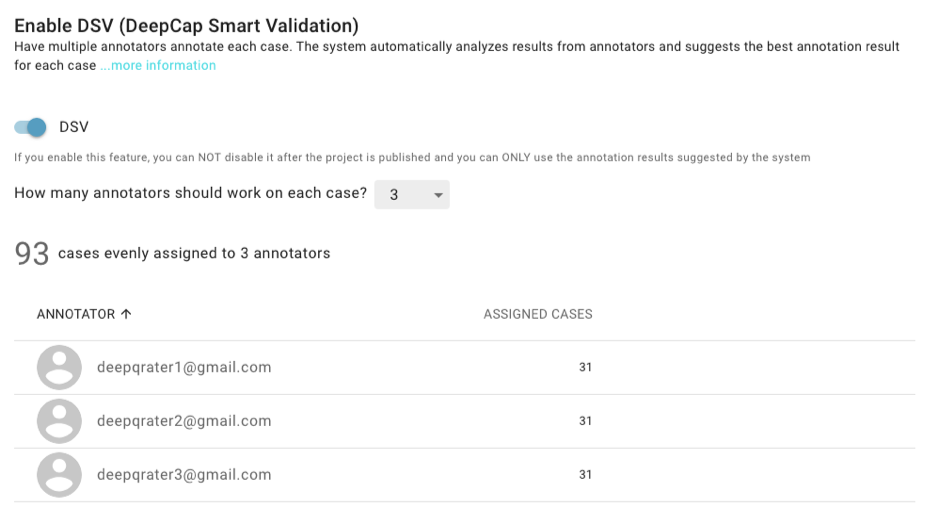
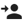
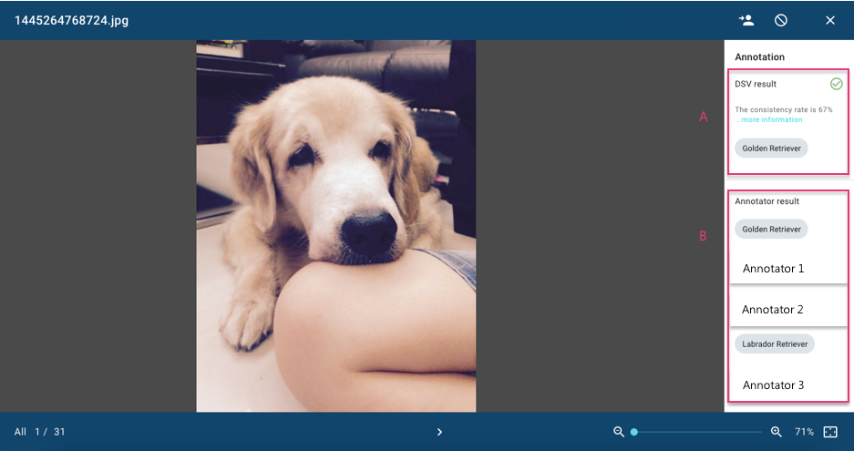
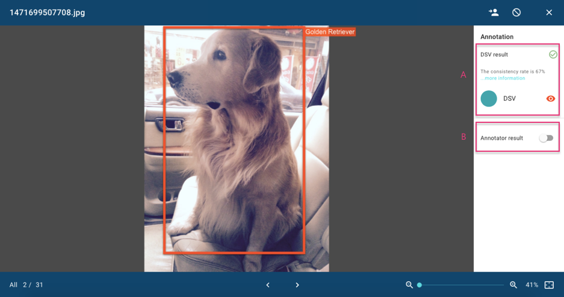
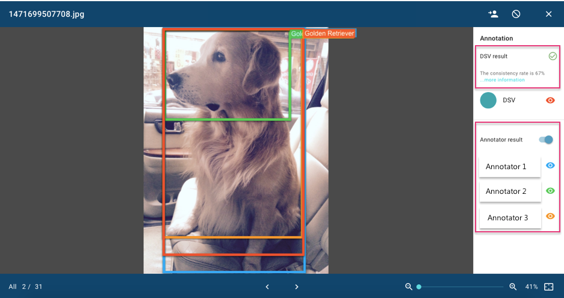
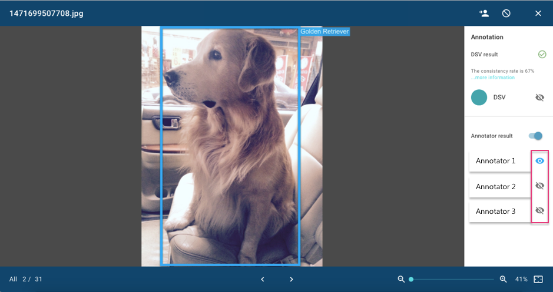

# DeepCap Smart Validation \(DSV\)

DeepCap Smart Validation provides a consistent rate based on DeepQ original algorithm for an iterative annotation process. The system suggests annotations and provides accurate ground truths for model training.

## Enable DSV During the Project Creation Process

You can enable DeepCap Smart Validation \(DSV\) function if the number of annotators in this project is greater than or equal to two. For example, you can select two or three annotators to work on each case if the project has three annotators. The maximum number of annotators that can be assigned to work on each case you can set is five.

Notice: 

1. The number of annotators to work on each case cannot be edited once the project is published. 
2. The DSV result is applied as the default value to export for training. 
3. You can return each case to the annotator or exclude it from artificial intelligence \(AI\) training if the DSV result is not acceptable to your requirements.

## View DSV result from Annotation Details

As a project owner, you can view the DSV result that the system suggests for each image and can check each annotation result from each annotator.

#### Image Classification:

* **DSV result \(A\):** The suggested label for the entire image and consistency rate can be presented in this area. The DSV calculation for image classification is simple as the DSV result is determined by estimating the majority consensus. For example, suppose that three annotators work on each image. The consistency rate is 67% if two annotators select the same label for an image. The DSV result is presented as “failed” if the consistency rate is less or equal to 50%. In this case, you can return \(\) this case to the annotator or exclude \(\) this case from AI training. 

* **Annotator result \(B\):** You can view the result labeled by each annotator in this area.

The DSV result is presented as “failed” if the consistency rate for the entire image is less than or equal to 50%. If a case has failed, you can return \(\) this case to the annotator or exclude \(\) this case from AI training.

#### Object Detection:

* **DSV result \(A\):** The suggested bounding box and consistency rate might be presented in this area. You can disable the DSV bounding box to show on the image by clicking “”. The DSV result for object detection is based on the following calculation steps.

1. Calculate IoU for each two bounding boxes from different annotator.
2. Grouping the bounding boxes. 
3. Calculate the average of the bounding box groups.

* **Annotator result \(B\):** You can enable “annotator result” to view all bounding boxes annotated by each annotator on the image. You can disable any annotator’s annotation result by clicking on “”. The remaining bounding boxes will be presented on the image.

**\[Disable annotator result\]**   

**\[Enable annotator result\]**

**\[Disable DSV and any annotator’s annotation\]**

