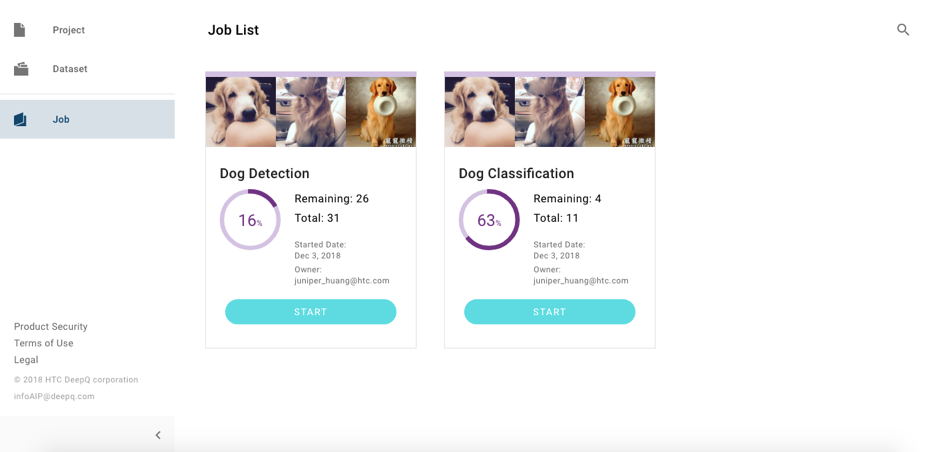
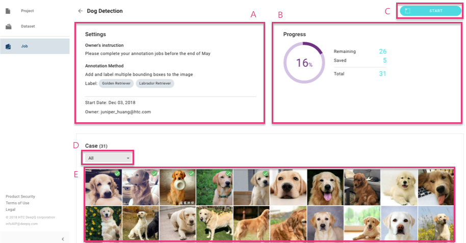
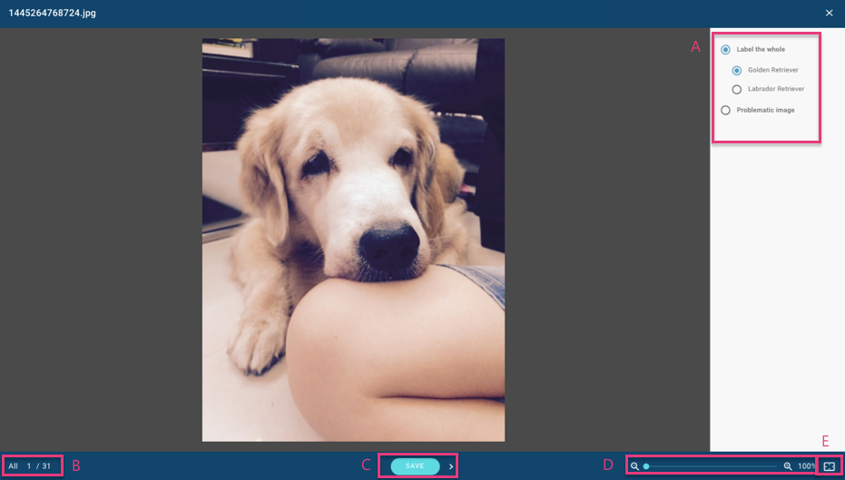
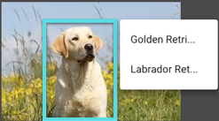
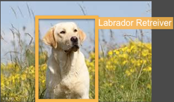
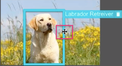
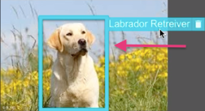
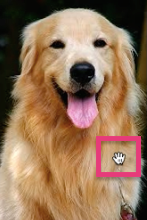
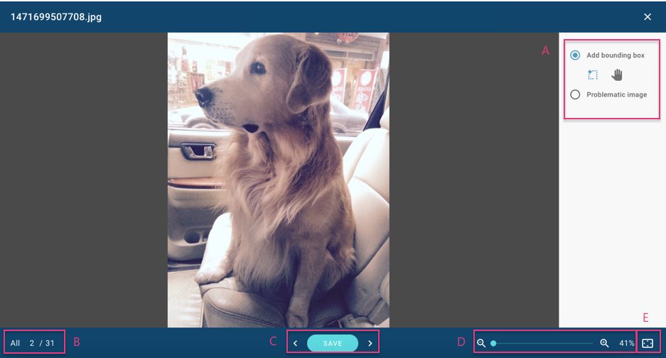

# Start Annotation

After you click on the “Job” tab, you can view the job list that was assigned by the project owner. Each job presents the annotation progress, including the total cases that have been assigned to you and the cases that have not been annotated. Click on “START” and begin the annotation process.

## Detail View

**A:** Project settings information 

**B:** View the annotation progress of your job. 

**C:** Click on “start” to being the annotation process. 

**D:** Filter the jobs based on the annotation status.

| Annotation Status |  |
| :--- | :--- |
| Remaining | These cases have not been annotated. |
| Saved | These cases have been annotated and saved. |
| Returned | These cases have been returned by the project owner. |

**E:** Click on each thumbnail image to annotate. “Saved” cases are indicated with a “green tick”.

## Image Classification Annotation

Annotation view instructions: 

**A:** You can select one of the labels for the entire case. If there are no labels can be  
annotated, please select “problematic image”. 

**B:** The left number is the order number of cases from your entire jobs. The right number presents the total number of cases assigned to you. 

**C:** Please click on “save” after annotating each case. You can also click on “&lt;” to go back to the last case or click on “&gt;” to go to the next page. 

**D:** You can zoom in and zoom out of the images by using this slider bar. 

**E:** Click on this button to restore the image to its original size.

## Object Detection Annotation

Annotation view instructions: 

**A:** Annotation by a bounding box.

<table>
  <thead>
    <tr>
      <th style="text-align:left">
        Bounding Box Draw Mode</th>
      <th style="text-align:left"></th>
      <th style="text-align:left"></th>
    </tr>
  </thead>
  <tbody>
    <tr>
      <td style="text-align:left">Inserting a bounding box</td>
      <td style="text-align:left">
        

        <ul>
          <li>Drag and drop a bounding box.</li>
          <li>Click again to fix the box position or size.</li>
          <li>Select one label for this box.</li>
        </ul>
      </td>
      <td style="text-align:left">
        
        
      </td>
    </tr>
    <tr>
      <td style="text-align:left">Adjusting the position or size of the bounding box</td>
      <td style="text-align:left">
        

        <ul>
          <li>Move the cursor near the bounding box until the brown box changes to a
            blue box and the cursor changes to &#x201C;
            &#x201D;. Click on the box to maintain the &#x201C;edit status&#x201D;.</li>
          <li>Adjust the position and size of the bounding box.</li>
        </ul>
      </td>
      <td style="text-align:left">
        
        
      </td>
    </tr>
    <tr>
      <td style="text-align:left">Removing bounding box</td>
      <td style="text-align:left">
        

        <ul>
          <li>Move the cursor near to bounding box or the label until the brown box
            changes to a blue box. Then, click on &#x201C;
            &#x201D; to remove the bounding box.</li>
          <li>You can also move the cursor near the label and click on &#x201C;
            &#x201D; to remove the bounding box.</li>
          <li>The system provides some hotkey functions for removing the bounding box.
            Please refer to hotkey function table.</li>
        </ul>
      </td>
      <td style="text-align:left">
        
        
      </td>
    </tr>
  </tbody>
</table><table>
  <thead>
    <tr>
      <th style="text-align:left">
        Bounding Box Pan Mode</th>
      <th style="text-align:left"></th>
      <th style="text-align:left"></th>
    </tr>
  </thead>
  <tbody>
    <tr>
      <td style="text-align:left">Adjusting an image position</td>
      <td style="text-align:left">
        

        <ul>
          <li>Tap on the image by using the cursor to adjust the position of the image.</li>
          <li>The system provides some hotkey functions for moving an image. Please
            refer to the hotkey function table.</li>
        </ul>
      </td>
      <td style="text-align:left">
        
      </td>
    </tr>
  </tbody>
</table>**B:** The left number is the order number of cases from your entire jobs. The right number presents the total number of cases assigned to you. 

**C:** Please click on “save” after annotating each case. You can also click on “&lt;” to go back to  
the last case or click on “&gt;” to go to the next page. 

**D:** You can zoom in and zoom out of the images by using this slider bar. 

**E:** Click on this button to restore the image to its original size.

## Hotkey functions

<table>
  <thead>
    <tr>
      <th style="text-align:left">General functions (Image Classification &amp; Object Detection)</th>
      <th
      style="text-align:left"></th>
    </tr>
  </thead>
  <tbody>
    <tr>
      <td style="text-align:left">
        
<b>Keyboard </b>
        

        
Windows: Ctrl and Left Key (&#x2190;)
           Mac: Command and Left Key (&#x2190;)

      </td>
      <td style="text-align:left">Back to the last case</td>
    </tr>
    <tr>
      <td style="text-align:left">
        
<b>Keyboard </b>
        

        
Windows: Ctrl and Right Key (&#x2192;)

        
Mac: Command and Right Key (&#x2192;)

      </td>
      <td style="text-align:left">Go to the next case</td>
    </tr>
    <tr>
      <td style="text-align:left">
        
<b>Keyboard </b>
        

        
Windows: Ctrl and +

        
Mac: Command and +

      </td>
      <td style="text-align:left">Zoom in</td>
    </tr>
    <tr>
      <td style="text-align:left">
        
<b>Keyboard </b>
        

        
Windows: Ctrl and &#x2013;

        
Mac: Command and &#x2013;

      </td>
      <td style="text-align:left">Zoom out</td>
    </tr>
    <tr>
      <td style="text-align:left">
        
Windows: Ctrl and 0

        
Mac: Command and 0

      </td>
      <td style="text-align:left">Fit to Screen</td>
    </tr>
    <tr>
      <td style="text-align:left">
        
<b>Keyboard </b>
        

        
Windows: Ctrl and Enter

        
Mac: Command and Enter

      </td>
      <td style="text-align:left">Save annotation</td>
    </tr>
    <tr>
      <td style="text-align:left"><b> Mouse wheel</b>
      </td>
      <td style="text-align:left">Zoom in and zoom out of the image</td>
    </tr>
    <tr>
      <td style="text-align:left"><b>Trackpad </b>Gesture</td>
      <td style="text-align:left">Zoom in and zoom out of the image</td>
    </tr>
    <tr>
      <td style="text-align:left"><b>Trackpad</b> Two Fingers</td>
      <td style="text-align:left">Adjust the image position</td>
    </tr>
  </tbody>
</table><table>
  <thead>
    <tr>
      <th style="text-align:left">Object Detection</th>
      <th style="text-align:left"></th>
    </tr>
  </thead>
  <tbody>
    <tr>
      <td style="text-align:left">
        
<b>Keyboard </b>
        

        
Windows: Ctrl and Up (&#x2191;)/ Down (&#x2193;)/ Left (&#x2190;)/ Right
          (&#x2192;)

        
Mac: Command and Up (&#x2191;)/ Down (&#x2193;)/ Left (&#x2190;)/ Right
          (&#x2192;)

      </td>
      <td style="text-align:left">Adjust the position of a bounding box</td>
    </tr>
    <tr>
      <td style="text-align:left"><b>Keyboard</b> ESC Key</td>
      <td style="text-align:left">Remove a bounding box without tag</td>
    </tr>
    <tr>
      <td style="text-align:left"><b>Keyboard</b> Delete Key</td>
      <td style="text-align:left">Remove a bounding box with tag</td>
    </tr>
  </tbody>
</table>