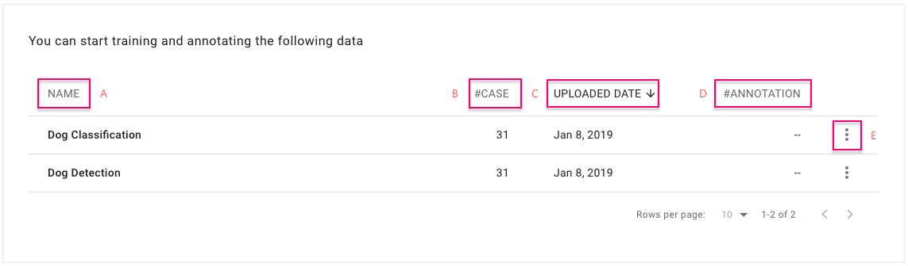

# Upload Dataset

## **Introduction**

\*\*\*\* **Upload Dataset:** Click on this button and upload your dataset. 

\*\*\*\* **Help:** You can find useful details pertaining to the dataset format details from here. 

\*\*\*\* **Search:** You can search for your uploaded dataset by its name.

## Dataset and Image Format

Please check your dataset and image format before uploading. 

#### Dataset format: zip file

* **Without annotation:** Only a folder of images should be present here. Please note that folder name must be “image,” entirely in lowercase letters.    
* **With annotation:** A folder named as “image” and a file specifying the label of each image, “label.csv” should be present here. Please note that the image folder name should be named as “image,” entirely in lowercase letters. For the CSV file, the number of columns can only be two for image classification and six for object detection. You can either zip “image/” and “label.csv” or put them into another folder and zip that folder.  

  

#### Notice:

 For Windows users, please compress your file by "Bandizip" tool and process as the following steps if the name of your images are non-English format.

1. Compression Setting: Select "Store Unicode file names in an extra header field if Zip files \(UTF-8\)".
2. Compress "xxx.zip".

#### Naming the zip file: 

The name of the dataset should be the same as that of the zip file you uploaded, which cannot be edited in the “Dataset” tab. You can rename the zip file before you upload it.

#### Image format: 

JPG and PNG are acceptable image format. Both width and height should be between 16px and 4096px.

## Dataset List

After uploading the dataset successfully, you can view the datasets in the “Dataset” tab. 

**NAME \(A\):** Presents the name of the zip file you uploaded. 

**CASE \(B\):** Presents the number of cases in your dataset.

**UPLOADED \(C\):** You can find the date on which your dataset was uploaded. 

**ANNOTATION \(D\):** You can easily recognize which datasets have been already annotated. 

**Menu button \(E\)** **:** You can click once on this button to “Start annotation” and “Start Training”.


Here, the alert message of “preparation failed” is presented if the dataset you uploaded has an incompatible format. Click on the dataset and view the error message.

Then, you can either save the successful cases and continue, or you can delete the entire dataset and upload a new one.

## Export Annotated Dataset for Training

The following annotated dataset cannot be exported for training.

* Without annotation result: There are no any saved annotations for this dataset. 
* User exclude: A project Owner excludes \(\) that case. 
* System exclude: The DSV result excludes that case because of an unacceptably lower consistency rate. 
* Problematic image: Annotated as “Problematic image” by an annotator. 

The following annotated dataset would be excluded from export for training. 

* User exclude: A project Owner excludes \(\) that case. 
* System exclude: The DSV result excludes that case because of an unacceptably lower consistency rate. 
* Problematic image: Annotated as “Problematic image” by an annotator.

## Annotation Conditions for Training

To deliver the best possible training performance, please ensure that your annotation meets our system requirements.

*   **Image Classification**:

The annotated dataset should contain at least two categories and each category should be used as an annotation on at least two cases. For example: Category “Dog” was used on cases A and B, and category “Cat” was used on cases C and D.

| Dataset | Annotation |
| :--- | :--- |
| Case A | Dog |
| Case B | Dog |
| Case C | Cat |
| Case D | Cat |

*  **Object Detection**

The annotated dataset must contain at least three cases, and each case should be annotated with at least one bounding box.  
For example, Cases A, B, and C should be annotated with at least One bounding box.

| Dataset | Annotation |
| :--- | :--- |
| Case A | Bounding Box with Tag “Dog” |
| Case B | Bounding Box with Tag “Dog” |
| Case C | Bounding Box with Tag “Cat” |

## Delete Dataset

Please note that there are some rules to delete a dataset.

* The dataset you want to delete should not be related to any existing annotation project. If it is related, then you need to delete that project first and then delete the dataset.
* The dataset you want to delete should not be related to any existing training task and annotated dataset. If it is related, then you need to delete that training task first and then delete the annotated dataset. Finally, you can delete the dataset.

