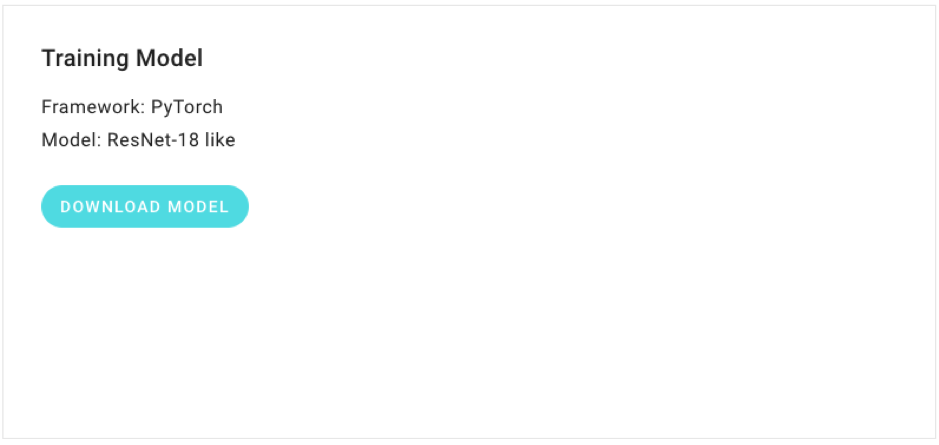

# How to Test the Model on Your Machine

After your training is completed, the next step is to test the performance of your trained model. This tutorial introduces how to download the trained model as well as the prediction script and the way to run the prediction on your machine locally.

### Requirements

* Docker 
* Docker image with PyTorch v0.4.0 \(downloaded from Dockerhub\) 
* Unix-like command line interfaceSteps

#### 1. Download training results

Download the training results with the button, “models”, on the task details page. Extract the zip file, and there will be a folder, `results`. The folder contains at least `inference.py`, `model_X.bin` \(X is the best step during training\), and `label_name.csv`. 

For this tutorial, we put `results` under the home directory, i.e.`~/results/`. 

`cd ~` 

`unzip ~/Downloads/results.zip` 

`cd results`

#### 2. Prepare a testing image

Put the image file into `~/results`. For example, we put an airplane image at `~/results/airplane.jpg`.

#### 3. Prepare the Docker image

We provide a Docker image with PyTorch 0.4.0 \(runs without GPU\) and other required packages installed. You can easily run the test inside the docker container. 

`docker pull csigo/ai-platform-inference:inference-pytorch-cpu`

#### 4. Start the Docker container

We mount `~/results` to `/results` inside the container with`-v`.

`docker run -ti --rm -v ~/results:/results csigo/ai-platform-inference:inference-pytorch-cpu bash`

#### 5.Run testing

A scripts `predict.sh` is provided to classify an image easily. First, change directory to `/results`, and then run `predict.sh`! 

`cd /results` 

`./predict.sh ./airplane.jpg` 

It will show the top-5 predicted categories of the image. The output will look like the following: 

`Output: create network: resnet18v1` 

`RESULT {"scores": [0.9954907894134521, 0.00436920952051878, 0.00013990419392939657, 4.442737733256763e-08, 1.852817810288343e-08], "labels": ["airplane", "horse", "bird", "deer", "automobile"]}`

| Label | Score |
| :--- | :--- |
| "airplane" | 0.9954907894134521 |
| "horse" | 0.00436920952051878 |
| "bird"  | 0.00013990419392939657  |
| "deer" | &lt; 0.00001 |
| "automobile" | &lt; 0.00001 |

As shown in above diagram, "airplane" has the highest score, which implies the prediction is correct.

