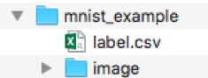
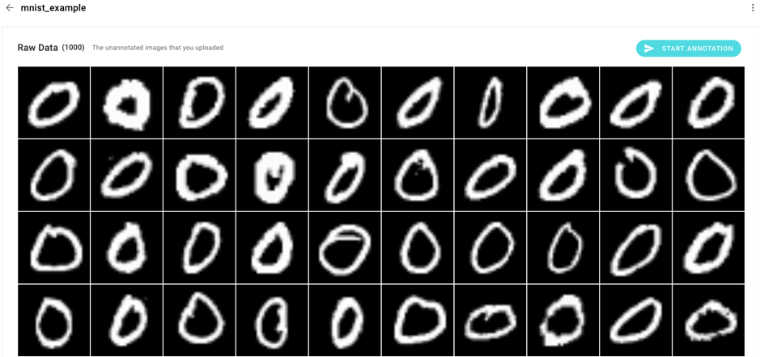
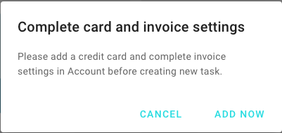
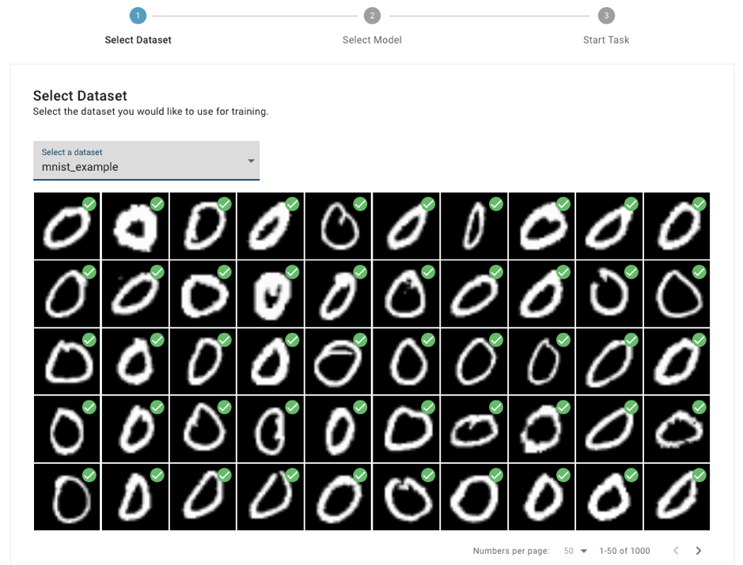
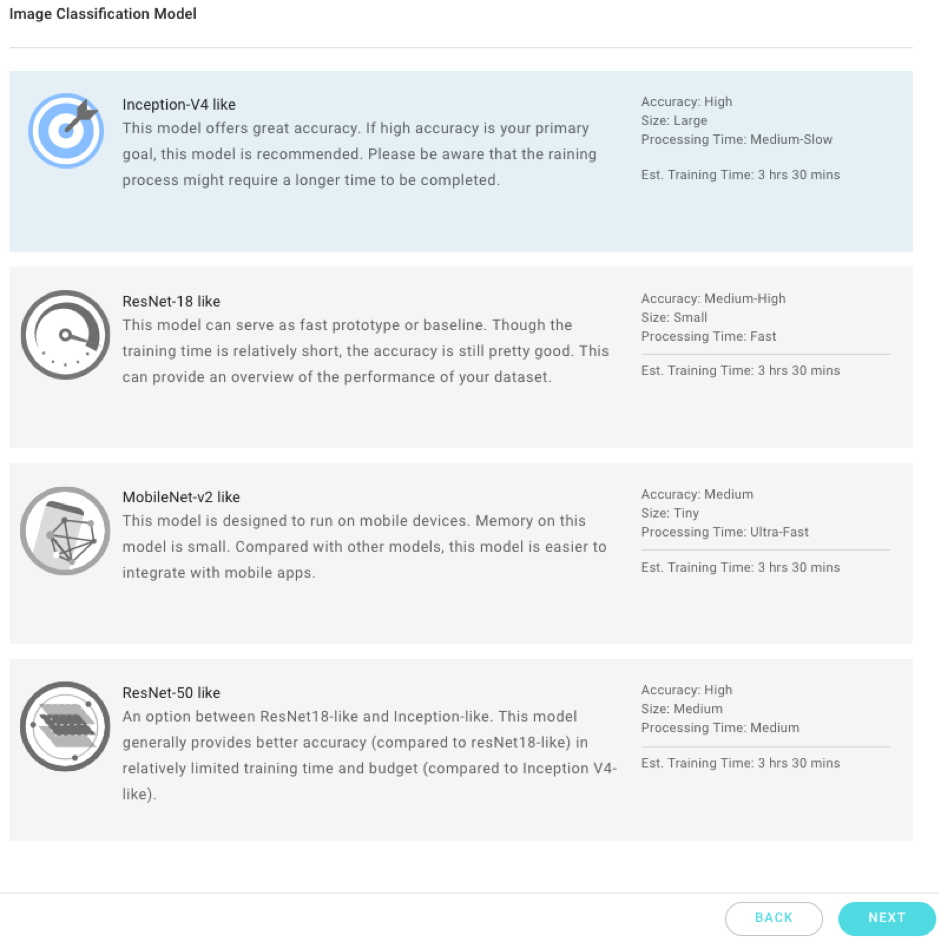
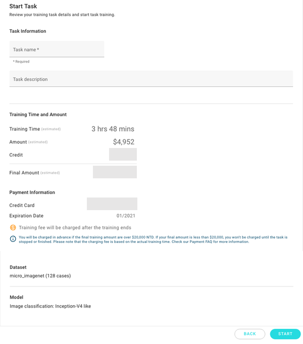
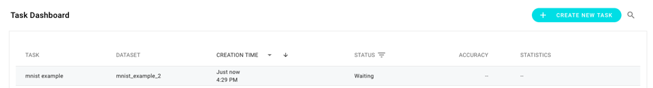
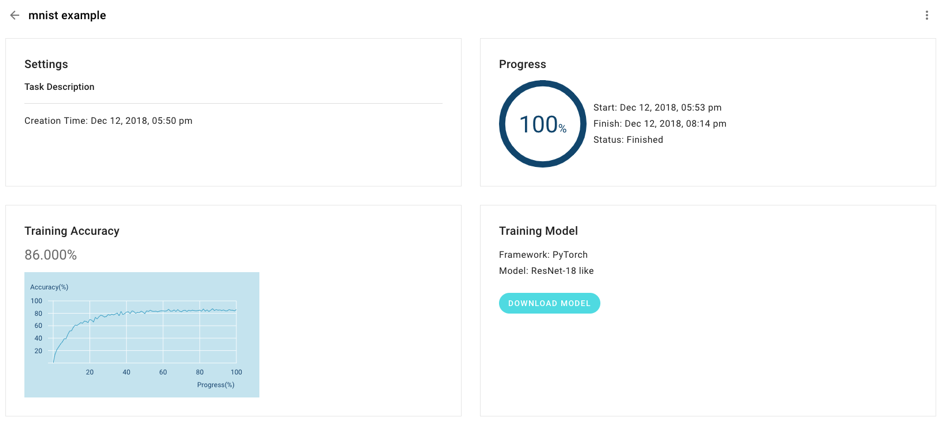
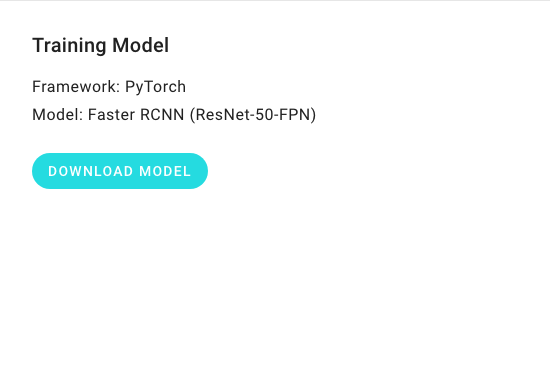
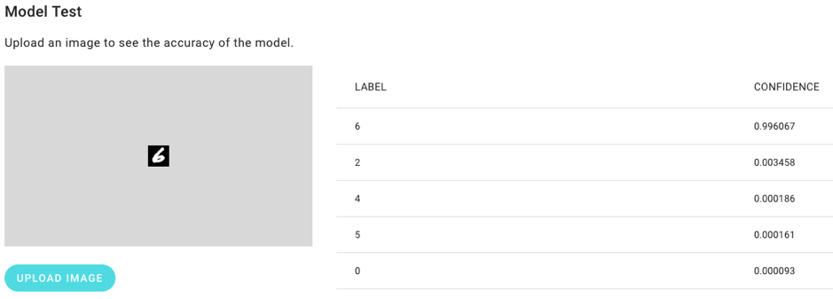

# Train an Image Classification Model

This is a simple tutorial on using DeepQ AI Platform. In this tutorial, we will illustrate how to train a deep learning model for an image classification application in five steps. After the training is finished, we will upload a testing image and use the trained model to predict the category of the testing image.

Let’s start!

## 1. Prepare MNIST dataset

[MNIST](http://yann.lecun.com/exdb/mnist/) is a classic handwritten digits \(0-9\) dataset. We prepared a smaller version of MNIST as our example dataset for our tutorial. The example MNIST dataset can be downloaded from [here](https://storage.googleapis.com/aip-sample-dataset/mnist_example.zip).

The MNIST example dataset contains 1,000 images. DeepQ AI Platform splits the dataset images into training and validation sets. If you are interested in the dataset format, you can unzip mnist_example.zip and see the structure as follows:

There are a folder of images, "image", and a file specifying the label of each image, "label.csv". You can learn how to prepare your own dataset in the tutorial on data preparation.

## 2. Upload MNIST example

Click on “Upload Dataset” to upload mnist_example.zip.

Wait for the uploading and the following processing. Then, we can click “mnist_example” to see the images of handwritten digits.

Scroll down, and we will see the “Annotation Data”. It means the images are annotated with class labels, and are ready for classification training.

## 3. Start Training

Click the "Start Training" button.

If this is your first time using DeepQ AI Platform, it will direct you to the page of the credit card and invoice settings first. After that, you can come back to the training console to start the training again.

At the ”Select Dataset” step, we can see we are using “mnist_example” dataset. Click “NEXT”.

## 4. Select a model

Currently, DeepQ AI Platform provides 4 popular deep learning models for image classification. More models for various applications are coming soon. Each model has its own merits. For example, the InceptionV4-like model will gain higher accuracy, the MobileNetV2-like model will generate the smallest model in terms of memory usage and ResNet-like models get the average performance.

For the tutorial, we select ResNet18-like as our demonstration model.

## 5. Enter the task name and verify the details

Assigning a name to your training task will ease you of the later search for it. Verify the selected dataset and model. Now, click "Submit" to start our first training!

## 6. Have a cup of coffee

Now you’ll see the task in the Task Dashboard. If the status shows "Waiting", please wait for the machine setting up the required resources. When the required resources are ready, the status will show the state of "Running". Your training of the first task has started.

Have a cup of coffee! Please remember to come back to check the progress later. The training of MNIST will take no more than three hours.

Click the task, and we will see the details of the task, including the training progress and the accuracy so far.

## 7. Predict an image

We provide two different ways to use the trained model:

- Download and run the inference script with the model.
- Upload an image for the online prediction.

Once the status becomes "Finished", you will see a button "DOWNLOAD MODEL" in the task detail page.

You can download the trained model and run the inference script. However, this tutorial does not cover this alternative scenario of using the trained model. Please refer to the tutorial on "How to test the model on your machine" for the details. In this tutorial, we illustrate the online prediction scenario. That is, you can upload an image onto DeepQ AI Platform and obtain the prediction of its category label.

At the bottom of the task detail page, there is a panel for image classification. Click "UPLOAD IMAGE" to select an image from your disk. After uploading the image, the prediction will start automatically. Please wait for a few seconds, and the table will show the top-5 labels along with their confidence scores.

