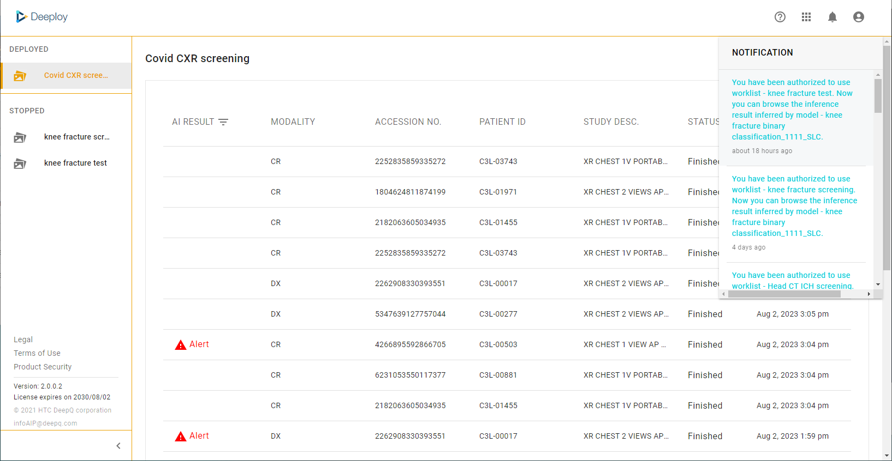
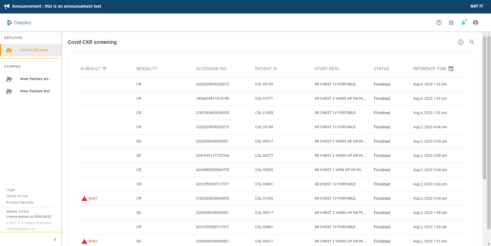

# 1.3 System Notifications & Announcements

**Notifications** **:** A red dot is presented when there is a new notification sent by the system or administrator. Notifications are provided for the following events.

* System notification
* Deployment authorization

<figure><figcaption></figcaption></figure>

**Announcements**：Announcements created by system admin will appear as a banner and can be dismissed by clicking on "GOT IT", it will also go away once it expires.

<figure><figcaption></figcaption></figure>

