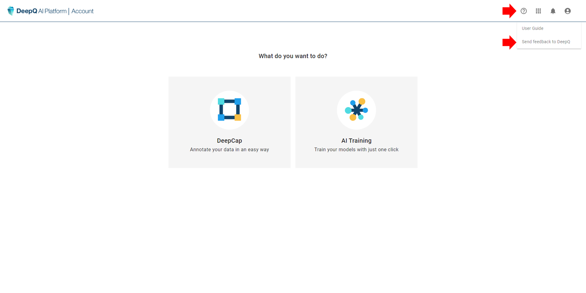

# ⁉ Troubleshooting & FAQs

**General Issues**

<strong>Q. What browsers are compatible with DeepQ AI Platform?</strong>

A. For the best experience, we recommend users run the DeepQ AI platform on Google Chrome, although our service is compatible with all major browsers.

<strong>Q. I forgot my password, what should I do?</strong>

A. Please contact the administrator of your organization/DeepQ customer service via feedback form to reset your password and you should receive an email shortly afterwards.

<strong>Q. The service becomes slow/unresponsive/freezes, what should I do?</strong>

A.&#x20;

When uploading large datasets, it takes longer for the system to unzip/process the images/labels. You may try to refresh or even restart the browser if necessary.

Q. I have a question/request, what should I do?

A. You are welcome to send your feedback/request via the DeepQ feedback form. Please remember to leave your personal contact information so we may reach out to you.

***

**Dataset Related Issues**

<strong>Q. What is the max/min resolution for each image?</strong>

A. The resolution any image should be between 16x16 and 4096x4096.

<strong>Q. What is the max. file size of each image?</strong>

A. No, there is no restriction for single image file size.

<strong>Q. What is the max. size of each dataset .zip file?</strong>

A. The maximum zip file size you can upload to our platform is 20GB

<strong>Q. My uploaded dataset failed to process, what might be wrong?</strong>

1. Check the .zip file structure.
2. Check the image formats: .jpg, .png & DICOM (.dcm) formats.
3. Check for duplicate image names in different folders , rename images with the same filename
4. make sure image filenames do not contain invalid characters, and replace spaces with underlines
5. For .dcm files, make sure that there are no duplicates, or files that share the same DICOM information.

<strong>Q. My uploaded labeling information did not successfully process</strong>

A. Please make sure that the uploaded label file follow the rules of DeepQ AI Platform instructed in [Annotation Data Formats](https://console.deepq.ai/docs/console/dataset/annotation-data-formats.html). Label files that contains empty cells/invalid numbers/values cannot be processed.

Q. How Do I compress my data into zip files?

A. we suggest you to compress your file by "Bandizip" tool and process as the following steps if the name of your images are non-English format.

1. Compression Setting: Select "Store Unicode file names in an extra header field if Zip files (UTF-8)".
2. Compress "xxx.zip".
3. **Naming the zip file:** The name of the dataset will be the same as that of the zip file you uploaded, which cannot be edited in the “Dataset” tab. You can rename the zip file before you upload it.

***

**Annotation related Issues**

<strong>Q. Other than classification &#x26; detection, can I upload my segmentation labels?</strong>

A. Other than LableMe, we currently do not support other segmentation formats. Please send us your request via feedback form.

<strong>Q. Does DeepCap support touchscreen and stylus?</strong>

A. Yes, DeepCap supports mouse input, touchscreen and stylus (Apple pencil). other than iPad & Apple pencil, some tablet devices can configure stylus working in "mouse mode", and can be used to annotate.

<strong>Q. What can I expect from AI assisted annotation?</strong>

A. Since Deep Learning models were trained to perform specific tasks. One cannot expect models trained for other tasks to assist the labeling of your specific purpose. for instance, a liver segmentation model train on abdominal CT will fail to segment tumor in brain MRI.

**The best way is to leverage AI in annotation is to train a model with available data and run it on images that have yet been labeled**. DeepCap supports export partially annotated data to training for the first part, and the AI labeled images can be sent to an annotation project for human inspection/review.

***

**Model Training Related**

<strong>Q. Can I estimate how long will a training job take?</strong>

A. The total training job consists of numerous variables, from training data size, model types, model capacity, tuning strategy, early stop mechanism...etc. and cannot be easily predicted.

Q. Can you explain how many GPU hours are used in a training task?

A. Users can set up a training task by selecting training data, model & tuning method. For better tuning efficiency, there might be multiple parallel training jobs within one training task, **each job runs on a specific set of hyperparameter and will occupy 1 GPU each**. The training time of each job depends on the GPU spec, model property, data size & other settings such as early stop. A training task will be complete once all training jobs are finished.

**Manual assignment**

Given a specific set of hyperparameter, manual assignment task will only run one job.

**Grid search**

The number of jobs in grid search is determined by the number of search points in hyperparameter space. The total numbers of jobs is limited to 48 job max.

The total number of jobs (search points) = “# of learning rate x # of weight decays x # of momentum”

An error will appear if the number of jobs exceed 48, this task cannot be started unless the numbers are fixed.

**Random search**

Random search runs multiple jobs with random hyperparameter combination within the given range (min-max of each hyperparameter), the min. number of jobs is 8 and the max number of jobs is 48.

**Population based tuning**

PBT also runs multiple jobs with different hyperparameter combination within the given range (min-max of each hyperparameter), where the DeepQ AutoML engine will search for the optimal hyperparameter adaptively. The min. number of jobs is 8 and the max number of jobs is 48. (Default setting of DeepQ AutoML is PBT-24 jobs)

Q. How come my training tasks with identical settings does not produce the same result?

A. Reproducing the results of a deep learning experiment depends on multiple factors like access to the same dataset, using the same model architecture, hyperparameters etc.. If these elements are accurately replicated and documented, there's a good chance of achieving similar results. However, slight variations in data sampling and random initialization can lead to differences in outcomes.

Q. how can I improve the performance of my models?

A. Deep learning heavily depends on the quantity and quality of training data, adding quality data is always a good option. Take a look at the training curves and the label distribution, you may find useful hints to improve your model.

**Resource Related**

Q. What will happen if meet my storage space cap?

A. If you run out of your storage space, you will not be able to upload/import/combine datasets. Please contact the system admin of your organization or DeepQ via feedback form.&#x20;

Q. What will happen if used all of my GPU-hrs?

A. You may not be able to start a new training task once you have no GPU-hrs left. Please contact the system admin of your organization or DeepQ via feedback form.&#x20;

