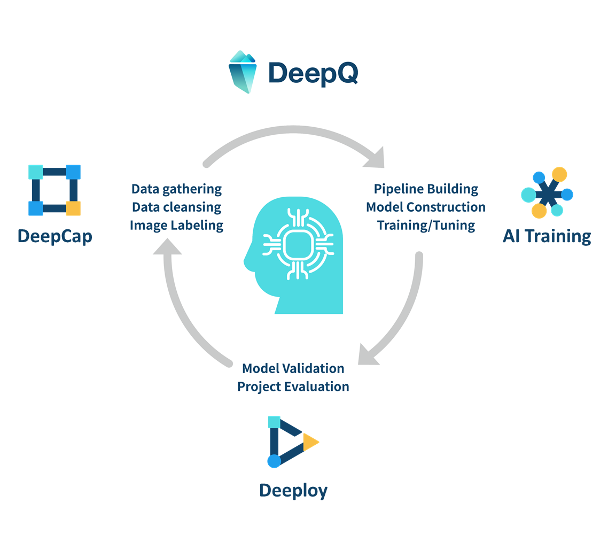

# 💡 What is DeepQ AI Platform?

### DeepQ AI Platform provides a one-stop solution for your medical image MLOPs cycle via web browser. Enjoy the best experience provided by our no-code environment. 

<figure><figcaption></figcaption></figure>

* DeepQ AI Platform dramatically reduces the learning thresholds and the cost of AI model training through efficient image annotation tools, optimized training environment, built-in multiple AI models, fully automated parameter tuning, and a simple user interface.
* It is different from the existing AI training platforms and services available on the market, users of DeepQ AI Platform can quickly convert their own medical image data into the AI models without the knowledge and skills of deep learning.\

### Deep Learning and its application in image analysis 

"Deep learning is part of a broader family of machine learning methods based on artificial neural networks with representation learning. Learning can be supervised, semi-supervised or unsupervised" \~[https://en.wikipedia.org/wiki/Deep\_learning](https://en.wikipedia.org/wiki/Deep/\_learning)\~

Deep learning uses multiple layers to progressively extract higher level features from the raw input, achieving great breakthroughs in certain applications, especially in image analysis.

### 4 major applications of Deep Learning in image analysis 

**Image Classification (including single-label & multi-label):** Contextual image classification, a topic of pattern recognition in computer vision, is an approach of classification based on contextual information in images. The goal of this approach is to classify the images by using the contextual information. _\*\*_ \~[https://en.wikipedia.org/wiki/Contextual\_image\_classification](https://en.wikipedia.org/wiki/Contextual/\_image/\_classification)\~

**Object Detection:** Object detection is a computer technology related to computer vision and image processing that deals with detecting instances of semantic objects of a certain class (such as humans, buildings, or cars) in digital images and videos. \~[https://en.wikipedia.org/wiki/Object\_detection](https://en.wikipedia.org/wiki/Object/\_detection)\~

**Image Segmentation:** In digital image processing and computer vision, image segmentation is the process of _\*\*_ partitioning a digital image into multiple image segments, also known as image regions or image objects (sets of pixels). \~[https://en.wikipedia.org/wiki/Image\_segmentation](https://en.wikipedia.org/wiki/Image/\_segmentation)\~

<figure><figcaption>
Various applications of deep learning in Medical image analysisA Survey on Deep Learning in Medical Image Analysis
</figcaption></figure>

## **The complete DeepQ AI Platform consists of 3 main modules：**

### **DeepCap:** Dataset management & image annotation 

* De-identification & anonymize of the imported medical image data.
* To produce labeled data using annotation tools (classification, detection & segmentation).
* To create, manage & monitor annotation projects and to ensure the quality of labeled data.
* To import labeled data from other sources.

### **AI training**：Model selection/tuning & evaluation 

* pre-built AI models for best training results.
* Create, monitor & manage AI training tasks.
* No-code automatic hyper-parameter tuning that can leverage advanced techniques such as transfer learning & data augmentation.
* Evaluate the training progress & outcome of the models with different metrics.

### **Deeploy：**Real-time model deployment, worklist & AI viewer 

* Get your AI models up and running with real-world data sent from PACS
* Inference engine automatically identifies image by DICOM tag and forwards to different AI models
* Set deployment authorization. Different users for different model deployments
* Download inference history for futher analysis and model retrain.

### &#x20;
