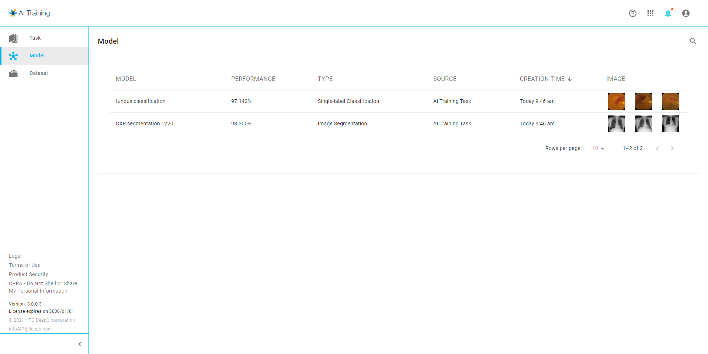

# 🧠 Models

<figure><figcaption></figcaption></figure>

All the deep learning models you've trained reside here. You can access and oversee the models, evaluate their performance, retrain, or download them as needed.

The Model section within the DeepQ AI platform is your hub for housing and accessing AI algorithms swiftly. Here, users can easily locate and access the AI models they have trained, streamlining the process of utilizing these models for various purposes.

Users can search for and select from a repository of their trained AI models. This section also allows users to perform inference jobs, enabling them to test these models with datasets to assess their performance. If ground truth data is provided alongside the test dataset, the system automatically computes evaluation metrics specific to the type of model used.

### Model Overview

<figure><figcaption></figcaption></figure>

### Model Detail

These evaluation metrics serve as quantitative indicators of the model's performance, offering insights into its accuracy, precision, recall, and other relevant metrics. This qualitative performance assessment is invaluable for users to gauge how well their AI models are performing under different conditions and datasets.

In summary, the Model section is a convenient repository for AI models, offering quick access and enabling users to evaluate their models' performance through inference jobs while providing detailed evaluation metrics for a qualitative understanding of the model's effectiveness.

\
\
