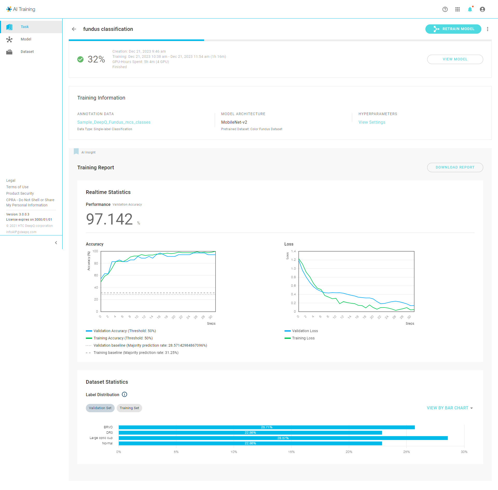

# ⚙ Training Tasks

DeepQ AI Training is where the neural network meets datasets. By training tasks users can create their AI applications with their own data.

The Task section within the DeepQ AI platform is like a comprehensive logbook where all the training tasks reside. This is where the neural network and datasets converge to facilitate the training process.

Users can create training tasks here, aligning neural networks with labeled images to craft their AI applications effectively. Each task is meticulously recorded, providing a dedicated space for individual tasks, each with its own unique settings and detailed specifications.

Within this section, users can access and manage various training tasks, each tailored to specific requirements. These tasks encapsulate the configurations, parameters, and details necessary for training neural networks using labeled images. It's a centralized space that tracks and organizes all ongoing and past training endeavors.

In essence, the Task section serves as a repository for all AI training initiatives, housing the settings and nuances of each task, enabling users to efficiently create their AI applications by orchestrating neural networks with labeled image datasets.

### Task List

In the “Task” tab, you can view the training status of all the tasks that you have created.

**CREATION TIME:** Filter your tasks by "CREATION TIME" or "FINISH TIME".

**STATUS:** Filter your tasks by using the task status: “Running", "Waiting", "Finished", "Stopped", or "Error".

 **SEARCH**: Search your tasks using project name.

### Task Detail

<figure><figcaption></figcaption></figure>

