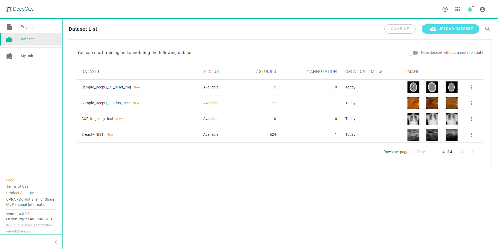

# 📐 DeepCap (Image Annotation Module)

DeepCap is where you turn your images into valuable data. Since deep learning is a data-driven technology, quantity & quallity of your annotation plays a critical role in your AI development/application.

### Project 

In the “Project” tab, you can view the annotation status of all the projects that you have created.

<figure><figcaption></figcaption></figure>

**PUBLICATION DATE:** Sort your projects by using the “Publication Date” and “Last Modified”.

**STATUS:** Filter your projects by using the project status: “On going”, "Finished" and “Stopped”.

 **SEARCH**: Search your projects using project name.

**CREATE PROJECT:** Click on this button and start the project settings.

### Dataset 

<figure><figcaption></figcaption></figure>

The same as "[Dataset list](https://console.deepq.ai/docs/console/dataset#dataset-list)"

### My Job 

Lists all annotation/review jobs that are assigned to you, please see [3.2 Start Annotation](https://console.deepq.ai/docs/console/working-flow/start-annotation.html#my-job-job-list) for more information

