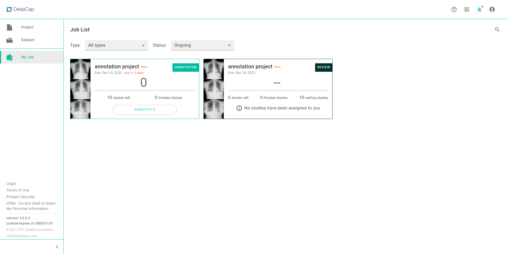
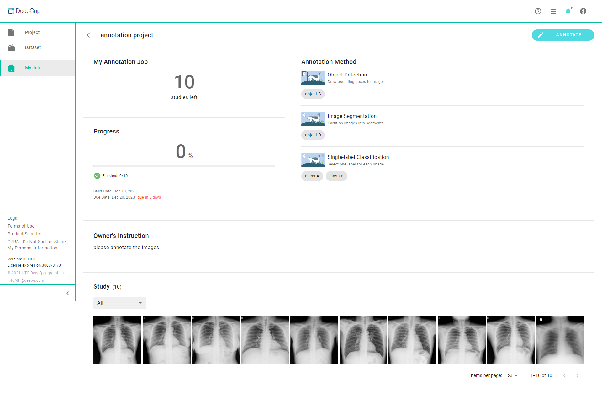
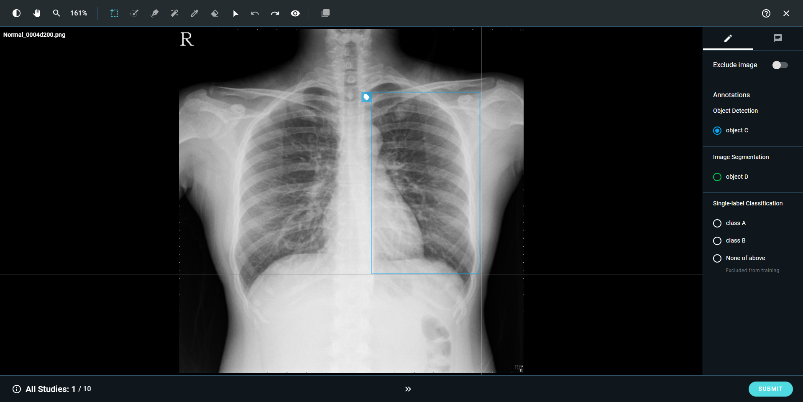

# 🖌 Annotation Jobs

### Job Overview

<figure><figcaption></figcaption></figure>

* <mark style="background-color:orange;">**CREATION TIME:**</mark> <mark style="background-color:orange;"></mark><mark style="background-color:orange;">Filter your tasks by "CREATION TIME" or "FINISH TIME".</mark>
* <mark style="background-color:orange;">**STATUS:**</mark> <mark style="background-color:orange;"></mark><mark style="background-color:orange;">Filter your tasks by using the task status: “Running", "Waiting", "Finished", "Stopped", or "Error".</mark>
*  <mark style="background-color:orange;">**SEARCH**</mark><mark style="background-color:orange;">: Search your tasks using project name.</mark>

### Job Detail

<figure><figcaption></figcaption></figure>

###

### Image viewer

<figure><figcaption></figcaption></figure>

