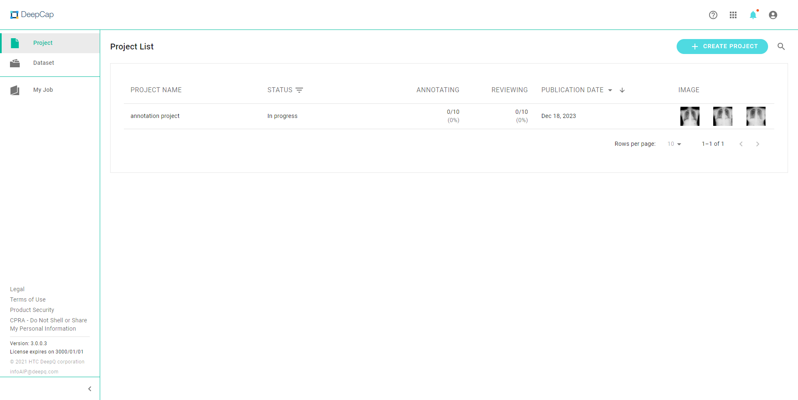
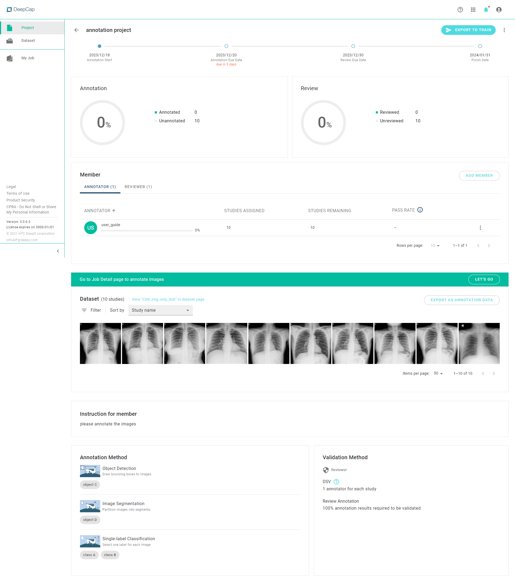

# 📝 Annotation Projects

In annotation project for deep learning, the project owner uploads medical images and creates the project (including annotation types, class names, project dates, project participants, reviewing method and other instructions). Export your annotation results anytime and start using them in AI training and testing.

<figure><figcaption></figcaption></figure>

### Project Overview

<figure><figcaption>
Porject Overview
</figcaption></figure>

* &#x20;.png>)**Create Project:** Create a new annotation project.
*  **Search:** search for your projects by name
* **Publication date:** Sort your projects by publication dates..
* **STATUS:** Filter your tasks by using the task status: “Running", "Waiting", "Finished", "Stopped", or "Error".
*  **SEARCH**: Search your project according to the following status: Publishing, in progress, finished, stopped & error.
* The annotation/review progress of each project is also shown in the overview.

### Annotation Project Detail

\
Selecting any annotation project will open the project detail view, where full information can be accessed.&#x20;

* **OPTION**: The project owner may also edit project names, project schedules & instructions if the project is in progress. Owners may also stop/delete/export annotation projects at any given time.

<figure><figcaption>
Project Deatil
</figcaption></figure>

###
