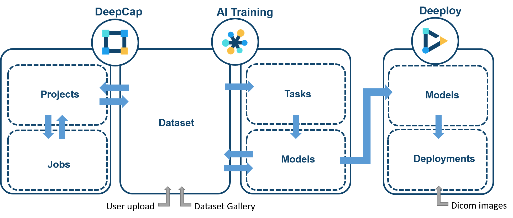
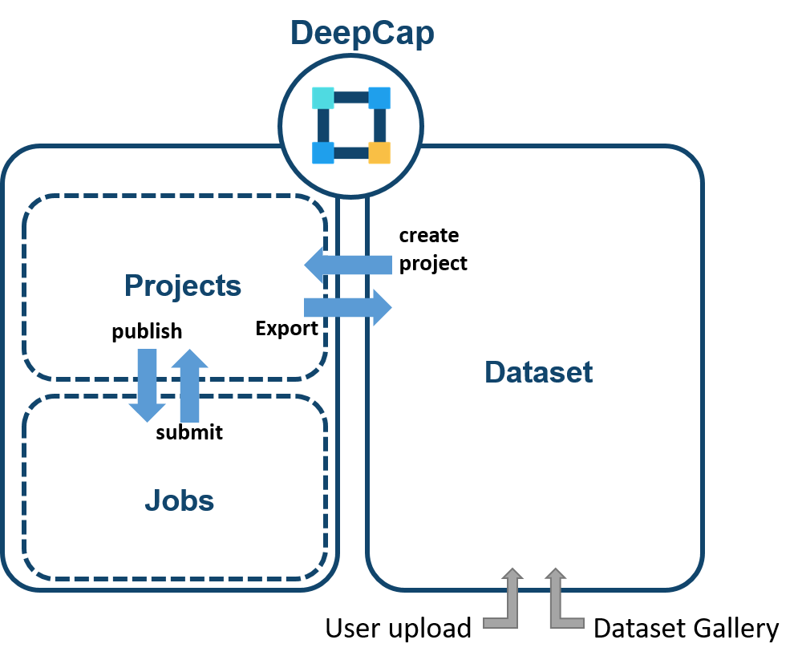
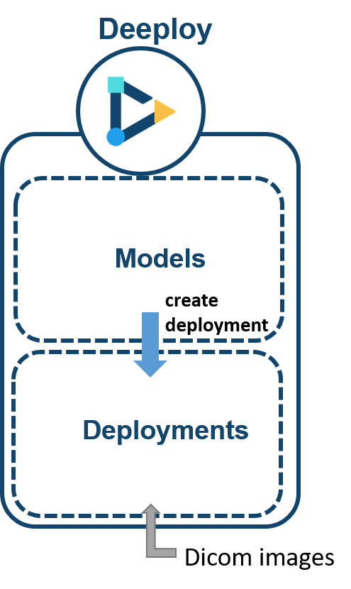

# 🧱 Modules

The moment you log into DeepQ AI Platform, you can choose from the three modules to start from. Please contact the system admin for your module authorization.

The complete DeepQ AI Platform consists of three main modules：

* [**DeepCap**](modules.md#deepcap-overview)**：**Dataset management & image annotation
* [**AI Training**](modules.md#ai-training-overview)**：**Model selection/tuning & evaluation
* [**Deeploy**](modules.md#deeploy-overview)**：**Real-time model deployment, worklist & AI viewer

<figure><figcaption>
The complete DeeQ AI Platform
</figcaption></figure>

### DeepCap 

The quality & quantity of datasets is the key to high performing AI models, but traditionally, preparing datasets is a tedious and lengthy process. DeepCap is designed with a highly intuitive interface, and includes critical features such as project management, AI-assisted annotation, and smart validation, to help you better prepare high-quality reliable data for training.

**Project**: Person who create a project will be the project owner. The project owner can check and manage all the projects in this tab.

**Dataset**: You can upload datasets in this tab.The system has imposes some limitations on your dataset, please refer to the [“Dataset Format”](https://app.gitbook.com/s/-LRpbrznmSNshCiwmSTG-3251841457/dataset/upload-dataset) and[ "Annotation Data Format"](https://app.gitbook.com/s/-LRpbrznmSNshCiwmSTG-3251841457/dataset/annotation-data-formats) tab for detailed information.

**My Job**: Annotators/Reviewers can view and work on the jobs assigned to them by a project owner.

***

### AI Training 

Our no-code AI training module eliminates the entry barrier of AI. Without any computer science background necessary, all you need is a good idea and data, our AutoML engine kicks in to train a high performing model in the least amount of time.

\

​

‌**Task**: All information regarding model training can be found here Person who create a task will be the project owner. The project owner can check and manage all the tasks in this tab.‌

#### **Model:**&#x20;

**Dataset**: You can upload datasets in this tab.The system has imposes some limitations on your dataset, please refer to the [“Dataset Format”](https://app.gitbook.com/s/-LRpbrznmSNshCiwmSTG-3251841457/dataset/upload-dataset) and ["Annotation Data Format"](https://app.gitbook.com/s/-LRpbrznmSNshCiwmSTG-3251841457/dataset/annotation-data-formats) tab for detailed information.

Models:&#x20;

### Deeploy  

Model Deployment is the last piece of an MLOPs cycle and it is where the power of AI brought to light. Improve performance and efficiency in your clinical workflow with Deeploy.

**Worklist**: A complete list of the image studies processed by model deployments that are authorized to you, shown from newest to oldest. Users can filter the worklist by selecting models by clicking on "**MODEL**".

**Authorized Models**: You can view the details of model deployments that are authorized to you. please contact system admin for model deployment authorization.


"Deeploy" Module is designed mainly for on-premise operations and will not be explained in this user guide


### Module permission 

DeepQ AI Platform module & function permission is listed in the table below. Users can click on the upper right corner to switch modules, or contact the system administrator to check which modules do you have permission to access.

<table><thead><tr><th width="300">Functions</th><th width="126">DeepCap</th><th width="116">AI Training</th><th>Deeploy</th></tr></thead><tbody><tr><td>Upload/manage dataset</td><td>V</td><td>V</td><td></td></tr><tr><td>Create/manage annotation project</td><td>V</td><td></td><td></td></tr><tr><td>Annotate/review image(s)</td><td>V</td><td></td><td></td></tr><tr><td>Create/manage training tasks</td><td></td><td>V</td><td></td></tr><tr><td>Evaluate training tasks</td><td></td><td>V</td><td></td></tr><tr><td>View model deployments (worklist &#x26; viewer)</td><td></td><td></td><td>V</td></tr></tbody></table>

