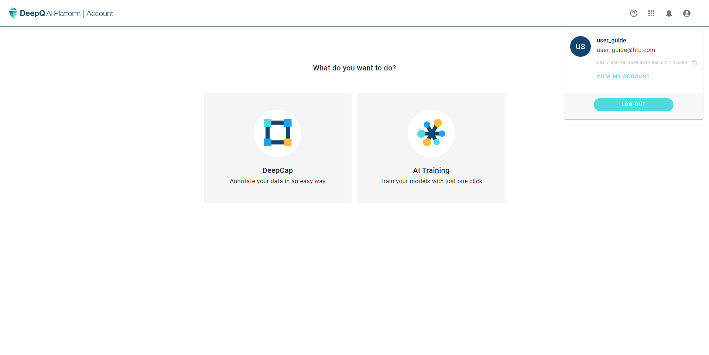
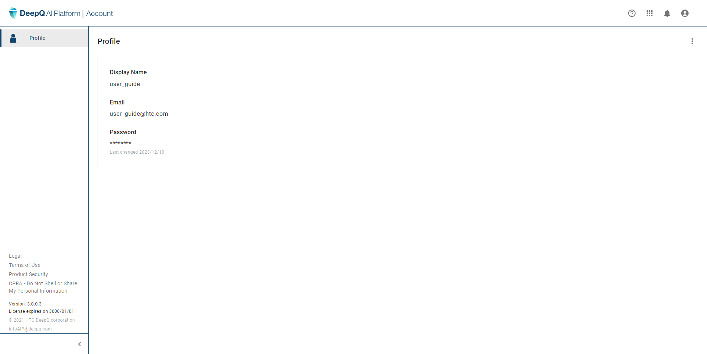
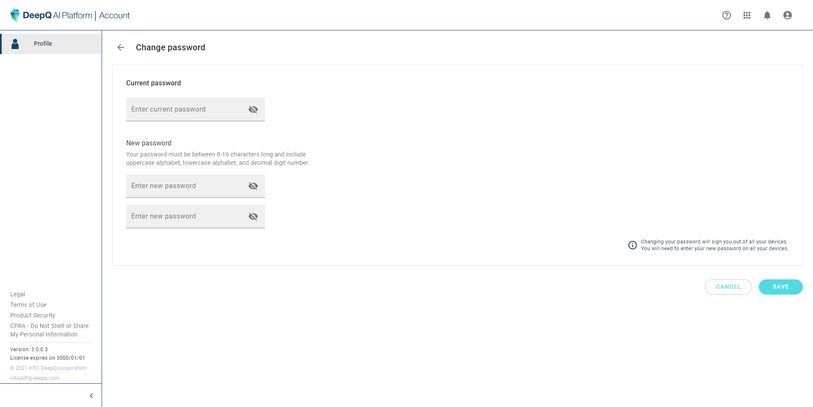

# 👩🏫 User Profile

Once logged in, click on the account button at the upper right corner, and select "view my profile" link.

<figure><figcaption></figcaption></figure>

#### **User Profile** 

your user information is listed here, you may also change your username or password.

<figure><figcaption></figcaption></figure>

#### **Change Password** 

Click on the top right tab “  ” and select "Change Password"

<figure><figcaption></figcaption></figure>

* Click on the top right tab “  ” to change password.

#### **Change User Name** 

Click on the top right tab “  ” and select "Change User Name"

<figure><figcaption></figcaption></figure>

### &#x20;

\
