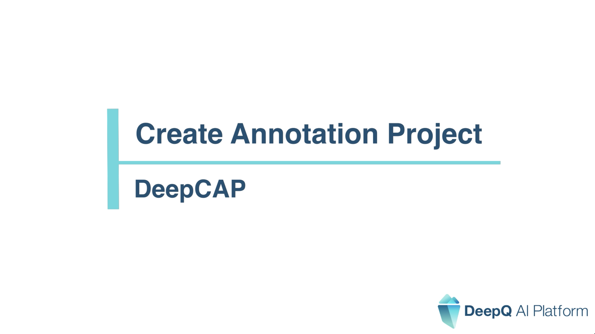
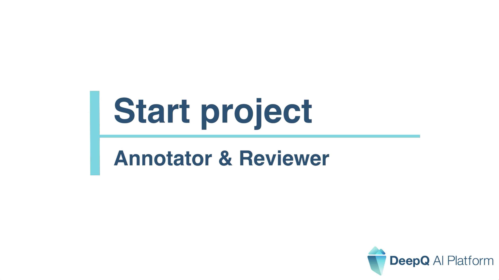
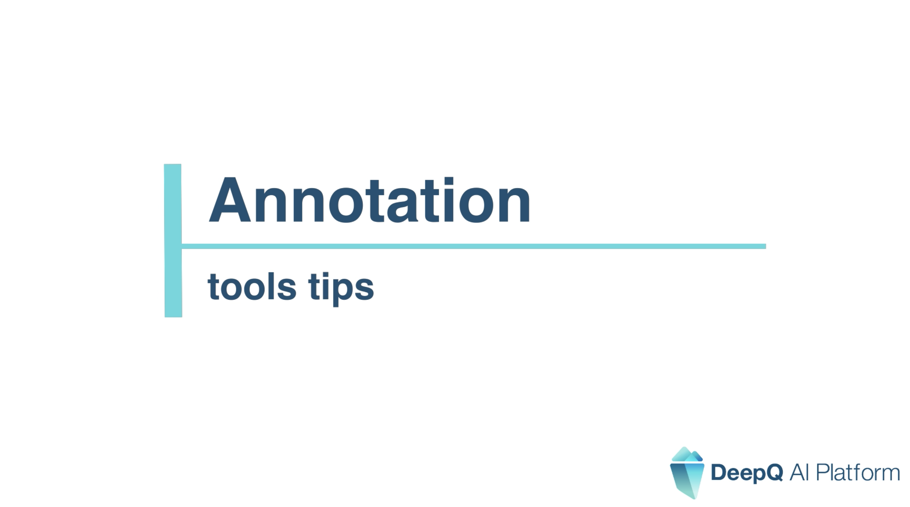
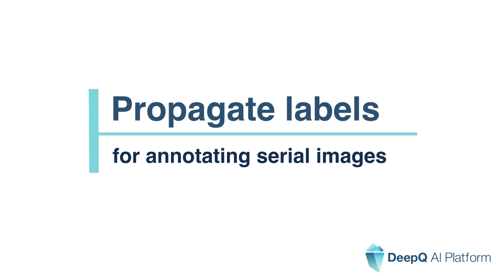

# 🎬 Annotation (DeepCap)

### [Create Annotation Project](https://www.youtube.com/watch?v=g2NDMQEhJy4\&ab\_channel=DeepQAIPlatform)

### [Start Project](https://www.youtube.com/watch?v=zr20tN1qamM\&ab\_channel=DeepQAIPlatform)

### [Annotation tool tips](https://www.youtube.com/watch?v=tWDfjwudI5k\&ab\_channel=DeepQAIPlatform)

### [Propagate Labels](https://www.youtube.com/watch?v=-3KM61IC71E\&ab\_channel=DeepQAIPlatform)

