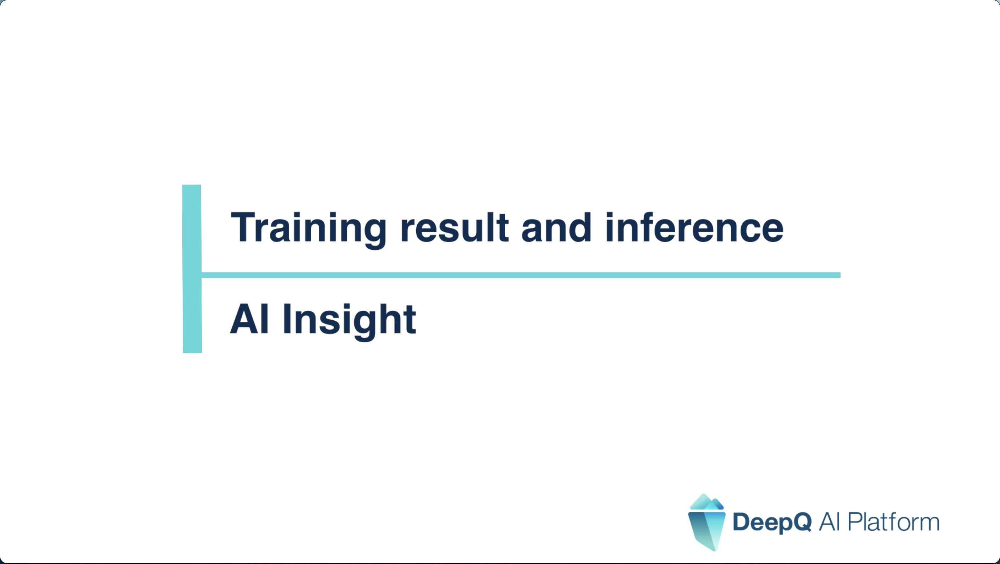

# 🎬 Model Training/Inference

### [Create Training Task](https://youtu.be/dt2uqztCD-4) 

<figure><figcaption></figcaption></figure>

### [View Training Task Result](https://youtu.be/cadya0vxuAA) 

<figure><figcaption></figcaption></figure>

### [AI Assisted Annotation](https://youtu.be/sKOEOdEFjtU) 

<figure><figcaption></figcaption></figure>
