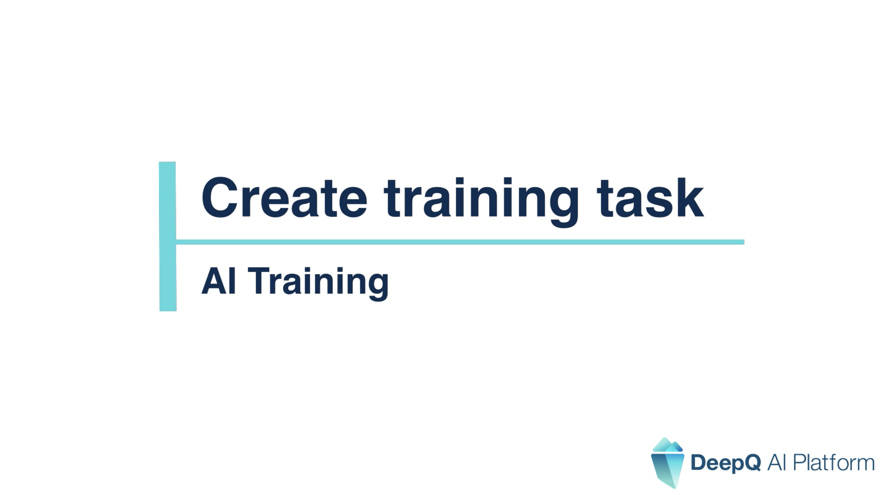
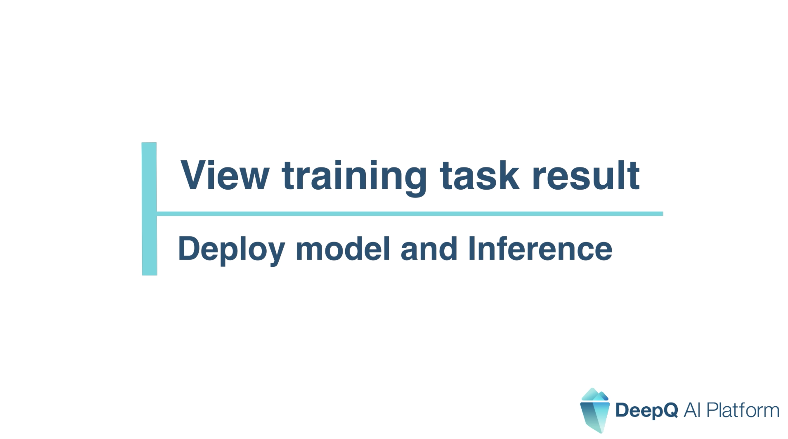
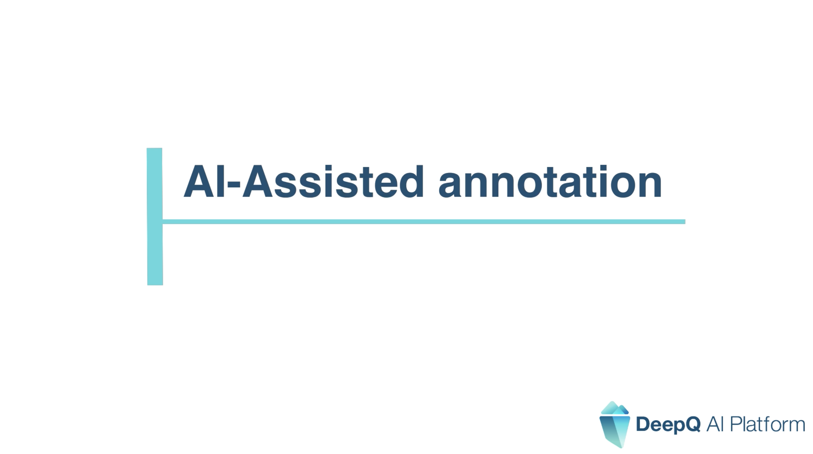

# 🎬 Model Training/Inference

### [Create Training Task](https://youtu.be/dK6xTppI-4g) 

###  

### [View Training Task Result](https://youtu.be/WCOm8iwJ-OE) 

###  

### [AI Assisted Annotation](https://youtu.be/sKOEOdEFjtU) 

###  
