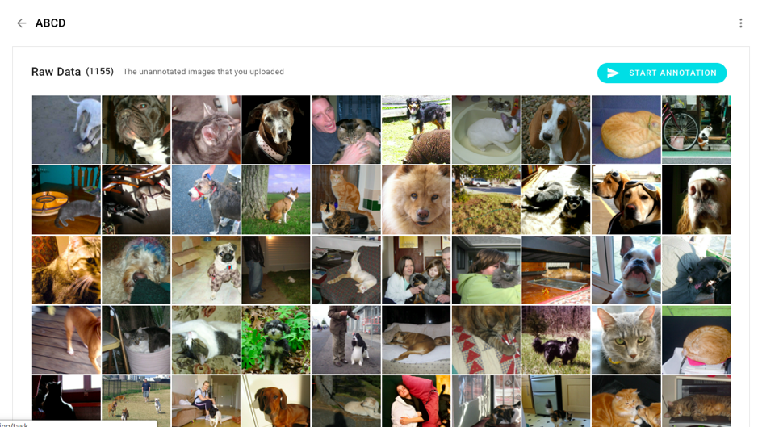
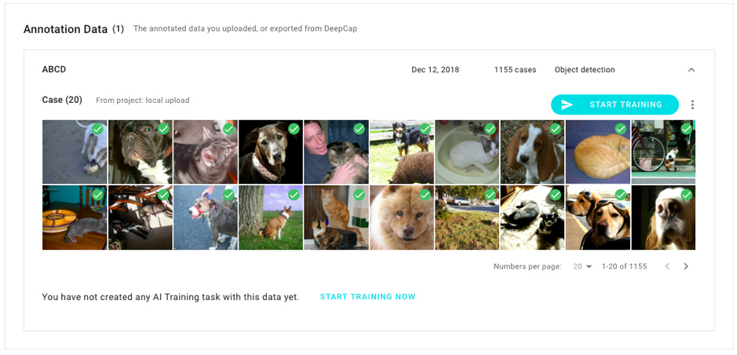
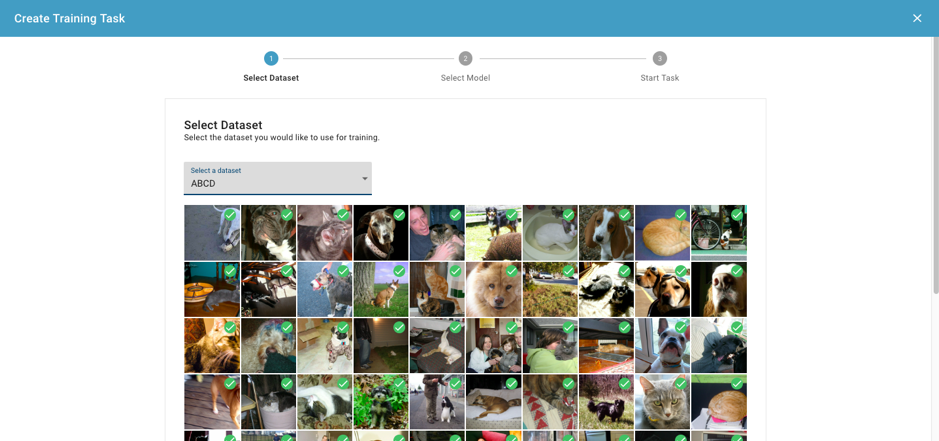
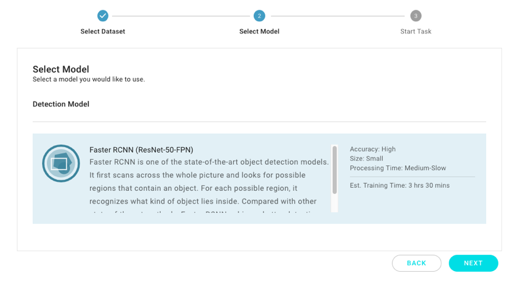
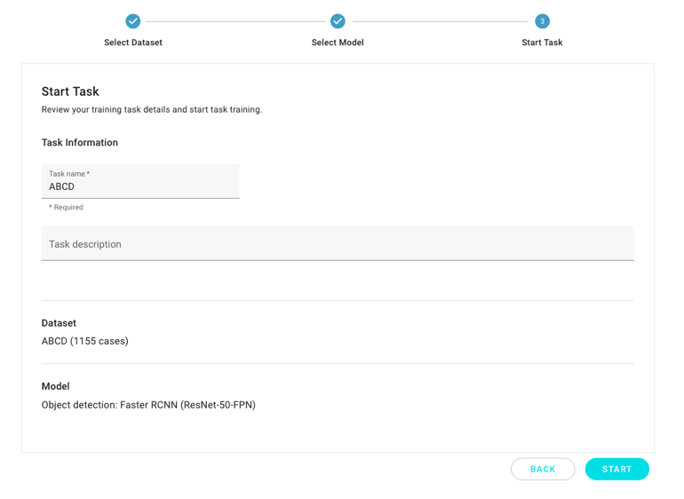
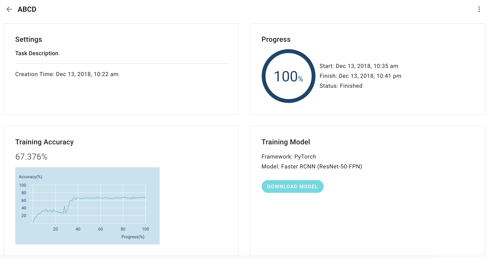
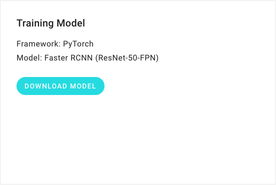
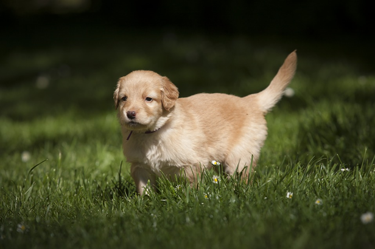
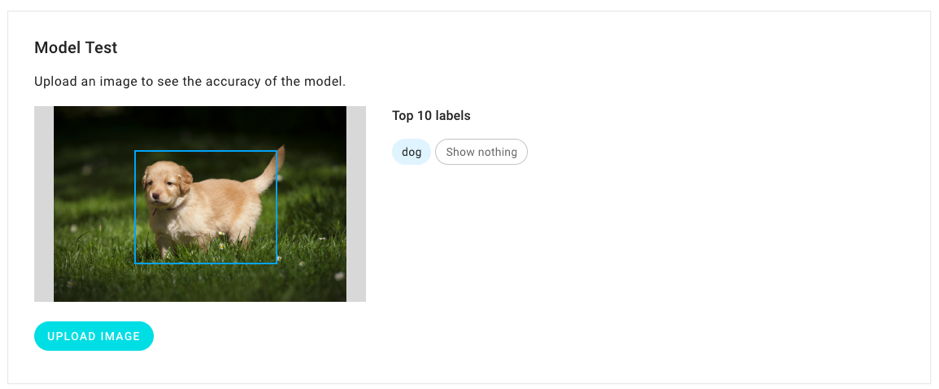

# Train an Object Detection Model \(TBD\)

Object detection is conducted to detect objects in images, and to output the bounding boxes of the objects. This tutorial discusses how to train an object detection model to detect dogs and cats in the simple dataset “ABCD”. \(A Bunch of Cats and Dogs\)

## **1. Prepare the dataset ABCD**

Download ABCD.zip [here](https://storage.googleapis.com/aip-sample-dataset/ABCD.zip). The dataset contains images of cats and dogs, and a file known as label.csv that includes the bounding box annotations. You can learn more about how to prepare your own dataset for DeepQ AI Platform in the [tutorial](dataset/upload-dataset.md).

## 2. Upload ABCD.zip to DeepQ AI Platform

Click on“Upload Dataset” to upload ABCD.zip.

Wait for the completion of the uploading process and some other processing tasks. Then, you can click on “ABCD” to view the images of cats and dogs in the uploaded dataset.

After scrolling down, you can see the “Annotation Data”. This implies that the images are annotated with bounding boxes, and ready for object detection training.

Now, you can click on“Start Training”.

## 3. Start training

If this is your first time using DeepQ AI Platform, you will be first directed to a page to add your credit card and invoice details. Subsequently, you can come back to the training console to begin the training again.

In the ”Select Dataset” step, ensure that you are using the“ABCD” dataset. Click on“NEXT”.

## 4. Select a model

In the “Select Model” step, please use the default object detection model “Faster RCNN”, which is a powerful and fast object detection model. Now, click on“NEXT”.

## 5. Enter the task name and verify the details

This is the final step. Please assign the name “ABCD”to the task and click on “START” to begin the training task.

## 6. To be trained!

The task is displayed on the task dashboard. Initially, the status is presented as“Waiting”. This implies that the DeepQ AI Platform is preparing the necessary resources for the training. Within 15 minutes, the status will switches to “Running”.

By clicking on the task, the details of the task, including the training progress and the accuracy so far, can be viewed.

After the training, you can see the results:

## 7. Predict an image

The system provides two different ways to use the trained model:

* Download and run the inference script with the model.
* Upload an image for the online prediction.

Once the status is presented as "Finished", you will see a button "Download Model" in the task detail page.

You can download the trained model and run the inference script. However, this tutorial does not cover this alternative scenario of using the trained model. Please refer to the tutorial on "How to test the model on your machine" for the related details. This tutorial illustrates the online prediction scenario. That is, you can upload an image to DeepQ AI Platform and obtain the predicted bounding boxes and categories of objects inside the image.

The bottom of the task detail page has a panel for object detection. Click on “Upload” to select an image from your disk. After you select an image and upload it, the detection begins automatically. After waiting for a few seconds, the table displays the top five bounding boxes and their class labels with their confidence scores.

A dog image can serve as an example. You can download the image [here](https://storage.googleapis.com/aip-sample-dataset/dog_detection.jpg).

The ABCD model successfully detects the dog.

