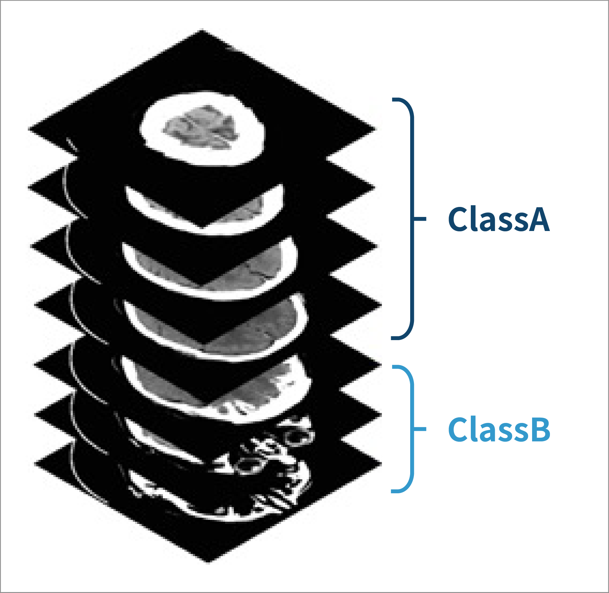
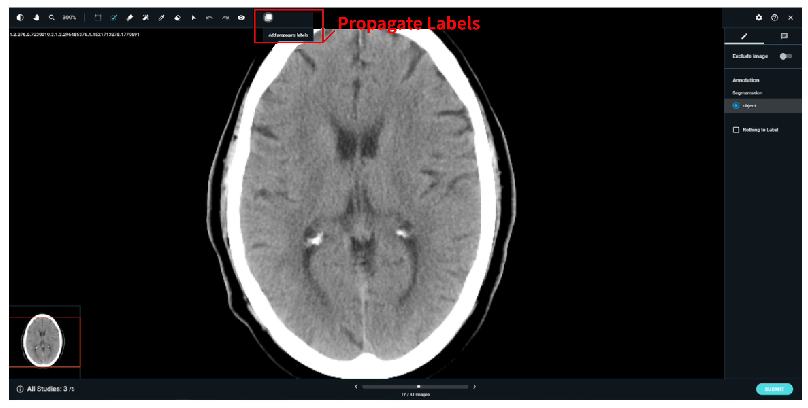
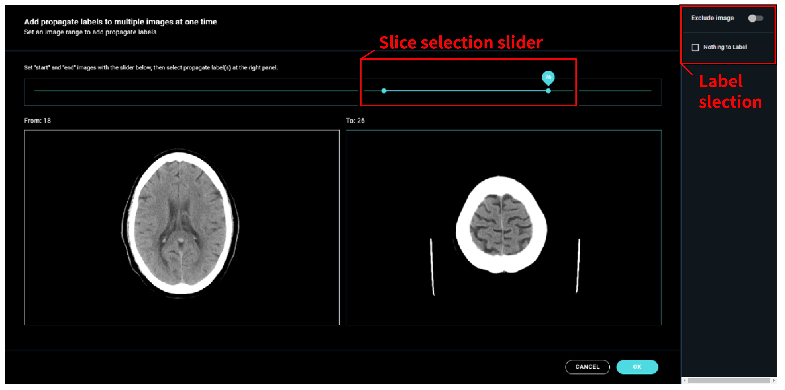
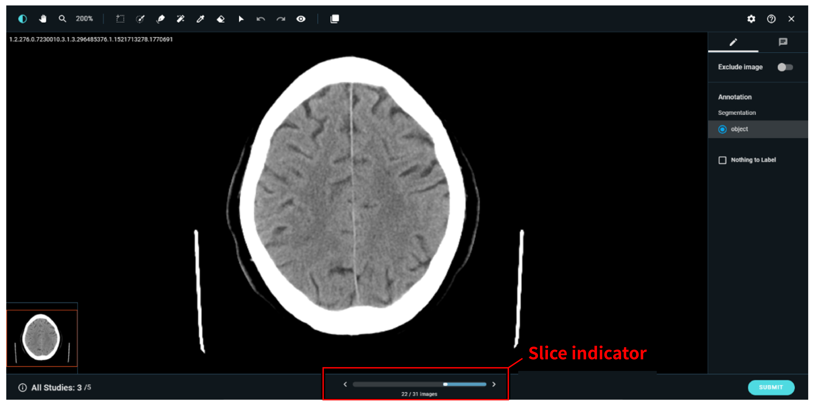

# Advanced Annotation Tips

***

### General annotation tips:&#x20;

* It's really important to make clear rules for how to mark images so that everyone does it the same way and gets it right.
* Using special tools that match the job you're doing, like drawing boxes or outlining things, can make it easier and more accurate.
* Teaching and checking the people who mark the images is super important to keep the quality high.
* Paying close attention to little things when marking helps make sure everything is labeled just right.
* Writing down any changes and getting everyone to work together and talk about what they're doing helps make the marks better and better.


DeepCap supports mouse input, touchscreen and stylus (Apple pencil). other than iPad & Apple pencil, some tablet devices can configure stylus working in "mouse mode", and can be used to annotate.


***

### **Serial image: Propagate labels** 

When annotating serial images such as CT or MRI, the user might want to duplicate labels for continuous slices such as the example shown below. Instead of clicking through each slice, “propagate label” function allows users to label multiple slices with ease.

“propagate label” will significantly reduce the effort needed to label continuous slices with the same label

In the annotation viewer, “propagate label” will automatically show up if the job is annotating continuous slices.

By clicking on “propagate labels”, the user is able to choose which slices will be tagged with the same label, and the type of label that will be assigned to these slices. For detection and segmentation, the user can simply assign “nothing to label” where the object does not exist. User can also exclude continuous slices in the same way by toggling “Exclude image”

After assigning specific slices with the same label, the slice indicator below will show that the slices have been labeled (colored segments, representing labeled slices).

***

### &#x20;
